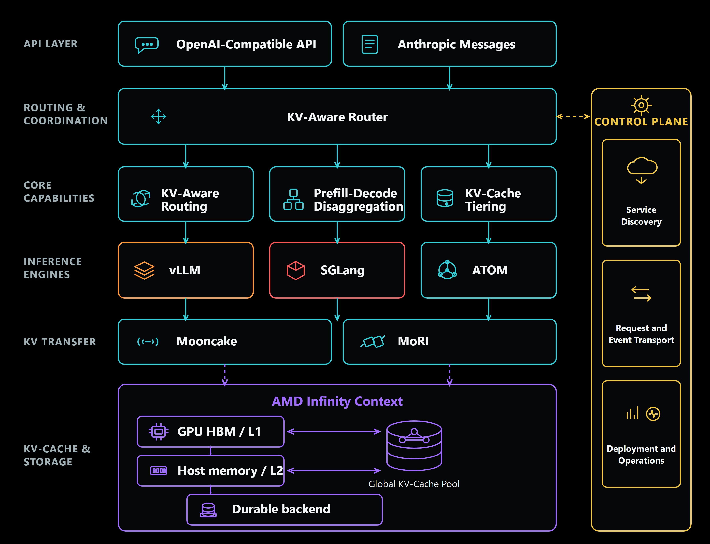
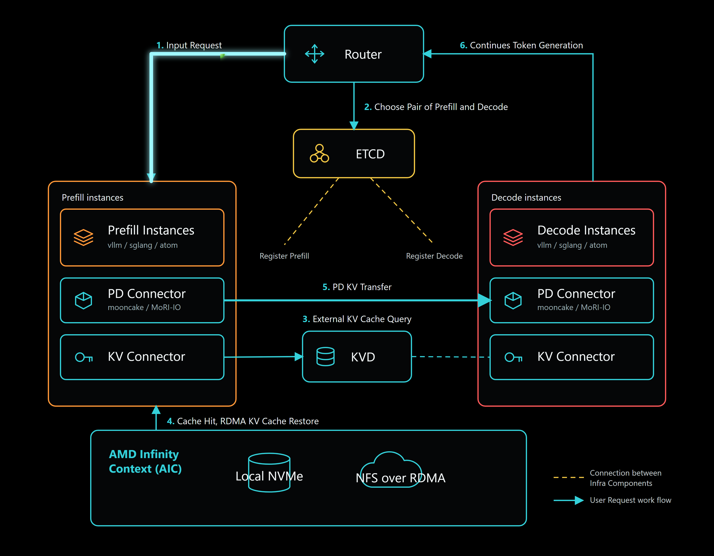

# Infera: Scaling Goodput for Agentic AI with Distributed Inference Orchestration

[](https://github.com/AMD-AGI/Infera/actions/workflows/ci.yml)
[](https://github.com/AMD-AGI/Infera/actions/workflows/release.yml)
[](https://rocm.docs.amd.com/projects/infera/en/latest/)
[](LICENSE)

[What's Infera?](#whats-infera) | [Key features](#key-features) | [Quick Start](#quick-start) | [Engine images](#engine-images) | [Benchmarks](#benchmarks) | [Documentation](#documentation) | [Roadmap](#roadmap) | [License](#license)

AMD ROCm™ Infera is a distributed inference reference solution for large-scale deployments — a
conductor for your inference GPU orchestra. It coordinates engine instances across three dimensions,
KV-Aware Routing, Prefill-Decode Disaggregation, and KV-Cache Tiering, tuned to your production SLA.

Infera is open source from day one and ROCm-native, built for AMD Instinct™ GPUs. It presents a
single OpenAI-compatible endpoint — and the Anthropic Messages API through a translation
layer — in front of one or many engine instances, and runs vLLM, SGLang, or ATOM underneath.

## What's Infera?

Modern inference engines optimize execution within an engine instance, but production systems rely
on many instances for scale, availability, and workload specialization. As deployments grow, teams
typically use conventional load balancing or custom logic to distribute requests.

This creates an orchestration gap, especially for agentic workloads. Agentic systems run long,
multi-turn loops that repeatedly reuse large prefixes (system prompts, memory, retrieved context,
tool outputs) while adding only small increments of new tokens. Contexts can reach tens or hundreds
of thousands of tokens, with input-to-output ratios exceeding 100:1. In theory, most of this work
should be reused via KV caching. In practice, reuse breaks down: systems lack visibility into which
instances hold relevant KV cache, memory pressure forces eviction of large prefixes, and requests
often land on different instances across turns. The result is repeated prefill, lost cache locality,
degraded latency, and lower throughput, even when systems appear balanced.

Infera addresses this by coordinating engine instances across three dimensions: KV-aware routing,
prefill-decode disaggregation, and KV-cache tiering. Rather than replacing inference engines, it
manages request placement, execution phases, and reusable KV state across the deployment. This
orchestration increases inference goodput — the rate of requests completed within latency targets
such as time to first token and inter-token latency — which is what determines end-to-end agentic AI
performance. Built and validated on AMD Instinct MI355X.

## Key features

Infera coordinates engine instances across three capabilities that turn GPU time into tokens:

- **Route: KV-Aware Routing** — route the request to an engine instance that balances KV-cache reuse and active work. The router scores every live instance by how much of the prompt's prefix it already holds and routes to the best match, so the prefix is served from cache instead of being recomputed.
- **Specialize: Prefill-Decode Disaggregation** — run prefill and decode on specialized engine instances. Prefill is compute-bound and decode is bandwidth-bound, so running both in one instance underuses each; separate them, size each pool for its own job, and stream the KV between them over Mooncake or MoRI-IO (AI NIC RDMA).
- **Retain: KV-Cache Tiering** — retain reusable KV state beyond GPU HBM memory for future requests. When HBM fills, AMD Infinity Context (AIC) keeps KV warm instead of dropping it: GPU HBM → local NVMe or remote NFS-backed storage, moved over a direct GPU data path that avoids staging through CPU DRAM, so one instance can pick up a prefix another already computed.

Around them:

- **Multi-engine** — run vLLM, SGLang, or ATOM behind one common serving interface.
- **OpenAI- and Anthropic-compatible API** — `/v1/chat/completions`, `/v1/completions`, and `/v1/messages` (Anthropic Messages, translated in-process).
- **Self-registering fleet** — workers register into etcd and heartbeat, so the router works from a live view and never routes to a worker that is gone; run any number of stateless server replicas.
- **Kubernetes-native** — an operator reconciles an `InferaDeployment` CRD (aggregated / PD / multi-node), with an optional Gateway API (GAIE) endpoint picker.

## Architecture

Infera introduces a focused orchestration layer to the ROCm inference stack. Applications connect
through the OpenAI-compatible API (with an Anthropic-compatible shim), where a built-in router
handles scheduling; the server scales out behind a load balancer, and the same routing logic is
also available as a high-performance Rust data plane.



At runtime, prefill and decode instances register with the control plane through etcd, and the
router selects a compatible prefill-decode pair based on role, active work, and KV-cache locality.
The prefill instance queries the external KV cache (kvd) for reusable blocks, AIC restores any hits
over a direct GPU path, the completed KV state is transferred to the decode instance over Mooncake
or MoRI-IO, and the decode instance streams the response back through the router.



## Quick Start

### Option A — Docker (fastest)

The engine images bundle Infera and the engine, so no host-side installation is required. Start
etcd, then run the server and a worker in an engine container.

```bash
# Step 1 — etcd (shared registry)
docker run -d --name infera-etcd --network host quay.io/coreos/etcd:v3.5.14 \
  etcd --advertise-client-urls http://127.0.0.1:2379 --listen-client-urls http://0.0.0.0:2379

# Step 2 — engine container (drop infiniband/IPC_LOCK/libionic for a single-host, non-RDMA run)
docker run --rm -it --network host --ipc host --shm-size 32g             \
  --device /dev/kfd --device /dev/dri --device /dev/infiniband           \
  --group-add video --group-add render --cap-add IPC_LOCK                \
  -v /usr/lib/x86_64-linux-gnu/libionic.so:/host-libionic/libionic.so:ro \
  docker.io/rocm/infera-sglang:v0.1.0 bash

# Step 3 — inside the container: start the server and a worker
python -m infera.server --port 8000 --etcd-endpoint 127.0.0.1:2379 \
  --router-tokenizer-path Qwen/Qwen3-0.6B \
  --discovery-backend etcd --request-transport http --kv-event-transport zmq &

python -m infera.engine.sglang --model-path Qwen/Qwen3-0.6B \
  --host 0.0.0.0 --port 30000 --etcd-endpoint 127.0.0.1:2379 \
  --discovery-backend etcd --request-transport http --kv-event-transport zmq &

# Step 4 — send a request (allow a few seconds for the worker to load the model)
curl localhost:8000/v1/chat/completions -H 'Content-Type: application/json' \
  -d '{"model":"Qwen/Qwen3-0.6B","messages":[{"role":"user","content":"1+1=?"}],"max_tokens":50}'
```

To build the image yourself, see [Engine images](#engine-images) and replace
`rocm/infera-sglang:v0.1.0` above with your local `infera-sglang:dev` tag.

### Option B — From source (pip)

> The PyPI package (`amd-infera`) is not yet published; install from a clone.

In a ROCm environment (e.g. an engine base image), install Infera plus at least one engine, then
run the same etcd + server + worker stack as in Option A:

```bash
pip3 install ".[sglang]"        # or .[vllm] / .[atom]  (add .[gaie] for the EndpointPicker)
pip3 install -e ".[dev,sglang]" # editable + lint/test tooling, for contributors
```

**Optional — Rust router** (`--router-backend rust`), the multi-core data plane. It is not yet
shipped as a wheel, so build the binary from source; this requires a
[Rust toolchain](https://rustup.rs):

```bash
cd rust && cargo build --release && cd -   # produces rust/target/release/infera-router
```

The server auto-discovers the binary (or set `INFERA_ROUTER_BIN=/path/to/infera-router`); then
run the server with `--router-backend rust`. The default backend is `python`, which requires no
Rust toolchain.

### Option C — Kubernetes

The operator reconciles an `InferaDeployment` CRD (aggregated / prefill-decode / multi-node)
with an optional Gateway API (GAIE) endpoint picker. Install the cluster dependencies (LWS +
NATS + operator; add `INSTALL_GATEWAY=true` for the GAIE stack), then apply a deployment:

```bash
deploy/scripts/deploy-k8s.sh            # LWS + NATS + operator (see --help for options)

# Edit the <PLACEHOLDERS> in these templates for your cluster before applying.
kubectl apply -f examples/k8s-deployments/pvc-models.yaml
kubectl apply -f examples/k8s-deployments/single-node-aggregated.yaml
```

Ready-to-fill deployment templates (single-node, prefill/decode, multi-node TP, GAIE) and their
placeholders are in [`examples/k8s-deployments/`](examples/k8s-deployments/README.md).

## Engine images

Each engine has one canonical Dockerfile under `deploy/docker/` that overlays Infera on a
vendor base. Build from the repo root; override the base with `--build-arg <ENGINE>_BASE_IMAGE=...`.

| Dockerfile          | Base image                                      |
|---------------------|-------------------------------------------------|
| `Dockerfile.sglang` | `lmsysorg/sglang:v0.5.15.post1-rocm720-mi35x`   |
| `Dockerfile.vllm`   | `vllm/vllm-openai-rocm:nightly-cbe9c40f…`       |
| `Dockerfile.atom`   | `rocm/atom:rocm7.2.4_…_atom0.1.4_20260612`      |

```bash
docker build -f deploy/docker/Dockerfile.sglang -t infera-sglang:dev .
docker build -f deploy/docker/Dockerfile.vllm   -t infera-vllm:dev .
docker build -f deploy/docker/Dockerfile.atom   -t infera-atom:dev .
```

## Benchmarks

**Kimi agentic benchmark** — a long-context, multi-turn coding-agent workload
(Kimi-K2.6-MXFP4 on MI355X) that compares prefill/decode disaggregation against a
single-node TP8 baseline at a fixed per-user interactivity SLA. Workload definition,
topologies, launch scripts, the concurrency-sweep harness, results, and reproduction
steps are in [`examples/kimi_agentic_bench/`](examples/kimi_agentic_bench/README.md).

## Documentation

Full guides, deployment recipes, and reference are hosted at
**[rocm.docs.amd.com/projects/infera](https://rocm.docs.amd.com/projects/infera/en/latest/)**.

To build the same Sphinx manual locally:

```bash
sudo apt-get install -y graphviz                            # `dot`, for the diagrams
cd manual && pip install -r sphinx/requirements.txt && make html   # open _build/html/index.html
```

## Roadmap

Infera is currently at v0.1, and the initial reference solution should be viewed as a
foundation rather than a feature-complete solution. Current limitations are detailed in the Infera
[Feature Matrix](https://rocm.docs.amd.com/projects/infera/en/latest/features/feature_matrix.html)
and [Compatibility Matrix](https://rocm.docs.amd.com/projects/infera/en/latest/features/compatibility_matrix.html).
The public [Infera Roadmap](https://github.com/AMD-AGI/Infera/issues/9) identifies the priorities.

## License

MIT — see [LICENSE](LICENSE). © 2026 Advanced Micro Devices, Inc.
