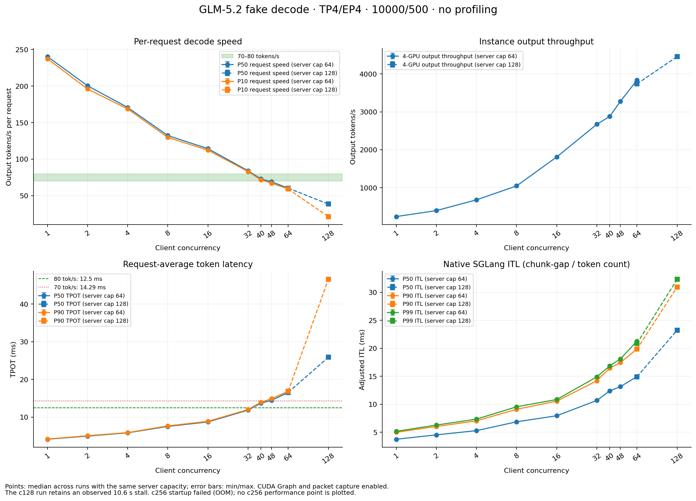

# GLM-5.2 TP4/EP4 实验汇总：算子分布、并发压测与 goodput

整理日期：2026-09-11。按用户要求停止新增测试，仅汇总已经生成的数据。

**已测配置中，每请求至少70 tokens/s推荐 conc=40；至少80 tokens/s推荐 conc=32。** 128已完成1024个请求，速率明显低于目标，并出现约10.6秒的长停顿。256在原始内存配置下启动OOM，没有完成性能测量；`mem-fraction=0.84`的重试只准备了脚本，未执行。

无profile压测共 **15轮、6336/6336请求成功、316.8万输出token**。启动失败和未执行的方案不计入成功轮数，也不填入推测的ITL或吞吐。

## 1. 目标与统计口径

每请求 decode 速率 = `(输出 tokens−1)/(请求耗时−TTFT)` = `1000/TPOT_ms`。70和80 tokens/s分别对应 TPOT ≤14.2857和12.5 ms。SLA goodput另按“达到该速率门限的请求所生成的输出token / 测量墙钟时间”计算。

每请求速率P90按成功请求的decode速率升序取第90百分位（线性插值），描述速率分布中较快的一侧。“90%的请求至少达到多少tok/s”应看速率P10，约等于`1000 / TPOT P90_ms`；下面的SLA选择规则仍按TPOT P90和请求达标比例判定。

| 选择规则 | 70 tokens/s | 80 tokens/s |
|---|---:|---:|
| 所有已测轮次的P50 TPOT满足门限 | 40 | 32 |
| 所有已测轮次的P90 TPOT满足门限 | **40** | **32** |
| 每轮至少90%的请求达到速率目标 | **40** | **32** |
| 更严格：每轮原生P90 ITL满足相同毫秒门限 | 32 | 16 |

上述最大值限于已经测试的配置，没有逐一穷举41–47等整数并发。原生SGLang ITL会把一个SSE chunk的间隔均摊到其新增token，因此不能把P90 ITL与整条请求的平均TPOT混用。真实chunk gap、TTFT、E2E和逐请求数据均已保留。

## 2. 无profile压测结果

主表为各档位首轮结果；32和40的额外复测在下一节汇总。全部成功运行保持ISL10000/OSL500、TP4/EP4/DP1、mem-fraction=0.85、EAGLE5 steps/6 draft tokens/topk1、模拟接受长度3.61。所有采样decode日志为CUDA Graph=True，retraction为0。

| conc | 服务max-running | 测量请求 | ITL P50 / P90 / P99，ms | TPOT P50 / P90，ms | 每请求速率P50，tok/s | 每请求速率P90，tok/s | 四卡输出吞吐，tok/s |
|---:|---:|---:|---:|---:|---:|---:|---:|
| 1 | 64 | 128 | 3.752 / 4.995 / 5.159 | 4.160 / 4.213 | 240.39 | 244.86 | 239.46 |
| 2 | 64 | 128 | 4.529 / 6.021 / 6.284 | 4.989 / 5.099 | 200.45 | 203.96 | 396.56 |
| 4 | 64 | 128 | 5.289 / 7.037 / 7.344 | 5.856 / 5.928 | 170.77 | 173.86 | 679.89 |
| 8 | 64 | 128 | 6.866 / 9.101 / 9.549 | 7.556 / 7.703 | 132.34 | 134.66 | 1047.28 |
| 16 | 64 | 128 | 7.949 / 10.555 / 10.849 | 8.744 / 8.906 | 114.36 | 115.56 | 1810.50 |
| **32** | 64 | 256 | **10.669 / 14.189 / 14.824** | **11.849 / 12.022** | **84.40** | **86.78** | **2685.27** |
| **40** | 64 | 320 | **12.381 / 16.474 / 16.865** | **13.730 / 14.029** | **72.83** | **74.29** | **2875.11** |
| 48（边界补测） | 64 | 768 | 13.143 / 17.448 / 18.090 | 14.475 / 14.916 | 69.09 | 69.93 | 3275.08 |
| 64 | 64 | 512 | 14.939 / 19.869 / 21.280 | 16.562 / 16.866 | 60.38 | 62.02 | 3833.24 |
| 64（扩容对照） | 128 | 512 | 14.923 / 19.864 / 20.868 | 16.579 / 16.893 | 60.32 | 61.59 | 3736.31 |
| **128** | 128 | **1024** | **23.244 / 30.943 / 32.336** | **25.883 / 46.575** | **38.64** | **39.14** | **4456.20** |
| **256** | 256 | **0** | — | — | — | — | **启动OOM，无测量值** |

从服务max-running=64扩到128后，conc=64对照的输出吞吐下降约2.53%，TPOT P90变化约0.16%。两套服务配置分别保留，曲线没有将它们当成同一配置的重复样本平均。



## 3. 推荐档位的复测依据

| conc | 轮数 / 请求总数 | 每请求速率P50，各轮范围 | 每请求速率P90，各轮范围 | TPOT P90，各轮范围 | 达到70 | 达到80 |
|---:|---:|---:|---:|---:|---:|---:|
| 32 | 3 / 1280 | 83.66–84.40 tok/s | 85.39–86.78 tok/s | 12.022–12.088 ms | 100% | 100% |
| 40 | 3 / 1600 | 72.72–73.59 tok/s | 73.69–74.29 tok/s | 13.915–14.029 ms | 100% | 0% |
| 48 | 1 / 768 | 69.09 tok/s | 69.93 tok/s | 14.916 ms | 4.17% | 0% |

c40的输出吞吐为2875.11–2904.52 tok/s，全部来自达到70目标的请求。c48总输出虽达到3275.08 tok/s，但70门限下的SLA goodput仅136.46 tok/s。c64和c128均没有请求达到70或80。因此，增加总吞吐不能直接视为完成每请求速度目标。

复测c32每轮512请求、c40每轮640请求，均为16轮满并发请求。初始扫点至少128请求且至少8轮；warmup为max(16,conc)个请求，按原生客户端规则使用OSL32，测量请求使用OSL500。

## 4. c128长尾：保留原始观测

c128于2026-09-10 15:42:25–15:44:37 UTC执行完毕，实际测量窗口114.896秒。1024/1024请求成功，TPOT P50/P90/P99为25.883/46.575/47.162 ms，均值28.146 ms。

这一轮有113个请求出现超过1秒的真实chunk gap，最大gap为 **10.625秒**；15个请求TTFT超过1秒，TTFT P99为10.539秒。均摊ITL的最大值为10.544秒，而其P99仅32.336 ms，说明单看ITL P99会遗漏少数很长的停顿。

同一窗口中，15:42:51日志出现 `FlyDSL sparse MLA decode declined: seq 113, need 1..96`，随后有临时C++文件的编译warning，15:43:02继续输出请求日志。这与约11秒停顿时间一致，但没有独立实验隔离因果。**未剔除停顿、未重测，也不把该轮P90当成充分预热后的稳定尾延迟。** 这不会改变70–80 tokens/s档位结论，因为c128的中位速率也只有38.64 tok/s。

证据：[离线长尾统计](summary/state/high128-latency-note.json)、[该轮完整日志](experiments/20260910_1540_n04_c128/rounds/high128_c128_r01/server-window.log)、[逐请求CSV](experiments/20260910_1540_n04_c128/rounds/high128_c128_r01/requests.csv)。

## 5. c256：已尝试与未执行的部分

| 尝试 | 配置 | 实际状态 |
|---|---|---|
| 原配置启动 | max-running=256，mem-fraction=0.85，图bucket=1/16/32/64/128/256 | target verify和draft decode图捕获完成；draft extend图捕获时HIP OOM。无benchmark请求、无吞吐或延迟数据。 |
| 内存调整方案 | max-running=256，mem-fraction=0.84 | **只准备了脚本和环境记录，未启动服务、未执行benchmark。** 用户要求停止新增测试后没有继续尝试。 |

OOM发生于2026-09-10 15:34:39 UTC：申请3.00 GiB，GPU2只剩1.22 GiB。问题发生在图捕获阶段，不能把它表述成已经测得的运行时吞吐，也不能把未执行的0.84方案称为修复成功。

证据：[OOM记录](experiments/20260910_1525_n04_c128_c256/state/failure.json)、[启动失败日志](experiments/20260910_1525_n04_c128_c256/state/startup-failed.log)、[0.84方案执行状态](experiments/20260910_1545_n04_c256_m084/state/status.json)。

## 6. 已有c32算子profile结论（独立样本）

此前完成了2窗口×4 TP rank的trace，每窗口12个MTP step，共204648个GPU kernel事件。按GPU kernel耗时累加：MoE expert GEMM 29.62%，通信/融合allreduce 18.01%，Dense GEMM 17.30%，Attention/MLA 16.40%，DSA index/top-k 6.91%，MoE sorting 5.01%。MTP阶段中target verify占83.61%，draft占9.71%，draft extend占4.67%。

该profile样本为了避免ROCm漏记大图kernel，使用了 `DEBUG_CLR_GRAPH_PACKET_CAPTURE=false`。因此这些数值用于算子热点定位，**没有混入上面的无profile压测指标，也不等同于原优化模式的精确墙钟时间分解**。所有无profile成功压测均未设置该开关、未调用profile API。

原始trace：[8份trace归档](../glm52_fake_tp4ep4_profile/results/20260910_n04_c32_complete/traces_c32.tar)。算子完整数据：[kernel CSV](../glm52_fake_tp4ep4_profile/results/20260910_n04_c32_complete/analysis/kernels.csv)、[分类CSV](../glm52_fake_tp4ep4_profile/results/20260910_n04_c32_complete/analysis/categories.csv)。

## 7. 环境、数据边界与资源状态

- 测量节点：`smci355-ccs-aus-n04-33`，GPU0–3，4×MI355X。模型路径 `/data/models/GLM-5.2-MXFP4`，FP8 KV，TP4/EP4/DP1，无DP attention，保留原packup三份fake-decode补丁。
- 实际镜像：`sha256:416d51effc431e27a4ddeed5cdd8ca6012c68eeabb071f987ce99f1ba9854973`。SGLang commit `402df1e1e453e1e85ec0f5ac4052d36598cc691a`，AITER commit `2c71811b32c8ce2e1266aedaec199df7d90f597d`。镜像ID与历史packup不同，源码commit一致；不是历史镜像的二进制级精确复现。
- 所有成功无profile测量的mem-fraction均为0.85。初始服务容量64，后续成功服务容量128；实际配置写入合并CSV的 `server_max_running`、`mem_fraction_static` 和 `experiment` 字段。
- synthetic KV / simulated acceptance，不代表真实prefill吞吐或PD正确性。native accept_length为服务累计值。TTFT/E2E从实际HTTP发送计时，不包含客户端semaphore排队。
- 原prompt文件只有160条，较长压测会循环扩展输入；一次初始c32任务因此截短为160请求，已单独保存并排除于正式统计，未混入6336请求。
- 当前不再使用测试节点。Slurm job `30020`于2026-09-11查询时已不在活动队列；accounting未启用，无法核实确切结束原因。**本任务未执行scancel，不声称是主动释放成功。** 查询凭据见 [slurm-status.json](summary/state/slurm-status.json)。

## 8. 统一数据入口与离线重算

- [合并指标CSV](summary/analysis/metrics.csv)：15轮完整指标，含ITL、TPOT、TTFT、E2E、真实chunk gap、SLO goodput和配置标签。
- [合并JSON](summary/analysis/summary.json)、[逐轮表格](summary/analysis/SUMMARY.md)、[曲线PNG](summary/analysis/goodput_sweep.png) / [SVG](summary/analysis/goodput_sweep.svg)。
- [第一阶段原始数据](experiments/20260910_1205_n04/rounds)、[后续64/128原始数据](experiments/20260910_1540_n04_c128/rounds)。每个成功round保留原始benchmark JSONL、请求CSV、命令、server_info与日志。

以下只做本地离线重算，不连接测试节点或启动模型：

```bash
ROOT=examples/glm52_fake_tp4ep4_goodput
python3 "$ROOT/analyze.py" \
  "$ROOT/experiments/20260910_1205_n04" \
  "$ROOT/experiments/20260910_1540_n04_c128" \
  --output "$ROOT/summary/analysis"
# 如本地已安装matplotlib：
python3 "$ROOT/plot.py" "$ROOT/summary" \
  --note 'c128 retains an observed 10.6 s stall; c256 startup failed with OOM.'
```
