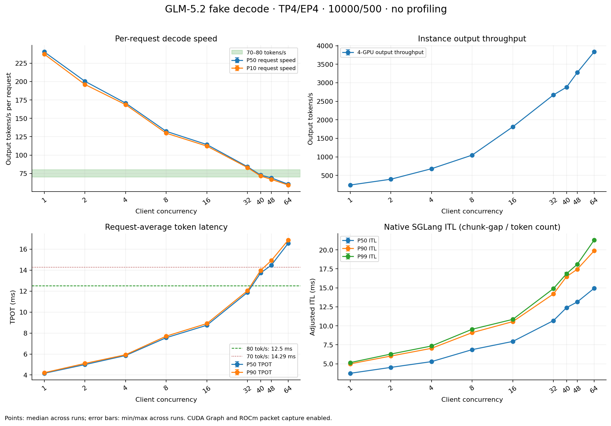

# 无 profile：GLM-5.2 TP4/EP4，70–80 tokens/s 的并发选择

**本次已测配置中，每请求至少 70 tokens/s 选 conc=40；至少 80 tokens/s 选 conc=32。** 两个点各完成首轮加两轮复测：c40 的 1600/1600 个请求达到70，c32 的1280/1280个请求达到80。补测 c48 已不能满足70目标，c64也不能满足。

这里每请求 decode 速率定义为 `(输出 tokens−1)/(请求耗时−TTFT)`，即 `1000/TPOT_ms`。70/80 tokens/s 分别对应 TPOT ≤14.2857/12.5 ms。P50、P90和至少90%请求达标三种选择规则在本次数据上得到相同的最大已测并发。SLA goodput 另外按“达标请求的输出 token 总数 / 测量时间”计算。

## 指定八个并发档位：首轮结果

| conc | 测量请求 | ITL P50 / P90 / P99，ms | TPOT P50 / P90，ms | 每请求 decode tok/s P50 | 四卡 output tok/s |
|---:|---:|---:|---:|---:|---:|
| 1 | 128 | 3.752 / 4.995 / 5.159 | 4.160 / 4.213 | 240.39 | 239.46 |
| 2 | 128 | 4.529 / 6.021 / 6.284 | 4.989 / 5.099 | 200.45 | 396.56 |
| 4 | 128 | 5.289 / 7.037 / 7.344 | 5.856 / 5.928 | 170.77 | 679.89 |
| 8 | 128 | 6.866 / 9.101 / 9.549 | 7.556 / 7.703 | 132.34 | 1047.28 |
| 16 | 128 | 7.949 / 10.555 / 10.849 | 8.744 / 8.906 | 114.36 | 1810.50 |
| **32** | 256 | **10.669 / 14.189 / 14.824** | **11.849 / 12.022** | **84.40** | **2685.27** |
| **40** | 320 | **12.381 / 16.474 / 16.865** | **13.730 / 14.029** | **72.83** | **2875.11** |
| 64 | 512 | 14.939 / 19.869 / 21.280 | 16.562 / 16.866 | 60.38 | 3833.24 |

以上均全部成功，实际 ISL10000/OSL500，无 request retraction，所有采样 decode 日志均显示 CUDA Graph=True。并发是客户端上限，实际 batch 的 warmup/尾部缩批由各 round 的 `observations.json` 保留，不将其解释成恒定满 batch 的时间加权占用率。

## 复测与边界

| conc | 有效轮数 / 请求总数 | 每请求速率 P50，各轮范围 | TPOT P90，各轮范围 | ≥70 达标 | ≥80 达标 |
|---:|---:|---:|---:|---:|---:|
| 32 | 3 / 1280 | 83.66–84.40 tok/s | 12.022–12.088 ms | 100% | 100% |
| 40 | 3 / 1600 | 72.72–73.59 tok/s | 13.915–14.029 ms | 100% | 0% |
| 48（补测） | 1 / 768 | 69.09 tok/s | 14.916 ms | 4.17% | 0% |
| 64 | 1 / 512 | 60.38 tok/s | 16.866 ms | 0% | 0% |

c40 的实例输出吞吐为 2875.11–2904.52 tok/s，同时这些输出全部来自达到70目标的请求。c48虽然总输出3275.08 tok/s，但70门限下的 SLA goodput 只有136.46 tok/s。仅按总吞吐选择c64会偏离本次每请求速度目标。

复测各使用16轮满并发请求，c32每轮512请求，c40每轮640请求；c48补测768请求。全部有效数据为13轮、4800/4800成功、240万输出token。另保留一次因数据集数量不足而截短的160请求诊断，未计入这些统计。

没有逐一测量41–47等整数并发，也没有测试64以上。这里推荐的是本次已测配置中的最大值。

## ITL 与目标口径

SGLang 的原生 ITL 将 SSE chunk 的到达间隔均摊到该 chunk 的新增 token。MTP 批量返回 token，因此 ITL、请求平均 TPOT、真实 chunk gap 是三个不同指标。脚本另外保留 `raw_chunk_gaps`、`chunk_token_counts`；例如首轮c40的真实 chunk gap P90/P99 为49.75/55.42 ms，而均摊 ITL P90/P99 为16.47/16.87 ms。

如果目标是**原生 P90 ITL**也不高于14.2857/12.5 ms，更严格的选择分别是 **c32 / c16**。这与报告开头按每请求平均速度选择的 **c40 / c32**不同，不能混用。

完整 mean/P50/P90/P95/P99/max ITL、TPOT、TTFT、E2E、真实 chunk gap、逐请求速率和SLA goodput见 [metrics.csv](analysis/metrics.csv)。TTFT/E2E从实际HTTP发送开始计时，不含客户端等待semaphore；例如c2保留了约506 ms的TTFT P99，未从原始统计中移除。

## 环境与采集

- 节点 `smci355-ccs-aus-n04-33`，GPU0–3，4×MI355X。沿用 TP4/EP4/DP1、mem-fraction0.85、FP8 KV、EAGLE5 steps/6 draft tokens/topk1、模拟接受长度3.61和原packup三份fake-decode补丁。
- 一套服务保持max-running=64；显式decode graph buckets为1、2、4、8、16、24、32、40、48、56、64，已测所有档位均有精确图shape。
- **没有调用profile API，没有profile相关环境变量，没有关闭ROCm packet capture。** 启动命令和实际容器环境由 [no-profile-validation.json](state/no-profile-validation.json)、[container-inspect.json](state/container-inspect.json)、[server-info-ready.json](state/server-info-ready.json) 保留。
- 实际镜像 `sha256:416d51effc431e27a4ddeed5cdd8ca6012c68eeabb071f987ce99f1ba9854973`，与上一轮节点测试相同。与历史packup镜像ID不同；SGLang `402df1e1e…` 和AITER `2c71811b…` commit一致。完整环境与config/index哈希见 [environment.json](state/environment.json)。
- 原prompt文件160条；高并发需要更多测量请求时，在对应round循环扩展synthetic prompt，实际成功数/长度逐点校验。[excluded-rounds.json](state/excluded-rounds.json)说明被排除的初次c32短请求数诊断。
- 每点预热max(16,conc)个请求，原生客户端预热OSL32，测量OSL500。客户端改动仅保存已有计时及SSE gap/token数，[client-details.diff](state/client-details.diff)可审阅；从逐请求数据重算TPOT/ITL，均与native统计匹配。
- 使用synthetic KV和simulated acceptance。这些数字不代表真实prefill性能或PD正确性；native accept_length也是服务生命周期累计值。

## 数据入口

- [运行与分析脚本说明](../../README.md)
- [完整数值CSV](analysis/metrics.csv)、[全部结果JSON](analysis/summary.json)、[逐轮汇总](analysis/SUMMARY.md)
- [PNG](analysis/goodput_sweep.png) / [SVG](analysis/goodput_sweep.svg)
- [原始逐请求数据与服务日志](rounds)：每轮保留`benchmark.jsonl`、`requests.csv`、benchmark命令、server窗口日志与server_info。

测试容器已正常停止，exit code 0；最终GPU利用率及显存占用均显示0%。证据：[cleanup.json](state/cleanup.json)、[gpu-after.txt](state/gpu-after.txt)。其他容器未作修改。
