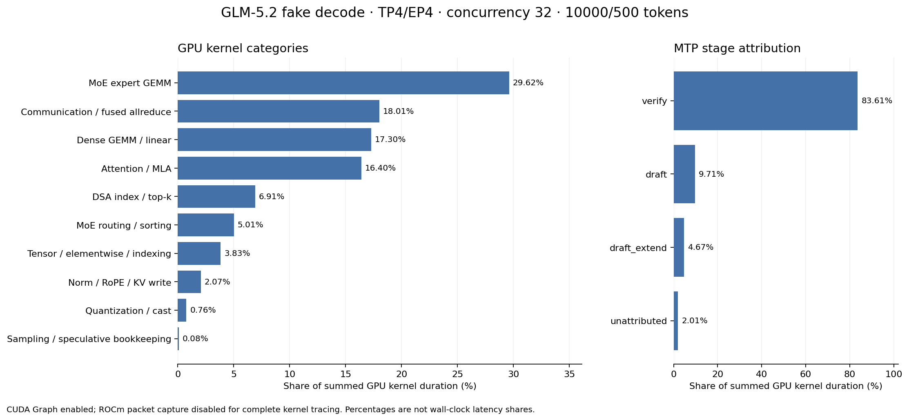

# GLM-5.2 TP4/EP4，conc=32 算子分布

2026-09-10 在 `smci355-ccs-aus-n04-33` 的 GPU 0–3（4×MI355X）完成测试。**主要 GPU 开销是 MoE GEMM 29.62%、通信 18.01%、dense GEMM 17.30%、attention/MLA 16.40%；MTP 的 target verify 阶段占 83.61%。**

基于指定 packup，保持 ISL=10000、OSL=500、TP4/EP4/DP1、FP8 KV、mem-fraction=0.85、EAGLE 5 steps / 6 draft tokens / topk=1、模拟接受长度 3.61、三份 fake-decode 补丁和 CUDA Graph。每轮客户端执行 16 个 warmup 请求，再执行 128 个测量请求。

**占比口径：GPU kernel duration 之和，不是请求延迟占比。** 为修复 ROCm 漏记大图 kernel 的问题，完整 trace 使用 `DEBUG_CLR_GRAPH_PACKET_CAPTURE=false`；CUDA Graph 仍开启，但 packet capture 优化关闭。因此这些占比用于定位热点，不应当作原优化模式的精确延迟分解。

## 算子类别

两个窗口各抓 12 个 MTP forward，均确认 verify batch=32；每窗口四个 TP rank，共 **8 份 trace、204,648 个 GPU kernel 事件**。每份 trace 有 25,581 个 kernel，36 次图回放均关联到 GPU kernel。两轮各类别占比最大差异 **0.24 个百分点**。

| 类别 | GPU kernel 时间占比 | 平均每 GPU、每 MTP step 的 kernel 累加耗时 |
|---|---:|---:|
| MoE expert GEMM | 29.62% | 12.665 ms |
| 通信 / 融合 allreduce | 18.01% | 7.701 ms |
| Dense GEMM / linear | 17.30% | 7.398 ms |
| Attention / MLA | 16.40% | 7.012 ms |
| DSA index / top-k | 6.91% | 2.955 ms |
| MoE routing / sorting | 5.01% | 2.142 ms |
| Tensor / elementwise / indexing | 3.83% | 1.639 ms |
| Norm / RoPE / KV write | 2.07% | 0.885 ms |
| Quantization / cast | 0.76% | 0.326 ms |
| Sampling / speculative bookkeeping | 0.08% | 0.034 ms |

最后一列将全部 kernel 耗时除以 2 窗口 × 4 GPU × 12 step，合计约 42.758 ms；不能解释成四卡实例的端到端 step 延迟。融合 kernel 整体归入一个类别，例如融合通信/norm 计入通信，融合 MLA Q/RoPE/KV preparation 计入 attention。

## MTP 阶段

| 阶段 | GPU kernel 时间占比 | 平均每 GPU、每 MTP step |
|---|---:|---:|
| Target verify | 83.61% | 35.750 ms |
| Draft | 9.71% | 4.154 ms |
| Draft extend | 4.67% | 1.996 ms |
| 未落入以上阶段的 kernel | 2.01% | 0.858 ms |

阶段通过 GPU kernel 与 CPU launch 的 correlation ID / external ID 关联；不会以 CPU/GPU 时间范围重叠推断异步归属。`unattributed` 保留阶段范围以外的工作，不计入 verify。各 rank 的 kernel 累加耗时在同一窗口内相差不到 0.23%；这表明总量接近，但不能仅据此排除通信中的等待。

## 值得继续看的热点

1. **MoE 的两个 MXFP4 expert GEMM 合计约 25.00%。** `mfma_moe1_silu_mul_afp4_wfp4_bf16_t32x128x256_pm1_async_v33` 占 16.24%，`mfma_moe2_afp4_wfp4_bf16_cshuffle_t32x128x256_vscale_fix3_fp4opt_v1_persist_cu256` 占 8.76%。加上其他 expert GEMM，类别总计 29.62%；另有 routing/sorting 5.01%。后续可先研究这个实际 c32 shape 的两阶段 MoE 内核与排序融合。
2. **通信中最显眼的是 `reduce_scatter_cross_device_store`，单项占 13.04%。** 相邻 `local_device_load_rmsnorm` 也归入通信/融合类别。这里含等待和融合计算，不能把 18.01% 全部解释为链路传输时间。
3. **C32 的 verify=32×6=192 行，确实触发 FlyDSL 96 行门限后的 TileLang fallback。** `main_kernel` 对应 TileLang sparse MLA partial/combine，合计占 13.54%；包含其他 attention 准备工作的类别总计 16.40%。若扩展 FlyDSL 对 192 行的支持，应对照这部分开销评估收益，不能直接去掉门限就假设有效。
4. **DSA index/top-k 合计 6.91%。** 其中 coop top-k 约 2.19%，paged MQA logits 约 2.03%；其余包含 index/cache metadata 和 Hadamard 等准备工作。

`main_kernel` 是泛化名称，因此没有仅按名字猜测归类：已对 8 份 trace 检查，每个 verify 图有 78 对 kernel，均位于 MLA Q/RoPE 准备与输出 BMM 之间；draft extend 有对应的一层 pair。源码确认 fallback 调用 partial/combine。`p0v2_kernel_0` 和 `p23_kernel_1` 由 AITER 的 MoE sorting 源码确认。证据见 [映射验证](results/20260910_n04_c32_complete/state/kernel-alias-validation.json)、[源码快照](results/20260910_n04_c32_complete/state/kernel-sources)和 [kernel_aliases.json](kernel_aliases.json)。

## 基准与采集限制

| 运行模式 | 成功 / 测量请求 | Output tok/s，四卡实例 | P50 TPOT | P90 TPOT |
|---|---:|---:|---:|---:|
| 原始 packet capture，无 profiler | 128/128 | 2641.97 | 11.827 ms | 12.282 ms |
| 关闭 packet capture，无 profiler | 128/128 | 2696.74 | 11.706 ms | 11.826 ms |
| 关闭 packet capture，profile_01 | 128/128 | 2553.89 | 11.902 ms | 12.689 ms |
| 关闭 packet capture，profile_02 | 128/128 | 2605.92 | 11.997 ms | 12.842 ms |

以上每个测量请求实际输入/输出均为 10000/500，错误数均为 0。profile 轮包含 trace 采集和导出开销；不同模式只各测一次无 profiler 基准，不能据此声称关闭 packet capture 提升性能。原始无 profiler 基准见 [metrics.json](results/20260910_n04_c32/baseline_c32/metrics.json)；完整采集轮见 [round-metrics.json](results/20260910_n04_c32_complete/state/round-metrics.json)。

最初的原始模式 trace 每 rank 只有 3,681 个 kernel，12 次 target graph 回放均没有 kernel 记录，已排除于本报告统计。交替回放大小图的独立测试预期 3,603 个 kernel：原模式只有 3 个；设置 **字面量 `DEBUG_CLR_GRAPH_PACKET_CAPTURE=false`** 后达到 3,603 个。该 runtime 上 `0` 没有解决问题。`analyze.py` 默认拒绝包含空 graph 回放的 trace。

实际镜像是 `sha256:416d51effc431e27a4ddeed5cdd8ca6012c68eeabb071f987ce99f1ba9854973`，与 packup 的 `b9a83742…` 不同；SGLang `402df1e1e453e1e85ec0f5ac4052d36598cc691a`、AITER `2c71811b32c8ce2e1266aedaec199df7d90f597d` 相同。模型来自 `/data/models/GLM-5.2-MXFP4`，config 与 safetensors index 的 SHA256 与基线一致，未校验全部权重分片。具体差异保存在 [profile-environment.json](results/20260910_n04_c32_complete/state/profile-environment.json) 和 [software-versions.json](results/20260910_n04_c32_complete/state/software-versions.json)。这不是历史镜像的二进制级精确复现。

这些是 synthetic KV / simulated acceptance 结果，不表示真实 prefill 性能或 PD 正确性。

## 文件与复现

- [README：启动、采集、离线分析命令](README.md)
- [全部 8 份 trace 下载包](results/20260910_n04_c32_complete/traces_c32.tar)
- [第一轮四个 rank 的 trace](results/20260910_n04_c32_complete/profile_01/traces)；[第二轮](results/20260910_n04_c32_complete/profile_02/traces)
- [完整 kernel 排名 CSV](results/20260910_n04_c32_complete/analysis/kernels.csv)、[类别 CSV](results/20260910_n04_c32_complete/analysis/categories.csv)、[逐 rank CSV](results/20260910_n04_c32_complete/analysis/rank_summary.csv)、[全部分析 JSON](results/20260910_n04_c32_complete/analysis/summary.json)
- [PNG](results/20260910_n04_c32_complete/analysis/operator_distribution.png) / [SVG](results/20260910_n04_c32_complete/analysis/operator_distribution.svg)

两份测试容器均已正常退出（exit code 0），最终 GPU 利用率和显存占用均显示 0%。保留停止的容器与本次 cache 方便复现；清理证据见 [cleanup-containers.json](results/20260910_n04_c32_complete/state/cleanup-containers.json) 和 [gpu-after.txt](results/20260910_n04_c32_complete/state/gpu-after.txt)。
