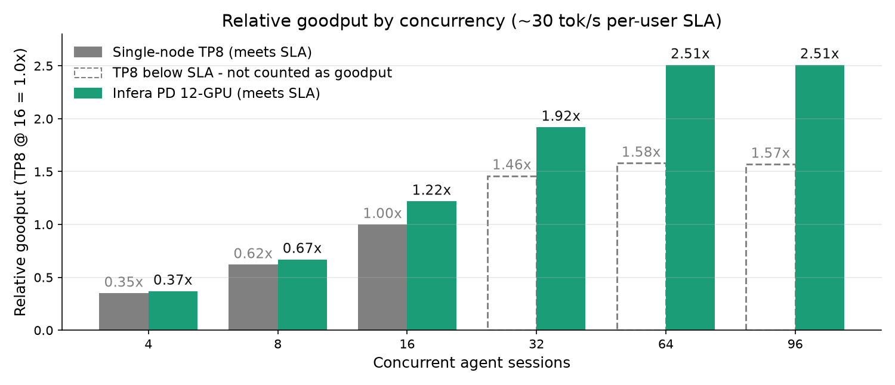
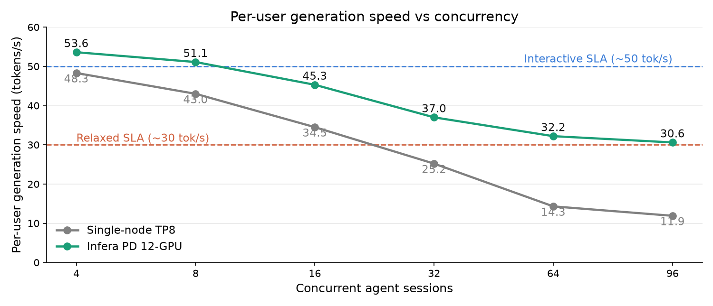

# Kimi agentic benchmark — disaggregation vs. single-node

Reproduces the coding-agent workload from the Infera blog: a long-running, multi-turn
agent session served by **Infera prefill/decode disaggregation (PD)** versus a
**single-instance TP8 baseline**, on Kimi-K2.6-MXFP4 / AMD Instinct MI355X.

At a fixed per-user interactivity target, PD converts additional concurrency into usable
**goodput** rather than raw throughput alone:

- **~30 output tok/s/user:** up to **1.7× higher goodput per GPU** vs. the TP8 baseline.
- **~50 output tok/s/user:** up to **2.6× higher goodput per GPU**.

As concurrency rises, long-context prompt processing interferes with active token
generation in the single-node baseline, so per-user speed drops below target. PD keeps
the two phases apart: dedicated prefill instances absorb the growing input context while
decode instances stay focused on generating tokens.

## Workload

The workload is the multi-turn dataset from the vLLM Mooncake-store benchmark, used to
represent long-running coding / tool-using agent sessions.

| | |
|---|---|
| Model | Kimi-K2.6-MXFP4 |
| Hardware | AMD Instinct MI355X |
| Shared prefix | 20K common tokens across all sessions |
| Per session | first input adds 10K tokens |
| Per turn | +2,048 input tokens, 900 output tokens |
| Turns | up to 30 user turns per session |
| Context growth | ~75K tokens at P50, ~115K tokens at maximum |
| Tool | vLLM multi-turn tool (`benchmark_serving_multi_turn.py`) |

**Metric — goodput.** Total (input+output) token throughput per GPU, counted only at
concurrency levels where the per-user output rate still meets the target (30 or 50
tok/s/user). Beyond that point, extra throughput is not usable serving capacity.

## Topologies

| | GPUs | Layout |
|---|---|---|
| **Baseline** (single-node) | 8 | single vLLM instance, **TP8**, prefill and decode share one batch |
| **Infera PD** | 12 | **4-GPU prefill (TP4)** + **8-GPU decode (TP2×DP4)** over Mooncake RDMA, kv-aware router |

## Results

On this agentic workload, Infera achieved up to **2.4× higher goodput per GPU** and up to
**3.7× higher total goodput** than the single-node TP8 baseline while sustaining
approximately 50 tokens per second per user (about 20 ms per output token). At this
interactive SLA, the single-node baseline holds generation speed only near idle; Infera's
prefill-decode disaggregation keeps decode isolated from long-context prefill bursts,
sustaining **4× higher SLA-compliant concurrency with only 50% more GPUs**.

The advantage persists under a more relaxed SLA of approximately 30 tokens per second per
user (ITL ≈ 33 ms), the operating point shown in the figures below. Here the single-node
baseline stops meeting the SLA beyond a modest concurrency level — its raw throughput keeps
growing, but per-user generation speed collapses, so that throughput no longer counts as
goodput. Infera's 12-GPU PD configuration remains SLA-compliant at 4× higher concurrency
and delivers up to **2.5× higher total goodput** and **1.7× higher goodput per GPU** than
the baseline at its best SLA-compliant operating point.

#### Figure 1 — Relative goodput by concurrency (~30 tok/s per-user SLA)



Total (input+output) throughput relative to single-node TP8 at its highest SLA-compliant
concurrency (16 sessions) = 1.0×. Beyond 16 sessions TP8 still produces raw throughput
(dashed outline), but per-user generation speed drops below the ~30 tok/s SLA, so it no
longer counts as goodput. The Infera PD 12-GPU config stays SLA-compliant through 96
sessions at up to 2.5× the baseline goodput. *Source: internal benchmark, 3-run averages.*

#### Figure 2 — Per-user generation speed vs concurrency



Per-user generation speed in tokens/s (single-node = output throughput / concurrency;
PD = 1000 / ITL p50). The single-node TP8 baseline crosses below the ~30 tok/s line after
16 sessions as long-context prefill interferes with decode; the Infera PD 12-GPU config
degrades gently and stays above it through 96 sessions. *Source: internal benchmark,
3-run averages.*

Both figures are produced by [`plot_results.py`](plot_results.py) (`pip install matplotlib
&& python plot_results.py`); edit the data arrays in it to plot your own sweep results.

## Prerequisites

- The Infera container image (`inferaimage/infera:vllm-v0.1.0`, or a build from this repo).
- Kimi-K2.6-MXFP4 weights on a local path (set `MODEL`).
- vLLM's multi-turn benchmark tool from the [vllm](https://github.com/vllm-project/vllm)
  repo: `benchmarks/multi_turn/benchmark_serving_multi_turn.py` (set `TOOL_DIR`).
- A large plain-text corpus as the token source (e.g. a Project Gutenberg dump). Session
  counts of N≥64 need a multi-million-token file so sessions don't run out of distinct
  tokens (set `TXT`).
- For PD: an `etcd` endpoint reachable by both nodes (set `ETCD_EP`), and RDMA between the
  prefill and decode nodes for Mooncake KV transfer.

Common engine environment (both topologies, already set by the launch scripts):

```bash
export VLLM_ROCM_USE_AITER=1 VLLM_ROCM_QUICK_REDUCE_QUANTIZATION=INT4 \
       HSA_NO_SCRATCH_RECLAIM=1 PYTHONHASHSEED=0
```

Edit `env.sh` (or override from the environment) to point `PREFILL_IP`, `DECODE_IP`,
`ETCD_EP`, and `MODEL` at your cluster.

## Running

### Baseline — single-node TP8 (8 GPUs)

```bash
# inside the Infera container, on the baseline node:
TP=8 bash launch/launch_single.sh

# from the benchmark host:
SESSIONS="1 2 4 8 16 32 64 96 128" NGPU=8 \
  ROUTER=http://<baseline-host>:30000 \
  PREFILL_METRICS=http://<baseline-host>:30000/metrics \
  TOOL_DIR=/path/to/vllm/benchmarks/multi_turn \
  TXT=/path/to/corpus.txt \
  OUT=./results/baseline bash run_sweep.sh
```

### Infera PD (12 GPUs = TP4 prefill + TP2×DP4 decode)

```bash
# prefill node (inside container): prefill engine + router
TP=4 bash launch/launch_prefill.sh      # add KVD=1 to enable kvd L3 offload
bash launch/launch_router.sh

# decode node (inside container):
TP=2 DP=4 bash launch/launch_decode.sh

# from the benchmark host (drive the router):
SESSIONS="1 2 4 8 16 32 64 96 128" NGPU=12 \
  ROUTER=http://<prefill-host>:8100 \
  PREFILL_METRICS=http://<prefill-host>:30000/metrics \
  TOOL_DIR=/path/to/vllm/benchmarks/multi_turn \
  TXT=/path/to/corpus.txt \
  OUT=./results/pd bash run_sweep.sh
```

`run_sweep.sh` writes one row per concurrency level to `<OUT>/summary.csv`. Columns:

```
sessions, req_s, ttft_ms_mean, ttft_p50, ttft_p99, itl_ms_mean, itl_p50,
isl_mean, isl_max, osl_mean, dur_s, in_out_tps_total, in_out_tps_gpu,
l1_hit_pct, l3_hit_pct, combined_hit_pct
```

- **per-GPU throughput** = `in_out_tps_total / #GPU` (`in_out_tps_gpu` column).
- **per-user output rate** = `1000 / itl` (ms) — the interactivity metric.
- **cache-hit** is read live from the prefill engine's `/metrics` prefix-cache delta.

## Reading the result

For each topology, find the highest concurrency level whose per-user output rate still
meets the target (e.g. `itl_p50 ≤ 33 ms` for ~30 tok/s/user, `≤ 20 ms` for ~50). The
per-GPU throughput at that level is the goodput; the PD-vs-baseline ratio is the speedup.
On this workload PD holds ≥30 tok/s/user to far higher concurrency than the baseline,
because decode runs isolated from long-context prefill.

Run each configuration a few times and take the median; drain the engine (let in-flight
requests finish) between points so a heavy prior level doesn't bleed into the next.

> These are early results. Coverage across models, workloads, engines, AMD Instinct GPUs,
> and deployment topologies is expanding.
