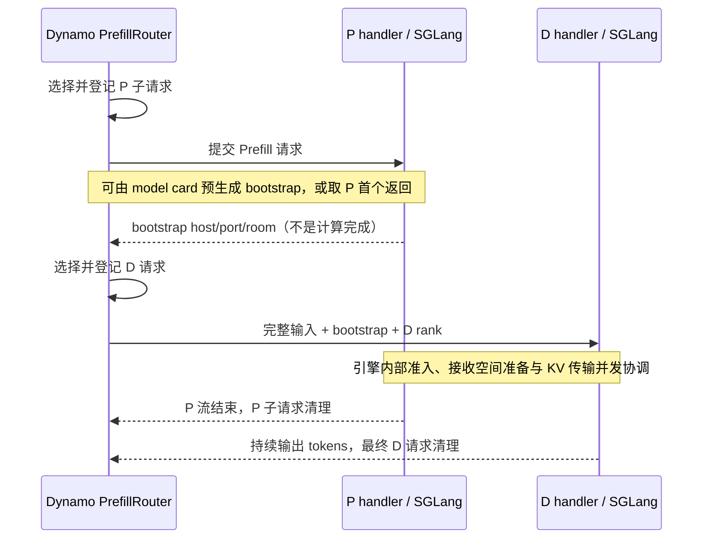

# NVIDIA Dynamo 调度与缓存调研：C80/C112 联合优化方案

日期：2026-09-23。

**状态：已完成固定 Dynamo commit 的路由、P/D 编排、缓存事件与分层索引、Planner 源码核验，并更新与当前 C80/C112 系统的对照。** 本文是源码研究与实验方案，不是 Dynamo 部署性能验收。

源码版本：`ff3ac59e83c73e03b98a5d0ec192ec28847130f7`（2026-09-23，开发分支快照），本地目录 `/perf_apps/liyingli/bench_agentx/dynamo-source-ff3ac59e`。所有 `[Sxx]` 引用指向该 commit，不能直接视为某个已发布版本的行为。源码文件 SHA256 与核验范围见 [取证清单](dynamo-source-audit-manifest.json)。旧下载问题已解除，历史见 [恢复记录](SESSION-RECOVERY-20260923.zh-CN.md)。

本文区分三种证据：Dynamo 本仓库的**代码事实**、随该 commit 保存的**支持文档声明**、当前 Infera 实验的**运行证据**。后端引擎和传输库不是本次固定仓库中的完整实现；涉及它们的物理分配、kernel 和传输释放细节，不以 Python 适配层推测代替端到端验证。

相关资料：

- [原 C80/C112 分析报告](RECOVERY-AND-FINDINGS.zh-CN.md)。
- [调度链详细问答](SCHEDULING-QA.zh-CN.md)。
- [新增离线证据](joint-cache-evidence.json)与[复算脚本](../scripts/analyze_joint_cache.py)。
- [已完成 8K chunk 实验复核](chunk8k-31625/final/REVIEW.zh-CN.md)。

## 目录

1. [核心判断与建议顺序](#conclusion)
2. [Dynamo 的实际调度与缓存机制](#dynamo)
3. [当前系统对照及采用建议](#comparison)
4. [新增实验数据审计](#data)
5. [先把长尾 miss 分成六类](#miss)
6. [最小 debug 数据闭环](#debug)
7. [可实施的调度与 cache 联合方案](#solutions)
8. [验证矩阵与收益判据](#experiments)
9. [源码证据与剩余实验](#sources)

<a id="conclusion"></a>
## 1. 核心判断与建议顺序

**联合调整调度和缓存值得优先投入，但应先证明长尾 miss 中有多少可以避免，再选择策略。** 现有证据支持“长尾 miss 增加 P 服务需求并引发连锁等待”，尚未证明这些 miss 主要由路由选错位置或缓存容量不足导致。

需要把两个问题分开：

- 定位瓶颈：少量请求贡献大量 miss，横跨多轮 Prefill，影响请求供给和等待。
- 找到可消除的工作：这些请求在到达时，是否本来就有正确、可复用、可及时取回的 prefix KV？

如果多数是从未计算过的新前缀，提高 cache affinity 不会消除它们的首次计算。如果其他 rank 已有完整前缀，路由修正可能直接省掉多轮 Prefill；如果同 rank 的前缀刚被驱逐，保留／容量策略才是关键；如果 prefix 已在 host，却未被正确识别或回读，扩 GPU 容量未必是第一步。

建议顺序：

1. 核对实际 token 前缀、缓存事件和命中记账的正确性。
2. 为 miss≥32K 请求记录所有候选 P rank 的可兑现命中与预计等待，先做 shadow 审计。
3. 根据 miss 分类，只实施一个最有证据的改动：纠正缓存视图、改善前缀放置，或减少不必要驱逐。
4. 加入短时间尺度的真实 P 剩余工作与 D 分配压力反馈，验证联合效果。
5. 若 D 提前预分配仍显著限制系统，再研究两阶段 credit／reservation，不能直接延后现有 D prealloc 调用。

按用户决定，**不安排“给新短请求保留份额／改变 chunk 续跑公平性”的实验**。优先减少真实 miss 和服务需求，而不是重新分配等待。

本地已有 8K 实验：长 miss 组 chunk 数由 18.80 降至 10.15，但未观察到总体吞吐收益。Prefill 节点不同，不能把差异全部归因于 chunk；这至少说明“轮数减少必然提速”不成立，不应把尚未执行的 4K→8K 当作唯一首选下一步。

<a id="dynamo"></a>
## 2. Dynamo 的实际调度与缓存机制

本节阅读入口： [P 评分](#p-score) · [P 负载生命周期](#p-lifecycle) · [Router 准入](#router-admission) · [D 评分](#d-score) · [SGLang 时序](#sglang-flow) · [其他后端](#backend-flows) · [分层缓存](#tier-cache) · [一致性与 KVBM](#cache-boundaries) · [Planner](#planner)

### 2.1 先分清三个调度层

Dynamo 决定请求交给哪个 worker/DP rank、是否先在 Router 等待，以及怎样编排远端 Prefill；SGLang、vLLM、TensorRT-LLM 决定本地 KV 能否分配和下一轮 GPU batch。Planner 决定实例数。这三个层次的 admission 含义不同。

| 层次 | 本版本实际职责 | 与当前问题的关系 |
|---|---|---|
| Router 选目标与排队 | 根据缓存和逻辑负载选择 worker+DP rank；可配置路由等待队列；派单前登记 booking | 少派到缺缓存或积压严重的目标；可把一部分等待留在引擎之外 |
| 后端本地 admission/batch | 适配层调用引擎；槽位、物理 KV、chunk 与 batch 由引擎控制 | Router booking 不保证 D 立刻能接收 KV，也不改变 SGLang chunk 续跑规则 |
| Planner | 根据流量模型或 ForwardPassMetrics 调整 P/D 实例数量 | 固定 P8D8 的单次 rank 优化不能靠扩副本策略替代 |

生产默认评分在 `lib/router-plugins/builtin/src/default/scorer.rs`，并非文件名看似对应的 `selector/reference.rs`；后者用于测试/benchmark 对照。以下公式以生产插件为准。[S01][S02][S05][S17][S32]

<a id="p-score"></a>
### 2.2 P rank 怎样选：当前请求成本与已派工作一起算

忽略 taint、显式 pin、会话绑定和自定义插件，默认评分可写为：

```text
b = KV block 的 token 数
I = 当前请求完整输入 tokens
A(r) = Router 估算的该 rank 尚未完成的有效 Prefill tokens
G(r), H(r), K(r) = GPU、host、disk 的分层连续前缀命中 blocks
S(r) = shared pool 中超出 GPU 前缀范围的命中 blocks

credit(r) = c_eff(r) × G(r) + h × H(r) + k × K(r) + s × S(r)

cost(r) = a × max((A(r) + I) / b - credit(r), 0)
        + projected_decode_blocks(r)
        + q × active_requests(r)
```

这是有负载快照、开启 Prefill tracking 的常见路径。无负载快照时 prompt 项用 `I/b`；关闭 Prefill tracking 后 raw prompt 项为零。`projected_decode_blocks` 是 active block 的请求相关投影，不是 allocator free/used gauge；Prefill 独立池关闭 active decode-block tracking，避免重复计入 D 成本。[S01][S04][S07]

普通默认参数为 `c=1, a=1, h=0.75, k=0.25, q=0`；shared multiplier 的 Rust 配置默认值为 **0**。共享缓存文档中示例使用 `0.5`，不能将它当作 Rust 默认开启值。GPU credit 的负载衰减默认关闭；queue threshold 默认未设置；这些能力需要分别启用。[S03]

在仅 GPU 缓存、普通独立 P 池、上述默认参数下，式子近似为：

```text
cost_P(r) ≈ (该 rank 已派未完成的有效 Prefill tokens
             + 当前请求需重新计算的 tokens) / block_size
```

因此它同时考虑“当前请求送过去要算多少”和“前面已经派了多少工作”。它不是当前 Infera 的 `-20×hits + distinct_active + recent`，也没有同义的 recent 按派单次数乘 0.97 项。

举例，block size=64，输入=64K，A rank GPU hit=48K、有效 backlog=32K，B rank GPU hit=32K、backlog=8K：

| 候选 | 新请求 miss | backlog + miss | 默认 P cost |
|---|---:|---:|---:|
| A | 16K | 48K | 768 |
| B | 32K | 40K | 640 |

此时选 B，虽然它命中少。如果 A backlog 降到 8K，则 A 的 cost=384，应选 A。**命中更高仍可能输给等待成本，但等待成本目前主要用 token 负载代理，而非逐请求真实完成时间。** 不同 context、batch、DP 同步与 AMD kernel 的成本差异，仍需本地校准。

当开启 `overlap_score_credit_decay=d>0` 时，GPU 加分变为：

```text
excess(r) = max(A(r) - min_eligible A, 0) / b
c_eff(r) = c / (1 + d × excess(r) / request_blocks)
```

它降低相对积压 rank 的 GPU 缓存吸引力；host/disk/shared credit 不随这一项衰减。把 credit 调到大于 1 可以强化缓存亲和，但 prompt cost 会被截断到零；多个候选都变零时，继续增大 credit 未必还能区分它们。[S01]

最终默认 temperature=0 时取最小 cost，同分随机打破；temperature>0 使用按候选成本范围归一化的 softmax 抽样。显式目标、eligibility、会话 affinity 和插件可能先改变候选集合，故不能仅凭公式重现所有 pick。[S02][S05]

<a id="p-lifecycle"></a>
### 2.3 P 的有效负载从哪里来、何时扣掉

Router 选择目标后，以该目标的缓存估计计算有效 Prefill tokens，登记到本地序列账本。没有预测模型时，这笔工作主要靠生命周期结束/Prefill 完成事件扣除，并不是每执行一个 SGLang chunk 都收到实时进度。[S05][S08]

默认 `router_prefill_load_model` 关闭。可选预测器接收 batch size、effective ISL、prefix，返回预计耗时；Prefill tracker 可据时间推进估计剩余量。这是模型推算，不能称为 GPU 测得的剩余算力；预测缺失时保留无模型路径。[S03][S08][S33]

生命周期分两种：

- 通用 request guard 看到非空输出 tokens 时可标记 Prefill 完成，继续保留请求后续生命周期；请求退出、失败或重试时释放 booking。
- SGLang 独立 P handler 首先只返回 bootstrap、随后在后台消费引擎结果。这个空 token 的 bootstrap **不会**被 guard 当成 Prefill 完成。P 子请求流结束后清理自己的 booking，不要求一直等到完整 D 输出结束；这一时刻可能包含传输等待，而不是纯 GPU 最后一个 kernel 的结束。[S06][S09][S10][S26][S27]

这对当前实现有直接借鉴价值：分开 P 工作与 D 输出的生命周期。但更细的“P compute 已完成、P transfer 仍在占资源”仍需要自己的事件，不能把 Dynamo 子请求结束等同于理想的 compute-only 负载。

<a id="router-admission"></a>
### 2.4 Router admission：可配置的排队与串行登记

`SchedulerQueueActor` 在一次派单中更新负载投影、选择目标、登记 `SequenceRequest`，再把选择结果交还调用者；接收者已取消则跳过登记，响应交付失败则撤销 booking。它避免同一 actor 内一批请求都依据尚未更新的旧负载派出去。[S05]

路由队列的忙碌判据可按 policy class 设置：

```text
busy = A(r) > absolute_prefill_threshold
    或 A(r) > threshold_fraction × max_num_batched_tokens(r)
```

还有 queued requests、raw ISL tokens、cached tokens 的每 worker 队列上限。多个 class 之间用 DRR 分配机会；class 内支持 FCFS/LCFS/WSPT 等顺序以及优先级/期限处理。WSPT 是路由等待队列的策略，不是修改 SGLang 内部的 chunk 续跑额度。本文仍不安排用户已排除的公平性实验。[S05][S19][S34]

有三个限制必须保留：

1. 默认未配置 queue threshold，不会因为“Dynamo 有队列”就自动有有效背压。
2. 这些 threshold 和 booking 是 **Router 的负载/容量管理**；不是本次 D allocator 两道门槛、512 增长预留和 metadata slots 的完整副本。`max_num_batched_tokens` 也不是 D 总 KV 容量。
3. 串行 actor 管理本地登记；跨多个 Router 的同步和覆盖范围是额外条件。不能把它当作全局强一致的物理容量 credit。默认 `router_replica_sync=false`。[S03][S05]

选中 worker 后发生资源错误，并没有一个对所有后端都适用的“自动重选、继续同一 KV 写入”协议。Prefill 编排会将资源耗尽/worker overloaded 等错误向上返回；若做迁移/重试，必须按 attempt 清理 booking，已经建立的传输也需要后端协议配合。[S06][S09]

<a id="d-score"></a>
### 2.5 D rank 怎样选：普通分离式路径主动采用负载评分

这里有一项比初稿更明确的代码事实：普通 remote-prefill 路径转入 Decode 时，会设置：

```text
overlap_score_credit = 0
assume_kv_reuse = false
track_prefill_tokens = false
```

conditional disaggregation 可以保留 Decode overlap credit，但仍需区分这个可选路径；默认 conditional disaggregation 关闭。[S03][S09]

`assume_kv_reuse=false` 使输入 active tracking 使用随机 block 身份，避免把不同请求的相同前缀当作共享物理 KV。默认普通 D 分离式评分因而主要是：

```text
cost_D(r) = 该 rank 已跟踪的 active blocks
          + 当前请求新增的 active blocks
          + q × active_requests(r)
```

默认 q=0；输出 block tracking 默认关闭，可选开启。账本记录的是已被 Router 接纳的请求，在 D 尚未开始生成、还在等待上游时也存在。相比本次 Infera D 的 hits/active/request blocks 全零、只按 recent 次数派单，Dynamo 能保留输入大小的差别。[S01][S03][S04][S05]

但这仍是 **由请求推导的 active footprint**，不是引擎所有物理 KV、页尾、增长余量和在途分配的精确总和。输出增长、取消收尾、其他入口流量和多 Router 状态覆盖都可能造成偏差。它补足本次缺失的需求记账，却不能直接替代 D admission。

<a id="sglang-flow"></a>
### 2.6 SGLang：先完成路由准入，再让 P/D 并发推进

本仓库的真实顺序如下。[S09][S10][S26][S27]



若 model card 已有 bootstrap 地址，Router 可预生成 room 并在后台消费 P 流，随后推进 D；不必等 P 的第一条 bootstrap 消息。图中的 P 返回是另一条兼容路径。room 编码还会配合 DP rank/size，P/D handler 都将所选 rank 传给 `data_parallel_rank`。[S09][S10][S26][S27]

P handler 把本地请求提交给 `engine.async_generate`；D handler 收到 bootstrap 后把同一个传输房间信息交给自己的引擎。**Dynamo 适配层没有把 SGLang 的本地预分配改成“P 算完才分配”。** 当前 Infera 镜像的 optimistic=0、D 提前准备输入 KV 再让 P 正常推进，仍是需要针对具体 SGLang 版本检验的底层机制。不能因这个框架更换就认定它消失了。

P 后台任务在客户端断开时不会简单中止；handoff 层观察 P 错误并停止/报错到 D 响应，D 的成功终结也要等待 P 任务成功，避免先报成功再收到晚到的 P 错误。这是传输生命周期保护，不是保证永远不泄漏的实验证据。[S11]

<a id="backend-flows"></a>
### 2.7 vLLM 与 TensorRT-LLM：不能套用 SGLang 的时序

| 后端/connector | 本仓库核查到的调用链 | 不能从适配层推出的结论 |
|---|---|---|
| vLLM + NixlConnector | P 设置 remote-decode 参数、执行一 token Prefill；返回引擎提供的 KV transfer params；Router 再交给 D；D connector 按远端信息取 KV | NIXL 源 KV 何时解锁、D 内部每一页何时分配，需要对应 vLLM/connector 源码与运行证据 |
| vLLM + MooncakeConnector | P 提前生成 transfer_id；响应把同一 ID 和 P bootstrap 地址交给 D；适配不同于 NIXL 的协议 | 不能把此处 Mooncake protocol 等同于当前 SGLang Mooncake 的 bootstrap/prealloc 实现 |
| vLLM + LMCacheMP | P 写共享缓存；D 按 token hash 取；交接 envelope 中 KV 参数可为空，部分 miss 可以本地重算 | 存在共享缓存接口不等于 D 100% 命中，也不等于无额外 copy |
| TensorRT-LLM | P 使用 context_only，返回编码的 disaggregated params；D 解码后设置 generation_only；非终结请求缺少合法 ctx_request_id 会被 Router 拒绝 | KV 分配与传输完成语义在 TRT-LLM 引擎，不能拿来证明 SGLang 的 D 驻留已解决 |

vLLM 普通返回结果的路径与 SGLang 早期 bootstrap 不同：Router 的非-bootstrap 分支消费 P 返回/流完成后交给 D。P 引擎响应完成和底层所有异步发送/源缓存解锁也不是一回事。[S09][S12][S13][S14]

结论是：Dynamo 没有一个跨后端完全一致的 P-first/D-first 内存协议。对于当前问题，应借鉴“让请求尽量在 P Router 尚未准入时等待、明确 P/D 的资源生命周期”，不能直接移植某个后端的交接次序。

<a id="tier-cache"></a>
### 2.8 GPU/host/disk/shared：有分层索引，但需要真实事件

SGLang publisher 按 worker 和 DP rank 订阅引擎 KV 事件，带 block size 转交 `KvEventPublisher`。归一化器根据 medium 和 locality 区分可接收事件；未知 medium、非本地 locality 等会按原因过滤。publisher 处理 Stored/Removed/Cleared，保留存储层信息并记录原始事件序号缺口。[S15][S16][S28]

GPU 用主前缀索引；host/disk 等用 lower-tier 索引。查询按 GPU→host→disk→external 的前缀延续推进：某 rank GPU 命中 N 个 blocks 后，host 从 N 的位置继续找连续前缀，不把 GPU 与 host 中同一前缀重复计入。[S18]

例：GPU 有前 10 blocks，host 有前 30 blocks，host 延续项是 20，而非再加 30。默认加分为 `10 + 0.75×20 = 25 blocks`。这是路由中的成本折扣，不意味着只回读 15 blocks，也不意味着 0.75 就是当前机器上精确的“回读/重算速度比”。

固定 commit 的支持文档给出如下条件；它们是版本与集成声明，不是本次 AMD 环境的实测结果。[S20]

| 路径 | 文档与适配代码给出的边界 |
|---|---|
| SGLang HiCache host | 文档要求 SGLang 0.5.11+ 发布 CPU_PINNED 事件；更老引擎即使能 offload，Router 也可能只看到 GPU |
| SGLang + Mooncake shared | 文档要求 0.5.13+ 并配置 HiCache storage backend 与 Router shared-cache lookup；它是第三层共享池，不应另造一个 SGLang disk 层 |
| vLLM native CPU offload | 文档要求 0.24.0+、OffloadingConnector、自描述 KV events，所列路径主要为 aggregated；不能直接外推所有 PD 组合 |
| vLLM STORAGE | worker-local 映射到 Disk；REMOTE/未知 locality 不纳入该索引；文档标注尚未充分验证，salted namespace 也有限制 |
| TRT-LLM native host | Router 看到合并的 GPU+RAM 缓存视图，无法套用独立 host 权重 |

当前实验是 Unified Radix。必须验证它实际发布的 GPU/host insert、evict、load-back 事件与 DP 归属；HiCache 的支持文档不能证明 Unified Radix 已经发出相同事件。更不能把“Router 能看到 host”理解成“任意 P rank 都能直接读取另一 P 的 GPU prefix”。数据读取仍需本地引擎或共享缓存/传输集成。

<a id="cache-boundaries"></a>
### 2.9 缓存一致性、预测命中与 KVBM 的边界

**事件恢复。** 本版本包含按 publisher/source 身份与 rank 管理的恢复状态机，处理 reset、失效源隔离、恢复目标和失败重试。publisher 自身也有序号缺口诊断。[S16][S21] 但 publisher 发出 Stored 只能证明它收到并发布了该事件；原始引擎到 publisher 已丢掉的历史，不能仅靠重放 publisher 缓存凭空找回。应分开记录 engine→publisher 与 publisher→router 两段的覆盖。

**无事件时的近似索引。** `use_kv_events=false` 有按请求推断的 TTL/可选 LRU 路径，普通 TTL 默认 120 秒；默认仍是事件模式。另有显式 `router_predicted_ttl_secs` 创建短 TTL 的 predict-on-route side indexer，要求同时开启真实 KV events，默认不启用。[S03][S22]

因此本版本**有**推测性放置提示，不能说它永远只看已完成的真实事件；但路由预测不是 producer 已完成的证明，也不是可靠的“相同前缀只算一次”屏障。当前 fan-out 若要减少重复计算，仍应记录 producer 开始/完成、超时和取消，先量化机会。

**KVBM。** KVBM 管理 GPU→host→disk→object storage 的缓存资源与搬运；它和 KV Router 是不同组件。此 commit 的 Python 集成目录包括 vLLM、TRT-LLM connectors，SGLang 路径在本报告核查的是原生 HiCache。不能把 KVBM 配置参数直接用于 Unified Radix，也不能将 router 的近似 LRU 视作引擎真实 eviction policy。[S23][S30][S31]

KVBM 的 offload 优先级、transfer batch/concurrency 是可借鉴的控制维度；要判断当前系统该扩 cache、保护前缀还是改善 host 回读，仍由第 5–8 节的数据归因决定。

<a id="planner"></a>
### 2.10 Planner：调副本，而非接管每个请求的 cache 决策

本版本 Planner 有两条来源：[S17]

- **Throughput-based**：流量预测配合引擎性能模型，求满足 TTFT/ITL 目标的副本数。
- **Load-based**：接收 ForwardPassMetrics；SLA 模式利用在线回归，其他目标可用 queue/KV utilization 门限。

代码在 disaggregated 模式分别计算 P、D 目标副本数，再应用 throughput 下限、最小实例数和预算；扩缩容进行中或观测实例数不一致时会跳过部分决策。P 的回归使用 queued prefill tokens、max batched tokens 和 hit-rate 信息估计 TTFT；D 使用 scheduled/queued decode KV 估计 ITL，并在缩容时检查合并后的 KV 能否放下。[S24]

FPM 支持 per-rank 信号不代表每个 DP rank 都是可独立扩缩的实例。P8D8 当前是固定部署，尤其存在 attention-DP 协同，不能把 rank 当作独立 GPU worker 增减。对本次最有用的是借鉴 FPM 的测量和回归，而不是启动 autoscaling。平均命中率或平均 ISL 模型也不能替代对 miss≥32K 长尾的单独分析。

<a id="comparison"></a>
## 3. 与当前 Infera/SGLang/AMD 系统的对照及采用建议

### 3.1 哪些机制值得借鉴

| 问题 | 当前实验的运行证据 | 固定版本 Dynamo 代码事实 | 建议 |
|---|---|---|---|
| P 缓存视图 | 有事件和 prefix hash，但无全候选快照；旧 host 插桩路径不生效 | 分 tier 索引、worker+DP 归属、事件过滤/缺口/恢复 | 优先补实际 Unified Radix 事件与候选命中审计 |
| P 负载生命周期 | P/D 共用 guard 可让 P active 持续到 D 结束 | 独立 P 子请求 booking；有效 Prefill token tracking | 先 shadow 分离 compute、transfer、D completion 的记账 |
| D 输入需求 | 实测 21,151 次 D pick 的 blocks/hits/active 全零 | 普通分离式 D 禁止前缀共享假设，按输入 active footprint 记账 | 优先补完整输入需求、输出增长与待分配需求 |
| 派单并发 | 仅看旧负载可能重复使用同一容量估计 | actor 串行选择与 booking，响应失败回滚 | 可借鉴；仍要与实际 D 预算对账 |
| D 等待 P 驻留 | 提前输入分配等待 P，C112 驻留代理扩大 | SGLang bootstrap 后 P/D 并发；没有统一延迟物理分配协议 | 不宣称迁移已解决；评估在 P Router 阶段背压是否减少 D 等待 |
| 缓存亲和与热点 | 尚未量出全 rank 可避免 miss | 默认 backlog+新请求成本；可选 GPU credit 衰减 | 借鉴成本分解，权重用本机数据校准 |
| Prefix 留存/回读 | GPU/host resident 接近满，不等于全部不可驱逐 | 有原生 HiCache/独立 KVBM 路径，能力逐后端不同 | 先区分驱逐损失和 host 不可兑现，再调策略 |
| Batch/chunk | 当前每 rank 4K、已有 chunk 续跑 | Router 不接管引擎 batch | 保持既定“不做 chunk 公平性实验” |

### 3.2 AMD 与当前定制镜像的兼容性结论

本次固定仓库的标准容器渲染器 device choices 为 `cuda/xpu/cpu`；其文档列出的 SGLang 主线引擎 pin 为 0.5.19，容器依赖有自己的 CUDA/NIXL 组合。[S25][S29] 这不足以证明 Dynamo 在所有 AMD 环境都不可用，但**没有建立当前 AMD/ionic/Mooncake/Unified Radix 镜像可直接替换运行的证据**。

要移植的首先是 CPU 侧调度与观察协议；要替换整个框架则至少涉及 model card、KV block/hash 与事件、DP rank 标识、engine API、传输内存注册、KV layout、取消及超时收尾。本次源码研究没有编译或部署这些组合，也没有测试 GPU 传输。

### 3.3 当前选择：先做局部修正，保留对照部署选项

当前建议是 **借鉴设计并逐项改当前系统，不先迁移整个推理栈**。实施顺序为：

1. 给 Unified Radix 的真实缓存路径补证据，产出全候选缓存机会与六类 miss 的账本。
2. 在 shadow 中比较当前评分与“P 剩余服务需求 + 新请求成本”；同时修正 D 输入需求账本和本地预算的差异。
3. 根据证据只选择一个改动做 A/B：事件正确性、前缀放置、缓存留存、host 回读或负载生命周期。
4. 若本地改动无法覆盖明确需要的共享缓存/恢复能力，再考虑移植特定组件或单独建 Dynamo 对照。保持实际 token replay、初始缓存、资源预算和模型一致。

P Router 背压可以作为后续设计候选：让尚未取得 P 服务机会的请求暂不占 D 输入 KV。但必须同时衡量它是否减少全局 idle、是否只把等待移位，以及是否延迟 D 供给；它不是未经测试就应开启的吞吐优化。第 7.7 节的两阶段 credit 仍是我们提出的设计，**不是 Dynamo 已实现的 SGLang 物理 KV reservation 协议**。

<a id="data"></a>
## 4. 新增实验数据审计

### 4.1 长尾计算量与 D 驻留不应混为一谈

本轮从原始 joined 请求明细复算，口径为有效 profiling cohort，尾组是实际 miss≥32,768：

| 指标 | C80 | C112 |
|---|---:|---:|
| 有效请求 | 9,651 | 9,321 |
| 长 miss 请求 | 332 | 450 |
| 长 miss 组占全部 miss | 41.58% | 57.03% |
| 长 miss 组平均 P forward | 19.13 秒 | 30.94 秒 |
| 全体 D 等待输入 KV 驻留代理 | 310.13 万 token | 863.40 万 token |
| 长 miss 组自身 D 等待驻留代理 | 30.33 万 token | 109.28 万 token |
| 长 miss 组自身占 D 等待驻留代理 | 9.78% | 12.66% |

驻留代理为 `Σ(input_tokens × D_transfer_wait_seconds) / 3600`，不是瞬时页数；未裁剪请求尾部到发送窗口，不含输出增长和页对齐。

**少量长 miss 请求贡献大量计算，但 D 等待 KV 的占用主要在其他请求。** 这与“重尾 P 服务拖慢其他高命中、长输入请求”的机制相容；它不是逐请求阻塞因果证明，还需同 rank 时序与 batch 关联。优化时应同时观察被拖慢的其他请求，而非只观察长 miss 组自己的 D 内存。

这也细化了“不做短请求保留份额”这一判断：短 miss 请求可能有非常长的总输入，占用很多 D KV；不能简单用 miss 长短代表内存大小。当前仍按用户决定不做公平性实验，重点是消除多余计算。

### 4.2 同一 source position 不保证同一实际输入

使用 `(source_trace_id, source_outer_idx, source_inner_idx, source_kind)` 对齐：

- C80/C112 各自 source position 无重复、无缺失。
- 两档共同位置 7,227 个。
- 只有 1,905 对实际 input token 数相同。
- 这 1,905 对中，1,742 对选择了不同 P rank。
- 相同长度子集的总输入均为 251,332,701 token，但 miss 从 11,263,837 增至 16,100,381。

**不能因此宣称“换 rank 导致 miss 增加”。** 相同位置和长度都不证明 token ID 一样；两档顺序运行、缓存历史不同，rank 改变本身也可能是合理的路由响应。这个审计的价值是：下一次必须记录实际 token-prefix digest，才能做可靠的配对和 replay。

### 4.3 已有 8K 实验对下一步的影响

本地 [8K 复核](chunk8k-31625/final/REVIEW.zh-CN.md) 记录：

- 输出吞吐 -1.22%，完成请求 -0.69%。
- P queue 均值 -19.58%，P forward 均值 +44.37%。
- TTFT mean +7.91%，p50 +27.39%。
- 22 个共同 context/miss/host 分组统一加权 forward +48.48%。
- 长 miss 组 chunk 数由 18.80 降至 10.15，chunk envelope 均值由 1.018 秒升至 2.042 秒。

这不是严格同节点因果实验，也不证明 8K 永远无益；但不能继续用“轮数少一半”预测吞吐会提升。原复核提到的同节点 4K 对照是否已完成，本轮未核查其后续状态；本文不启动或重复该实验。

<a id="miss"></a>
## 5. 先把长尾 miss 分成六类

分类应按请求的前缀区间进行，一个请求可以同时含多类 miss。不得把整条请求粗暴归到唯一原因，或对同一段重复记账。

| 类别 | 定义 | 证明需要什么 | 优先处理 |
|---|---|---|---|
| 首次访问／内容变化 | 到达前从未产生过相同有效前缀 | 实际 token 链、历史已完成 KV；warmup 之前缺失时标 unknown | 接受必要计算；优化前缀稳定性须保持语义 |
| 放置／路由损失 | 选中 P 无缓存，其他 P 有可兑现前缀 | 到达时所有候选 rank 的缓存状态、锁和可用性 | cache-aware placement、有限会话亲和 |
| 保留／容量损失 | 历史曾计算，但需要时已不在可用缓存层 | 插入、驱逐、host 副本、重用间隔和容量 | 留存策略、限制污染、工作集容量 |
| 目录／匹配错误 | 实际有 KV，但事件索引、hash 或元数据不一致 | engine 与 router token/block 对照、事件序列与快照 | 先修正确性，不先调权重 |
| 慢层不可兑现 | host 有数据但无法及时回读、被门限拒绝或未接入 | host match、load submit/finish、拒绝原因、bytes | 回读路径、预取、容量和 I/O 成本 |
| 并发重复计算 | 另一请求正计算相同前缀，尚未发布为可用缓存 | prefix digest、producer 生命周期、batch/完成事件 | 有界等待、前缀生产者协调，谨慎避免重复算 |

只有拥有完整到达前历史，才能称为“compulsory miss”。只有在单 rank 相同访问序列下进行保留策略对照，才适合把损失细分为严格容量 miss 或替换策略 miss。有限采样无法支撑时统一写“未知／待区分”。

### 5.1 三个可计算的 oracle

1. **实际可兑现的全 rank oracle**：到达时哪一个可接纳 P 的 GPU／host 前缀能以最低预计成本使用？用于估计路由机会，不允许访问未来缓存。
2. **历史无限容量 oracle**：只保存该前缀首次完成后的缓存历史，不驱逐，估计历史重用上限；必须包括 warmup，或明确截断历史。
3. **当前容量的不同保留策略 replay**：使用相同访问顺序、页粒度、锁、层级和传输限制，比较保留价值，而不是简单累加所有命中潜力。

Oracle 1 的 GPU 命中增量可写为 `max_rank GPU_prefix_hit - chosen_GPU_prefix_hit`，但它仅是 token 机会。真实可优化量还要考虑该 rank 是否能准入、排队成本和事件滞后。Host hit 需按“最终可复用总前缀”统一计算，不能与 GPU hit 重复累加。

离线换路由会改变后续缓存和排队历史。固定原轨迹的 shadow 只估计当时机会，不能直接宣称整小时可节省多少总 token 或吞吐；需要闭环 replay／实际对照确认。

<a id="debug"></a>
## 6. 最小 debug 数据闭环

### 6.1 关联键与时间

优先复用现有 RID、source position 和 DP rank。新增各组件本地单调时钟、事件序号、router decision ID 及接收时刻；不使用不同机器 wall clock 的亚秒差值推导因果。事件应能从 router pick 关联至 P admission、chunk、KV transfer 和 D prealloc。

在 engine 实际 tokenize 完成后生成 token-prefix 链式 digest，与 Router 的 tokenizer、模板版本、block size、模型/cache 身份一致。只对长度或渲染文本做 hash 不足以验证实际 token 相同；模型版本、位置编码等会影响 KV 有效性。

### 6.2 需要新增的最小字段

| 位置 | 必要记录 | 目的 |
|---|---|---|
| Router 每次 pick | 全候选 P/D rank、命中前缀长度／层、完整评分分量、有效权重、候选是否可接纳、索引事件序号与年龄 | 判断是否有更好且可用的候选；当前只记选中 rank 不够 |
| P 实际匹配 | 实际 input digest、GPU/host/storage 连续前缀、最终承诺复用长度 | 检查 router 命中是否兑现 |
| P admission | 候选 miss/context、预算前后值、选中 extend 范围、停止原因、是否已加入 batch | 区分空间不足、chunk 用完和回读问题 |
| P 每轮执行 | batch ID、各 rank context/miss、chunk 范围、CPU 提交与 GPU event 时间 | 分离 kernel、同步、调度间隙 |
| Unified cache | insert/evict/load/writeback 的 node/block digest、层、bytes、锁、原因、submit/finish | 判定缓存丢在哪里、回读是否值得 |
| D prealloc | input、完整两门槛、free、增长预留、slots、waiting-for-P token 总量 | 不能只记录 required 门槛一 |
| 请求收尾 | P 最后计算、P transfer 完成、D ready、D completion、guard 释放 | 修正负载生命周期和驻留账本 |

缓存事件与 token digest 的覆盖必须足够完整，才能判断某个 prefix “不存在”。可将昂贵的 device profile 限定在短代表窗口；不能采样掉关键 cache 历史后，把未看到当成从未存在。全候选 pick 日志可限于短窗口或异常触发，但需记录覆盖范围。

本次旧 host 插桩在 hiradix，而实际用 Unified Radix。新增 host 日志必须落在实际 `_load_back_transfers / init_load_back / loading_check` 路径，不能重复使用不生效的事件。

### 6.3 先做四个一致性检查

1. Router 认为命中 H 个 GPU blocks，P 实际 GPU hit 是否接近 `H × block_size`？差异需排除对齐／边界处理，再查事件滞后和驱逐。
2. Router 看不到某前缀时，其他 rank engine snapshot 是否真的也没有？快照要带事件游标，避免时间不一致。
3. cache 已报告 load 完成后，是否兑现了预期 prefix，后续 miss 是否相应下降？有 bytes 不等于被请求实际复用。
4. 先统一 allocator/cache 指标口径：若 `used` 已包含可驱逐缓存，检查 `used + free = capacity`，再将 used 分为锁定与可驱逐部分；只有 used 专指不可驱逐占用时，才可用 `used + evictable + free = capacity`。锁状态能否解释在途传输和回读？

若发现 hash／事件正确性问题，先修它，不继续用权重 sweep 掩盖错误。

### 6.4 建议的 debug 输出

每个 miss≥32K 请求生成一行：源位置、实际 digest、总输入、GPU/host hit、miss、P rank、最佳可行候选、可避免 token 区间、等待、chunk 数、host bytes、D token-seconds、分类及证据覆盖度。

然后按“可避免 miss tokens”与“预计可节省 P 服务时间”排序。二者都应保留，因为长 context 下每 token 成本不同。不要按 TTFT 最大直接排序后就将所有尾延迟归为计算 miss。

<a id="solutions"></a>
## 7. 可实施的调度与 cache 联合方案

以下公式与策略是**针对当前系统提出的设计，不是 Dynamo 当前实现的复述**。

### 7.1 先修正路由的缓存视图与 P 负载生命周期

若目录有误，修复 rank 标识、block hash、快照／增量衔接和事件丢失恢复。不要用周期性清空热缓存作为正常“修复”手段，那会主动制造冷 miss。

P 的负载应在实际计算／交接完成的合适阶段分别扣除，不能一直沿用到 D 输出结束的共同 guard。建议拆开“剩余计算负载”“在途发送负载”“端到端请求引用”：它们有不同的释放时刻，取消／失败也要恰好清理一次。

计算耗尽后可不再计入 P compute work，但仍在 transfer 的请求会占 KV 与传输资源，不能一律认为 P 负载归零。此改动先 shadow 新旧估计差，不直接改线上评分。

### 7.2 按预计可完成时间选择 P，而非无限追逐命中

一个可校准的评分原型为：

```text
J_P(r) = 预计排队等待(r)
       + 预计未命中部分服务时间(context, miss, batch shape)
       + host 回读／其他缓存获取对关键路径的增量
       + P→D 传输对关键路径的增量
       + 缓存状态不确定性惩罚
```

各项统一为时间单位，并处理重叠：不能把已经包含在历史服务模型中的回读或通信再加一遍，也不能把所有传输串行相加。用实际测量拟合关键路径，而非假定 miss/峰值 token/s 就是服务时间。

`预计排队等待` 优先使用当前 rank 剩余 chunk/context 工作与最近真实完成速率，结合 rank 间协同；不只用请求数量。校准时看预测误差分布，在数据不足时保守回退，避免不稳定策略频繁摆动。

对两个候选，缓存较好的 A 应当优先，当且仅当其可节省的预计重算／回读时间超过额外排队与传输成本，并且 admission 可行。这样既利用长尾缓存收益，也避免热前缀把某 rank 持续压满。

### 7.3 会话／分支前缀放置：软亲和与有限复制

对 AgentX 多轮轨迹，优先用“实际共享前缀”而非仅 session ID 做 affinity。一个会话可以产生不同分支，多个会话也可能共享系统／工具前缀。

可以先给同一活跃分支维持 P home rank，在 home 预计等待明显过高或缓存已不存在时才允许溢出。阈值应按可节省的服务时间设定，并保留等待上限，避免永久粘住热点。

对高复用公共前缀，可评估少量副本，分摊热点；副本数受容量和实际需求限制。把所有前缀复制到全部 8 个 rank 会缩小有效工作集，可能增加长尾 miss。

需要记录 home 命中收益、溢出造成的新增 miss、热点等待和副本占用。相同 source 在 C80/C112 选了不同 rank，不足以直接证明需要硬绑定。

### 7.4 用复用价值保留缓存，避免一次性长前缀污染

先测 prefix 重用间隔和被驱逐后的重算量，再比较保留策略。候选价值函数可以使用：

```text
保留价值 ≈ 预计近期复用次数 × 每次避免的服务时间 / 占用字节
```

实际 radix 节点共享祖先，成本要算边际新增字节，不能让祖先和每个子节点重复领取整段收益。host 与 GPU 价值也不同，保留在 host 的收益要扣未来回读成本。

优先保护高复用祖先、活跃分支近期会再用的前缀；对一次性长尾 suffix 可降低 GPU 留存优先级或偏向 host。不能仅按前缀长度保留，长且不再用的数据可能挤掉大量高复用前缀。

保护最好是有期限的软优先级，而非无限硬 pin；pin 会把可驱逐缓存变为不可驱逐占用，反而制造 admission 压力。算法先离线 replay，不能在未证明重用时盲目扩容。

### 7.5 有界 host 预取与回读成本决策

若审计确认长尾 prefix 已在 host，且下一步请求可预测，可在不改变主执行顺序的前提下提前准备。Prefetch 有独立 bytes／请求数预算，可取消、可超时，并避免占用全部 GPU 空闲空间。

是否回读取决于“回读对关键路径的成本”与“重算成本”，不能以 host hit 数越多越好。预取未被使用时应计浪费；读写竞争使其他请求变慢时也要纳入净收益。

如果现有 prefix 未及时回读是因为 GPU 预算或锁限制，先查这些条件；增加 host 容量不会自动解决回读门槛。

### 7.6 并发重复前缀：先观察，再考虑 producer 协调

Fan-out 的多个请求可能同时携带相同长前缀。若缓存尚未发布，可能在多个 rank 重复计算。需要记录实际 digest 与各 producer 的开始／完成，才能确认，而非看到同一会话就认定重复。

可考虑：后续请求对同一个正在生成的前缀做有界等待，待安全发布后共享；超过等待阈值允许自行计算。KV 未完整就绪不能当普通 cache hit，生产者失败、取消和不同模型/cache 身份必须处理。

这不是合并多个请求的随机输出，也不是给短请求切片额度；只协调相同前缀的生产和复用。实现复杂度较高，若观测到的重复计算很少，则不做。

### 7.7 D KV-aware 选择与等待 P 的 token credit

本次 D `hits=active_blocks=0`，调 overlap 权重无效。第一步应补每 rank 的实际分配与 pending 输入需求、slots 和增长余量，并复用 D 完整 admission 规则做 shadow 判定。

对 D 不复用前缀的配置，新请求需求近似跟完整输入而不是 P miss 成正比。联合路由应避免把输入很大且预计 P 等待很长的请求继续压到已有大量 waiting-for-P KV 的 rank。

D 容量反馈宜使用“可分配预算 + pending reservation”，而非 free gauge；多个并发 pick 需要原子或有界误差的 credit，避免同时看到同一份空闲空间后超卖。出现容量不足时要定义重试和取消路径，不可依赖路由快照保证。

如果进一步延后 D 的物理输入分配，必须重新设计两阶段协议：先获得可撤销的容量意向／credit，在 P 接近可执行时落实 D 地址与分配，再开始依赖目标地址的发送。现有 optimistic=0 路径需要 D bootstrap，不能直接将 prealloc 往后挪，否则可能互等，也可能损失计算传输重叠。

### 7.8 暂不建议做的事

- 不做已移除的 chunk 公平性实验。
- 不只调大 P overlap weight；不知道错在哪里时可能把队列热点放大。
- 不调 D overlap weight 来解决本次空间偏斜。
- 不把 decode reserve=512 降到 0 来换容量。
- 不因 P resident≈100% 就断言必须扩物理池。
- 不将 Dynamo、NIXL、cache policy、memory fraction 和 chunk 一起替换，无法归因。

<a id="experiments"></a>
## 8. 验证矩阵与收益判据

### 8.1 第一步：无需改调度行为的审计

先采集覆盖 warmup 与代表性稳定窗口的 prefix/cache 历史和短窗口全候选 pick，统计六类 miss 的 token 占比与时间成本。诊断记录要单独评估开销，不能用高开销 tracing 的结果直接做吞吐承诺。

当窗口较短、初始缓存状态未知时，只报告窗口内可验证的路由机会与重复计算，首次访问／驱逐原因保留 unknown。

### 8.2 按证据选择实验，不全面扫参数

| 触发证据 | 单项实验 | 预期机制 | 停止／否定信号 |
|---|---|---|---|
| Router/engine prefix 经常不一致 | 修事件／hash／rank 视图 | 命中预测与实际一致，长尾 miss 下降 | 修复只改日志，实际 miss 不变 |
| 其他可行 P 常有更多有效前缀 | 软 affinity 或新评分之一 | 避免 miss 和 chunk 服务时间 | 命中提高但队列、完成率更差 |
| 近期重用前缀反复被驱逐 | 仅改保留策略或仅改 P 容量 | 重算量下降且工作集成本可解释 | GPU 占用增加但重算不降 |
| host 命中存在但回读晚／未兑现 | 仅改有界预取或单一回读参数 | 有效回读提前、P 关键路径缩短 | 未使用预取、写回竞争和锁定增长 |
| fan-out 同前缀重复计算占比高 | 有界 producer 协调 | 降低重复 miss 与服务量 | 等待依赖反而扩大尾部 |
| D 阻塞时其他 rank 实际可接纳 | D 容量-aware 路由 | 降 allocation 尾部与等待 token-seconds | 多数替代 rank 也不满足预算 |

保留策略和 P 扩容应分开测；改变 P mem_fraction 会随 hicache_ratio 改变 host 容量，需要固定 host 绝对值。路由模型更新与 guard 记账更新也要分别观察其影响。

### 8.3 工作负载控制

算法机会评估优先 replay 固定实际 token 序列与相同到达顺序，保存模型、tokenizer、chat template、cache identity、warmup 与初始缓存状态。AgentX 闭环业务测试另做一组，报告轨迹进度变化，不能与固定 open-loop replay 混成同一口径。

对有生成历史的请求，要保存实际已构建输入以便 token 级配对。改路由后生成和轨迹进度可能变化，source position 相同不足以控制输入工作量。

选定最有证据的策略后做匹配的 A/B 或 A/B/A，并按可用预算决定是否短试。本文不启动实验，也不将一次结果当成稳定收益。

### 8.4 成功不能只看 hit rate

主要结果应同时包括：

- 完成请求／轨迹速率、输出 token/s，以及输入／输出的实际工作量。
- TTFT p50/p90/p99、P 首次 queue、按 context/miss 分层的服务时间。
- 可避免 miss 总量、miss≥32K 组数量及贡献、重复计算量。
- D waiting-for-P 的 input token-seconds、allocation 阻塞、最热 rank 的真实预算。
- GPU/host 缓存实际占用、驱逐后再访问、有效回读 bytes、未使用预取。
- 错误、取消、retraction、请求永久等待和诊断开销。

逻辑输入 token/s 包含缓存命中，不能作为实际 GPU 计算吞吐。命中率提升但完成率不升，可能是 host/传输/排队的代价抵消了重算收益。

在相同逻辑输入下，C80 miss 比例约 5.0877%，hit 提高 1 个百分点对应约 19.66% 的 miss 工作减少，这是算术敏感性而非可实现承诺。实际服务成本不与 miss 线性，不能直接换算成 24.5% 系统吞吐增长。

<a id="sources"></a>
## 9. 源码证据、核验范围与剩余实验

### 9.1 已完成的核验

已沿生产入口核查默认评分与 picker、P/D 角色配置、请求相关 block 投影、路由排队和 booking、SGLang bootstrap 并发交接、vLLM connector 协议、TRT-LLM context/generation 参数、分层事件与索引、近似缓存路径、Planner 副本决策。文件清单、SHA256 和永久链接保存在 [dynamo-source-audit-manifest.json](dynamo-source-audit-manifest.json)。

只读核对固定 checkout 的 HEAD 与干净状态；报告链接与源文件行号做本地完整性校验。没有运行 Dynamo Rust 单元测试、引擎集成测试或 GPU benchmark：本次修改为研究文档，源码结论来自实际读取，不声称通过部署验证。

### 9.2 永久引用

以下路径均属于同一固定 commit。文档引用只用于说明支持声明；实现公式优先引用生产源码。

| 编号 | 核验主题 | 固定版本文件 |
|---|---|---|
| S01 | 生产默认评分 | [scorer.rs](https://github.com/ai-dynamo/dynamo/blob/ff3ac59e83c73e03b98a5d0ec192ec28847130f7/lib/router-plugins/builtin/src/default/scorer.rs#L135) |
| S02 | 生产 picker 与策略装配 | [picker.rs](https://github.com/ai-dynamo/dynamo/blob/ff3ac59e83c73e03b98a5d0ec192ec28847130f7/lib/router-plugins/builtin/src/default/picker.rs#L95) |
| S03 | 配置、默认值与非共享 tracking | [config.rs](https://github.com/ai-dynamo/dynamo/blob/ff3ac59e83c73e03b98a5d0ec192ec28847130f7/lib/kv-router/src/scheduling/config.rs#L950) |
| S04 | 请求相关 block 负载投影 | [prompt_registry.rs](https://github.com/ai-dynamo/dynamo/blob/ff3ac59e83c73e03b98a5d0ec192ec28847130f7/lib/kv-router/src/sequences/prompt_registry.rs#L23) |
| S05 | Router actor 派单、booking 与回滚 | [queue.rs](https://github.com/ai-dynamo/dynamo/blob/ff3ac59e83c73e03b98a5d0ec192ec28847130f7/lib/kv-router/src/scheduling/queue.rs#L1606) |
| S06 | 请求 guard 的 Prefill 完成与清理 | [request_guard.rs](https://github.com/ai-dynamo/dynamo/blob/ff3ac59e83c73e03b98a5d0ec192ec28847130f7/lib/llm/src/kv_router/routing_host/request_guard.rs#L730) |
| S07 | Prefill 独立池 active tracking 配置 | [activation.rs](https://github.com/ai-dynamo/dynamo/blob/ff3ac59e83c73e03b98a5d0ec192ec28847130f7/lib/llm/src/kv_router/prefill_router/activation.rs#L330) |
| S08 | Prefill 负载随时间推进 | [prefill_tracker.rs](https://github.com/ai-dynamo/dynamo/blob/ff3ac59e83c73e03b98a5d0ec192ec28847130f7/lib/kv-router/src/sequences/prefill_tracker.rs#L16) |
| S09 | P/D 主编排及 Decode override | [mod.rs](https://github.com/ai-dynamo/dynamo/blob/ff3ac59e83c73e03b98a5d0ec192ec28847130f7/lib/llm/src/kv_router/prefill_router/mod.rs#L400) |
| S10 | SGLang P bootstrap 与后台消费 | [prefill_handler.py](https://github.com/ai-dynamo/dynamo/blob/ff3ac59e83c73e03b98a5d0ec192ec28847130f7/components/src/dynamo/sglang/request_handlers/llm/prefill_handler.py#L130) |
| S11 | 并发 handoff、失败与终结保护 | [handoff.rs](https://github.com/ai-dynamo/dynamo/blob/ff3ac59e83c73e03b98a5d0ec192ec28847130f7/lib/llm/src/kv_router/prefill_router/handoff.rs#L19) |
| S12 | vLLM P/D handler | [handlers.py](https://github.com/ai-dynamo/dynamo/blob/ff3ac59e83c73e03b98a5d0ec192ec28847130f7/components/src/dynamo/vllm/handlers.py#L3985) |
| S13 | vLLM 各 connector 协议 | [kv_connector_protocols.py](https://github.com/ai-dynamo/dynamo/blob/ff3ac59e83c73e03b98a5d0ec192ec28847130f7/components/src/dynamo/vllm/kv_connector_protocols.py#L43) |
| S14 | TRT-LLM context/generation 参数 | [handler_base.py](https://github.com/ai-dynamo/dynamo/blob/ff3ac59e83c73e03b98a5d0ec192ec28847130f7/components/src/dynamo/trtllm/request_handlers/handler_base.py#L565) |
| S15 | SGLang 按 DP rank 发布 KV 事件 | [publisher.py](https://github.com/ai-dynamo/dynamo/blob/ff3ac59e83c73e03b98a5d0ec192ec28847130f7/components/src/dynamo/sglang/publisher.py#L354) |
| S16 | KV publisher 的事件与缺口 | [event_processor.rs](https://github.com/ai-dynamo/dynamo/blob/ff3ac59e83c73e03b98a5d0ec192ec28847130f7/lib/llm/src/kv_router/publisher/event_processor.rs#L48) |
| S17 | Planner 模式与数据来源声明 | [README.md](https://github.com/ai-dynamo/dynamo/blob/ff3ac59e83c73e03b98a5d0ec192ec28847130f7/components/src/dynamo/planner/README.md#L20) |
| S18 | 分层连续前缀查询 | [lower_tier_indexers.rs](https://github.com/ai-dynamo/dynamo/blob/ff3ac59e83c73e03b98a5d0ec192ec28847130f7/lib/kv-router/src/indexer/lower_tier_indexers.rs#L273) |
| S19 | 路由 class queue 门限 | [policy_config.rs](https://github.com/ai-dynamo/dynamo/blob/ff3ac59e83c73e03b98a5d0ec192ec28847130f7/lib/kv-router/src/scheduling/policy_config.rs#L39) |
| S20 | 逐后端分层缓存支持声明 | [offloading-support-matrix.md](https://github.com/ai-dynamo/dynamo/blob/ff3ac59e83c73e03b98a5d0ec192ec28847130f7/docs/fern/pages/developer-guide/knowledge-base/modular-components/router/offloading-support-matrix.md#L8) |
| S21 | 缓存事件源与恢复状态 | [worker_query.rs](https://github.com/ai-dynamo/dynamo/blob/ff3ac59e83c73e03b98a5d0ec192ec28847130f7/lib/llm/src/kv_router/indexer/recovery/worker_query.rs#L25) |
| S22 | 近似主索引与 predict-on-route 侧索引 | [mod.rs](https://github.com/ai-dynamo/dynamo/blob/ff3ac59e83c73e03b98a5d0ec192ec28847130f7/lib/llm/src/kv_router/indexer/mod.rs#L85) |
| S23 | KVBM 分层与传输配置声明 | [kvbm-configuration.mdx](https://github.com/ai-dynamo/dynamo/blob/ff3ac59e83c73e03b98a5d0ec192ec28847130f7/docs/fern/pages/reference/components/kvbm-configuration.mdx#L10) |
| S24 | Planner P/D 决策与缩容检查 | [load_scaling.py](https://github.com/ai-dynamo/dynamo/blob/ff3ac59e83c73e03b98a5d0ec192ec28847130f7/components/src/dynamo/planner/core/load_scaling.py#L129) |
| S25 | 标准容器 device 选项 | [render.py](https://github.com/ai-dynamo/dynamo/blob/ff3ac59e83c73e03b98a5d0ec192ec28847130f7/container/render.py#L68) |
| S26 | SGLang D handler | [decode_handler.py](https://github.com/ai-dynamo/dynamo/blob/ff3ac59e83c73e03b98a5d0ec192ec28847130f7/components/src/dynamo/sglang/request_handlers/llm/decode_handler.py#L683) |
| S27 | bootstrap/非 bootstrap 分支消费 | [admission.rs](https://github.com/ai-dynamo/dynamo/blob/ff3ac59e83c73e03b98a5d0ec192ec28847130f7/lib/llm/src/kv_router/prefill_router/admission.rs#L48) |
| S28 | KV 事件 medium/locality 过滤 | [mod.rs](https://github.com/ai-dynamo/dynamo/blob/ff3ac59e83c73e03b98a5d0ec192ec28847130f7/lib/kv-router/src/zmq_wire/mod.rs#L164) |
| S29 | 引擎版本及硬件组合声明 | [compatibility.mdx](https://github.com/ai-dynamo/dynamo/blob/ff3ac59e83c73e03b98a5d0ec192ec28847130f7/docs/fern/pages/reference/general/compatibility.mdx#L169) |
| S30 | KVBM vLLM connector | [pd_connector.py](https://github.com/ai-dynamo/dynamo/blob/ff3ac59e83c73e03b98a5d0ec192ec28847130f7/lib/bindings/kvbm/python/kvbm/vllm_integration/connector/pd_connector.py#L1) |
| S31 | KVBM TRT-LLM connector | [kvbm_connector_leader.py](https://github.com/ai-dynamo/dynamo/blob/ff3ac59e83c73e03b98a5d0ec192ec28847130f7/lib/bindings/kvbm/python/kvbm/trtllm_integration/connector/kvbm_connector_leader.py#L1) |
| S32 | 生产默认策略角色装配 | [default.rs](https://github.com/ai-dynamo/dynamo/blob/ff3ac59e83c73e03b98a5d0ec192ec28847130f7/lib/router-plugins/builtin/src/default.rs#L45) |
| S33 | Prefill 预测器接口 | [prefill_load.rs](https://github.com/ai-dynamo/dynamo/blob/ff3ac59e83c73e03b98a5d0ec192ec28847130f7/lib/kv-router/src/scheduling/prefill_load.rs#L7) |
| S34 | 分 class 队列调度 | [policy_queue.rs](https://github.com/ai-dynamo/dynamo/blob/ff3ac59e83c73e03b98a5d0ec192ec28847130f7/lib/kv-router/src/scheduling/policy_queue.rs#L1) |

[S01]: https://github.com/ai-dynamo/dynamo/blob/ff3ac59e83c73e03b98a5d0ec192ec28847130f7/lib/router-plugins/builtin/src/default/scorer.rs#L135
[S02]: https://github.com/ai-dynamo/dynamo/blob/ff3ac59e83c73e03b98a5d0ec192ec28847130f7/lib/router-plugins/builtin/src/default/picker.rs#L95
[S03]: https://github.com/ai-dynamo/dynamo/blob/ff3ac59e83c73e03b98a5d0ec192ec28847130f7/lib/kv-router/src/scheduling/config.rs#L950
[S04]: https://github.com/ai-dynamo/dynamo/blob/ff3ac59e83c73e03b98a5d0ec192ec28847130f7/lib/kv-router/src/sequences/prompt_registry.rs#L23
[S05]: https://github.com/ai-dynamo/dynamo/blob/ff3ac59e83c73e03b98a5d0ec192ec28847130f7/lib/kv-router/src/scheduling/queue.rs#L1606
[S06]: https://github.com/ai-dynamo/dynamo/blob/ff3ac59e83c73e03b98a5d0ec192ec28847130f7/lib/llm/src/kv_router/routing_host/request_guard.rs#L730
[S07]: https://github.com/ai-dynamo/dynamo/blob/ff3ac59e83c73e03b98a5d0ec192ec28847130f7/lib/llm/src/kv_router/prefill_router/activation.rs#L330
[S08]: https://github.com/ai-dynamo/dynamo/blob/ff3ac59e83c73e03b98a5d0ec192ec28847130f7/lib/kv-router/src/sequences/prefill_tracker.rs#L16
[S09]: https://github.com/ai-dynamo/dynamo/blob/ff3ac59e83c73e03b98a5d0ec192ec28847130f7/lib/llm/src/kv_router/prefill_router/mod.rs#L400
[S10]: https://github.com/ai-dynamo/dynamo/blob/ff3ac59e83c73e03b98a5d0ec192ec28847130f7/components/src/dynamo/sglang/request_handlers/llm/prefill_handler.py#L130
[S11]: https://github.com/ai-dynamo/dynamo/blob/ff3ac59e83c73e03b98a5d0ec192ec28847130f7/lib/llm/src/kv_router/prefill_router/handoff.rs#L19
[S12]: https://github.com/ai-dynamo/dynamo/blob/ff3ac59e83c73e03b98a5d0ec192ec28847130f7/components/src/dynamo/vllm/handlers.py#L3985
[S13]: https://github.com/ai-dynamo/dynamo/blob/ff3ac59e83c73e03b98a5d0ec192ec28847130f7/components/src/dynamo/vllm/kv_connector_protocols.py#L43
[S14]: https://github.com/ai-dynamo/dynamo/blob/ff3ac59e83c73e03b98a5d0ec192ec28847130f7/components/src/dynamo/trtllm/request_handlers/handler_base.py#L565
[S15]: https://github.com/ai-dynamo/dynamo/blob/ff3ac59e83c73e03b98a5d0ec192ec28847130f7/components/src/dynamo/sglang/publisher.py#L354
[S16]: https://github.com/ai-dynamo/dynamo/blob/ff3ac59e83c73e03b98a5d0ec192ec28847130f7/lib/llm/src/kv_router/publisher/event_processor.rs#L48
[S17]: https://github.com/ai-dynamo/dynamo/blob/ff3ac59e83c73e03b98a5d0ec192ec28847130f7/components/src/dynamo/planner/README.md#L20
[S18]: https://github.com/ai-dynamo/dynamo/blob/ff3ac59e83c73e03b98a5d0ec192ec28847130f7/lib/kv-router/src/indexer/lower_tier_indexers.rs#L273
[S19]: https://github.com/ai-dynamo/dynamo/blob/ff3ac59e83c73e03b98a5d0ec192ec28847130f7/lib/kv-router/src/scheduling/policy_config.rs#L39
[S20]: https://github.com/ai-dynamo/dynamo/blob/ff3ac59e83c73e03b98a5d0ec192ec28847130f7/docs/fern/pages/developer-guide/knowledge-base/modular-components/router/offloading-support-matrix.md#L8
[S21]: https://github.com/ai-dynamo/dynamo/blob/ff3ac59e83c73e03b98a5d0ec192ec28847130f7/lib/llm/src/kv_router/indexer/recovery/worker_query.rs#L25
[S22]: https://github.com/ai-dynamo/dynamo/blob/ff3ac59e83c73e03b98a5d0ec192ec28847130f7/lib/llm/src/kv_router/indexer/mod.rs#L85
[S23]: https://github.com/ai-dynamo/dynamo/blob/ff3ac59e83c73e03b98a5d0ec192ec28847130f7/docs/fern/pages/reference/components/kvbm-configuration.mdx#L10
[S24]: https://github.com/ai-dynamo/dynamo/blob/ff3ac59e83c73e03b98a5d0ec192ec28847130f7/components/src/dynamo/planner/core/load_scaling.py#L129
[S25]: https://github.com/ai-dynamo/dynamo/blob/ff3ac59e83c73e03b98a5d0ec192ec28847130f7/container/render.py#L68
[S26]: https://github.com/ai-dynamo/dynamo/blob/ff3ac59e83c73e03b98a5d0ec192ec28847130f7/components/src/dynamo/sglang/request_handlers/llm/decode_handler.py#L683
[S27]: https://github.com/ai-dynamo/dynamo/blob/ff3ac59e83c73e03b98a5d0ec192ec28847130f7/lib/llm/src/kv_router/prefill_router/admission.rs#L48
[S28]: https://github.com/ai-dynamo/dynamo/blob/ff3ac59e83c73e03b98a5d0ec192ec28847130f7/lib/kv-router/src/zmq_wire/mod.rs#L164
[S29]: https://github.com/ai-dynamo/dynamo/blob/ff3ac59e83c73e03b98a5d0ec192ec28847130f7/docs/fern/pages/reference/general/compatibility.mdx#L169
[S30]: https://github.com/ai-dynamo/dynamo/blob/ff3ac59e83c73e03b98a5d0ec192ec28847130f7/lib/bindings/kvbm/python/kvbm/vllm_integration/connector/pd_connector.py#L1
[S31]: https://github.com/ai-dynamo/dynamo/blob/ff3ac59e83c73e03b98a5d0ec192ec28847130f7/lib/bindings/kvbm/python/kvbm/trtllm_integration/connector/kvbm_connector_leader.py#L1
[S32]: https://github.com/ai-dynamo/dynamo/blob/ff3ac59e83c73e03b98a5d0ec192ec28847130f7/lib/router-plugins/builtin/src/default.rs#L45
[S33]: https://github.com/ai-dynamo/dynamo/blob/ff3ac59e83c73e03b98a5d0ec192ec28847130f7/lib/kv-router/src/scheduling/prefill_load.rs#L7
[S34]: https://github.com/ai-dynamo/dynamo/blob/ff3ac59e83c73e03b98a5d0ec192ec28847130f7/lib/kv-router/src/scheduling/policy_queue.rs#L1

### 9.3 尚需实验解决的问题

这次源码研究已完成；以下是后续优化验证，不是“网络还没恢复”留下的源码任务：

- 当前 Unified Radix 到 Router 的 host/GPU 事件是否完整且正确。
- 六类 miss 各占多少可避免 tokens/服务时间，其他 rank 是否当时可接纳。
- token 级 replay、低开销插桩，以及选定策略的匹配 A/B。
- 如决定采用 Dynamo，对当前 AMD/ionic/Mooncake/DP layout 的构建、传输和取消验收。

保留原 [离线复算脚本](../scripts/analyze_joint_cache.py) 与 [joint-cache-evidence.json](joint-cache-evidence.json) 的既有结果；本次没有重跑实验或更改它们。源码机制不能提供可信的迁移收益百分比，也不能把命中率提高直接等比例换算为系统吞吐。
