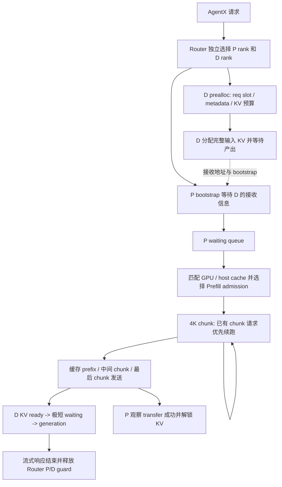

# AUS P8D8 C80 根因与 C112 退化：调度链、资源账本及验证方案

更新：2026-09-23。本报告重写早期恢复摘要，使用本次正式实验的逐请求记录、OTLP、独立资源采样，以及从**本次诊断镜像归档中提取**的 SGLang 源码。没有为本报告重新启动服务或执行干预实验。

## 1. 结论：C80 限制在哪里，哪些还不能称为根因

**C80 的主要排队限制在 Prefill 的服务/调度路径，优先解释是：重尾 miss 工作在每 rank 4K chunk、未完成请求优先续跑的执行方式下，形成较长的服务占用和新请求等待。当前证据不支持把 C80 的主要瓶颈归为 Decode KV 总容量不足，也不支持 Prefill 活跃 KV 把物理池占满。**

这里的“Prefill 服务”包括 kernel、TP/DP 协同、CPU 调度和 cache 操作；它不等于已经证明矩阵计算单元达到峰值。4K chunk 已被配置和代码确认，长 miss 请求的多轮占用已被 trace 确认；但“把 chunk 调大能提高多少吞吐”仍需单变量实验。不能将该候选参数的存在本身当成性能缺陷。

关键证据：

1. C80 有 14.97 个平均 Prefill waiting 请求，平均排队 5.576 秒；D allocation 平均只有 0.034 秒，D KV-ready 后排队约 0.00013 秒。排队位置明确。
2. P 的非可驱逐 KV 平均占容量 **7.44%**，可驱逐缓存约 **92.43%**。近 100% resident 不等于活跃容量耗尽；同 rank 有排队时，可回收 KV 平均仍有 **299.5 万 token**。
3. D 总体平均 KV 占用 **35.94%**；38/9651 条有效请求（0.394%）直接记录到 KV admission 拒绝。去掉这些请求后，P queue 均值仍为 **5.569 秒**。D 局部 KV 热点存在，但不能解释 C80 的普遍 P 等待。
4. C80 中 miss≥32K 的请求仅 **332 条，3.44%**，却贡献 **2449 万、41.58%** 的 miss tokens；每条平均经历 **18.80 个 chunk**，Prefill forward envelope 平均 **19.13 秒**。miss<1K 请求的 forward 仍约 **1.85 秒**，提示每轮服务固定开销/同步成本值得查，不能把时间只按 miss token 数线性解释。
5. C112 同一重尾组贡献 **4365 万、57.03%** 的 miss tokens。该组增加 1916 万 miss tokens，超过全体净增加的 1763 万；其余组总量反而下降。退化不只是“多开了 32 条 lane”。
6. D KV 增长可以被上游等待的驻留成本解释：逐请求 input-token×阶段时间的估算中，等待 KV 的占用从 **310.1 万→863.4 万**，generation 从 **540.5 万→465.4 万**；合计增加 **478.2 万**，实际 gauge 增加 **483.7 万**。这支持“上游变慢→D 提前分配的 KV 长期被占用→局部 allocation 阻塞→P bootstrap 也等待”的反馈链。

因此需要区分两个根因层级：

- **已定位的系统机制**：Prefill 重尾服务和排队限制有效请求供给，D 已分配 KV 的驻留时间随之增长；容量偏斜放大 C112 压力。
- **尚未唯一定位的最底层耗时来源**：Prefill kernel/collective 固定成本、小 chunk 开销、缓存回读/写回及调度间隙分别贡献多少。现有 tracing 没有 GPU kernel 时间或完整 Unified host-load 关联，必须用第 9 节实验区分。

不能把“根因仍有内部候选”写成“尚未知道任何东西”；也不能把已定位的 P 排队位置直接改名为“纯算力瓶颈”。

## 2. 实验边界、数据总体与可复算材料

### 2.1 实际配置

| 项目 | Prefill | Decode |
|---|---|---|
| SGLang | 0.5.19.dev20260916+ge7f7447333 | 同左 |
| 诊断镜像 | infera-sglang:aus-0922-reqtrace | 同左 |
| TP / attention DP / EP | 8 / 8 / 1 | 8 / 8 / 1 |
| mem_fraction_static | 0.85 | 0.85 |
| 每 rank KV token 容量 | 3,143,424 | 3,003,264 |
| KV dtype / page | fp8_e4m3 / 64 token | 同左 |
| chunked_prefill_size 实际值 | **4,096/rank** | 4,096（不是主要 generation 参数） |
| 命令行 chunk 参数 | 32,768，被 DP=8 调整 | 同类参数 |
| max_running_requests 命令值 | 256，全局配置；不能等同物理 req pool 大小 | 同左 |
| scheduler policy | fcfs | fcfs |
| prefix cache | Unified Radix Cache | disable_radix_cache=true |
| HiCache | ratio=1.5，write_through，kernel I/O | 未开启 |
| D radix reuse | 不适用 | disaggregation_decode_enable_radix_cache=false |
| num_reserved_decode_tokens | 512 | 512 |
| optimistic_prefill_attempts | 0 | 0 |

本轮有 simulated speculative acceptance=3.61，是性能实验口径。P8D8 不是 16 个各自完全独立的模型副本：attention DP rank 具有独立请求/KV 状态，模型 TP/执行协同仍会耦合各 rank 的服务进度。queue=0 不能直接等价为整张 GPU 可用。

关键生效参数已另存 [effective-config.json](effective-config.json)。来源：共享盘 `launch/server-info/{prefill,decode}-0.json`、`live-containers.json`、`server-logs/prefill.log`。后者明确记录 `chunked prefill size is adjusted from 32768 to 4096`。

### 2.2 请求和时间口径

| 指标 | C80 | C112 |
|---|---:|---:|
| profiling sent | 9,662 | 9,354 |
| 有效完成且 P/D 完整关联 | 9,651 | 9,321 |
| drain 取消，未导出客户端 JSONL | 11 | 33 |
| profiling runner errors | 0 | 0 |
| 总 token/s/GPU | 20,115.59 | 18,203.50 |
| 输出 token/s/GPU | 160.52 | 156.14 |
| TTFT mean / p50 / p90，秒 | 10.65 / 5.68 / 25.09 | 30.01 / 14.30 / 78.96 |
| 实际 input tokens | 1,157,823,951 | 1,047,702,056 |
| 实际 miss tokens | 58,906,191 | 76,532,520 |
| host-hit tokens | 6,933,568 | 29,092,928 |
| 实际总 cache hit | 94.912% | 92.695% |

- CONC 是 AgentX trajectory lane 数，fan-out 可使 HTTP 请求数超过 lane 数，不能用 CONC/8 代替 running batch。
- headline 吞吐包含缓存命中的输入 token，是逻辑业务吞吐，不是 GPU 计算 token/s。C112 逻辑总吞吐下降 9.51%，输出仅下降 2.73%，同时真实 miss 工作增加 29.92%。
- 请求延迟/分层取有效 profiling cohort，取消不填零；warmup 各有 3 条无效记录，与 profiling 错误不同。
- 资源采样只取各档固定 3600 秒发送窗口，排除 drain。请求 cohort 的完整 duration 可以延伸到 drain；两者不能强行要求完全相等。
- C80→C112 在同一服务、同一 collector 下顺序运行，没有重置缓存。不同 lane 数改变 trajectory 进度和缓存历史；两点不是严格 workload 配对的因果实验。
- 独立采样优先于 AIPerf server counter 聚合，后者有 counter-reset 警告。缺失/错误 scrape 不补零。

### 2.3 新增证据与复算

- [root-cause-evidence.json](root-cause-evidence.json)：重尾/host/阻塞分组，Little 定律账本，input token 驻留代理，逐 rank 同时刻 KV 容量恒等式。
- [chunk-evidence.json](chunk-evidence.json)：逐请求 chunk 数、重尾组 chunk 时长及 envelope 一致性检查。
- [source-evidence/manifest.json](source-evidence/manifest.json)：镜像 config ID、源文件所在 layer 和 SHA256。镜像 config 为 `4f125ff9096f75611fa24caad4c01c3707dd0892251680a6483b99ffaa2a88bb`。
- 原汇总：`../results/main-20260922/final/analysis/{summary,runtime-summary,span-summary,balance-summary,comparison}.json`。
- 原始数据根：`/perf_apps/liyingli/bench_agentx/p8d8-tracing-aus-20260922/runs/main-20260922`，以下简称 RUN。

在实验目录执行：

```bash
python3 scripts/analyze_root_cause.py /perf_apps/liyingli/bench_agentx/p8d8-tracing-aus-20260922/runs/main-20260922 analysis
python3 scripts/analyze_chunk_evidence.py /perf_apps/liyingli/bench_agentx/p8d8-tracing-aus-20260922/runs/main-20260922 analysis
```

新增脚本仅读 RUN，输出到仓库 analysis；校验唯一 RID、有效请求数、每 rank `used+evictable+available=capacity`，并保留主数据源 SHA256。它没有改写原始实验。

## 3. 请求如何经过整个 P/D 调度链



实际阶段可以重叠。特别是 D 在 P 开始计算前就持有 KV 空间；P 的 chunk 发送可与计算重叠，图中的箭头不是所有步骤严格串行。

### 3.1 Router：缓存命中估计不等于实时排队或实际 KV 占用

仓库 `rust/router/src/policy.rs` 的成本为：

```text
cost(rank) = -overlap_weight × cached_prefix_blocks
             + distinct_active_blocks + recent_blocks
```

既有实验配置的 P/D overlap weight 为 20/2。`disagg.rs::dispatch` 分别 pick P/D，随后并发发送两个请求；一个 ActiveGuard 同时持有 P 和 D 的引用，直到 Decode 响应结束才释放。

这有两个可验证的失配：

- P 已完成计算/传输之后，Router 仍把这条请求计入 P active 集合；它并非真实的 P queue/service 负载。
- D 关闭 radix reuse，多个共享 prefix 的请求仍要各自分配 KV；distinct block 去重可能低估实际 D 占用。

这里引用的是仓库路由实现，尚未逐字节确认运行中的 router 二进制与当前源文件完全一致；收益判断还需要运行版本核验和逐 pick shadow 数据。它足以指导审计，不能单凭静态代码量化丢失的吞吐。

### 3.2 D admission：容量检查在 generation 之前

镜像 [decode.py](source-evidence/disaggregation/decode.py) 的 `pop_preallocated`：

1. 依次检查 request pool、metadata pool、HiSparse 等预算。
2. D radix reuse 关闭时，`prefix_len=0`，按完整输入需求预分配，不因 P cache hit 高就少分配。
3. 计算可分配预算时，扣除 running、transfer、waiting 请求的 decode reserve，并考虑最大单请求增长、retracted 等预算。
4. 当 KV 不足时 `break`，当前大请求可能挡住后面较小请求；当前诊断主要记录遇到的队头，**38/268 不是所有受间接影响请求的完整数量**。
5. 分配后进入 transfer queue，等待上游 KV；KV ready 后才进入 waiting/running。

简化而非替代真实代码的预算式：

```text
B ≈ free_KV - max(512 × active_requests, single_request_growth_reserve)
            - retracted/restore/last_prebuilt adjustments
```

最终判定还包含 `max(required_alloc+512, input+clipped_max_new-retractable)`。诊断事件的 `required` 只记录前一个分量，因此会出现 `required < budget` 但仍被拒绝；不能把它误判为 allocator bug，也不能只用 required 与其他 rank free 做反事实接纳。

### 3.3 P admission、cache 和 chunk

镜像 `scheduler.py` 先对现有 `chunked_req` 调用 `add_chunked_req`，再遍历 waiting queue。`PrefillAdder` 同时管理 KV、input 和 chunk 预算；`add_one_req` 在选定 admission 后调用 `init_load_back`，再提交请求。遇到非 CONTINUE 结果会停止当前候选遍历。

因此“fcfs + chunked prefill”并不保证新请求每轮都能获得公平份额。一个长 miss 请求可以连续占用该 rank 的 chunk 预算，让后续短请求等待；是否发生全局空转还取决于其他 rank 和 TP/DP 协同，不能从本地队列长度直接推断。

Unified Radix Cache 的 `_load_back_transfers` 在空闲页不足时驱逐可回收缓存，再提交 H→D load；`loading_check` 轮询 ack、同步完成事件、解除锁。host 操作可能消耗资源并影响其他请求，即使那些请求自己没有 host-hit。

### 3.4 P handoff 与解锁

`prefill.py` 可以发送缓存 prefix、中间 chunk 和最后 chunk。P 在 transfer poll 成功后调用 `release_kv_cache` 解锁；D 则在接收完成后推进 generation。这意味着 P transfer tail 可能延长 P 页锁定，但它不是完整 RDMA 数据搬运时间，也不能与 D transfer wait 相加。

## 4. 指标对应什么阶段

| 指标 | 起止/含义 | 容易误判的地方 |
|---|---|---|
| 客户端 TTFT | HTTP request start→首个 content | 含路由/tokenize/两端等待，不是 Prefill kernel 时间 |
| P bootstrap | bootstrap queue→P wait queue | 默认 optimistic=0，会受 D 预分配拖慢 |
| P queue | wait_queue_entry→first forward_entry | 首次调度前等待，可能含 admission/cache 操作；不含后续 chunk 间隙 |
| P forward envelope | first forward_entry→prefill_finished | 多个 chunk、调度间隙和协同等待的请求墙钟范围 |
| chunked_prefill | 前一个 chunk 完成→当前完成，首个从 forward entry 起 | 不是 CUDA/HIP event kernel 时间；同 batch 多请求会重复覆盖 |
| P transfer tail | transfer queue entry→P 观察 KV transfer finish | 末尾确认/轮询与资源持有时间，不是全部传输字节/链路速度 |
| D allocation | bootstrap_done→decode_transfer_queue_entry | 明确包含资源 admission 等待 |
| D transfer wait | decode_transfer_queue_entry→wait_queue_entry | **等待 P 的排队、服务和传输**，不是纯网络时间 |
| D ready queue | wait_queue_entry→forward_entry | KV 就绪后等 generation 接入 |
| D generation | forward_entry→completion | 请求生成驻留，长输出自然更长，不等于 ITL |
| kv_used / evictable / available | 非可驱逐占用 / 可驱逐缓存 / 空闲池 | P resident≈100% 不能推出 active≈100% |
| GPU use | 采样时设备 busy | 通信/同步 kernel 也计 busy，不能作为 FLOPS 饱和证明 |

阶段差使用同一进程 monotonic clock。P/D wall clock 初测不确定区间约数毫秒至数百毫秒，未持续校时，不据此判定亚秒跨机先后。不同阶段 p50 不能相加；OTLP `decode_bootstrap` 的命名范围与独立 diagnostics 的 bootstrap/alloc 拆分不同，应按起止点读取。

### 4.1 主要阶段分布

| 阶段，秒 | C80 mean | C80 p50 | C112 mean | C112 p50 |
|---|---:|---:|---:|---:|
| P queue | 5.576 | 0.0032 | 22.409 | 6.432 |
| P forward envelope | 3.120 | 2.223 | 4.594 | 2.933 |
| P transfer tail | 0.927 | 0.881 | 1.222 | 1.121 |
| D allocation | 0.0341 | 0.00057 | 0.7932 | 0.00059 |
| D transfer wait | 9.421 | 4.052 | 28.029 | 12.284 |
| D generation | 13.133 | — | 12.513 | — |

C80 不是所有请求都排 5.6 秒：54.82% 的请求 P queue≤10ms，但 **40.99%>1 秒、18.06%>10 秒**。这是突发与服务时间重尾造成的分布，不是稳定、均匀的固定开销。C112 queue>1 秒达到 64.04%。

C80 两端 tokenize 平均约 0.17 秒，客户端 HTTP blocked 全体为零；相对秒级 P queue 不支持连接池或单独 tokenization 是主要限制。剩余 TTFT 差额不能直接当网络或 router 时间，因为两条腿并行且跨机时钟未精确对齐。

## 5. C80 候选根因逐项检验

### 5.1 Decode KV：局部热点成立，总容量主瓶颈不成立

C80 全 D 共 2402.6 万 KV token 容量，平均 used=863.6 万，free=1539.0 万；每 rank 等权采样 used fraction p99=92.11%，最大约99.85%，表明局部可以逼近上限，但全局没有普遍满池。

- 直接 KV 阻塞 38/9651；D prealloc queue 平均 0.089，allocation mean 34.1ms，p99 1.66ms，最大15.15秒：少数严重长尾，而非普遍 admission 堵塞。
- 阻塞事件中 free request slots 的中位数85、metadata slots中位数61；记录到的拒绝原因是 KV，不是这两个 slot 池。物理 pool 可包含额外 slots，因此不能拿 max-running/8=32 替代 allocator 实际大小。
- 去掉直接阻塞请求，P queue 仍5.569秒，TTFT仍10.626秒。
- 如果只机械删除所有请求已经测到的 D allocation 时间，固定请求集合的平均首 token 路径最多直接少约34ms，即现有 TTFT 的0.32%；这不是吞吐收益上界，因为队头阻塞和反馈也可能改变其他请求。

**判断：D KV 是 C80 尾延迟和 C112 放大的候选，不能作为 C80 主吞吐根因。仅扩 D KV 不应是第一项性能优化。**

### 5.2 Prefill KV：硬分配容量与缓存工作集容量是两个问题

逐 rank 完整 scrape 均通过以下恒等式（容许一个64-token页的舍入）：

```text
capacity = used_non_evictable + evictable + free
resident = used_non_evictable + evictable
reclaimable = free + evictable
```

| P 指标 | C80 | C112 |
|---|---:|---:|
| 非可驱逐占比，rank-sample mean | 7.44% | 7.74% |
| resident占比 | 99.868% | 99.939% |
| 每 rank 平均可回收 token | 2,909,691 | 2,900,046 |
| 同 rank queue>0 时平均可回收 token | 2,995,134 | 2,945,180 |
| queue>0 的 rank 样本数 | 4,933 | 9,787 |

这些有排队的样本均有至少524,288个可回收token。这不能保证任意候选在临时锁 prefix、增加其他预算后都能通过 admission，但强烈反对“P 因活跃 KV 普遍耗尽而停工”。

另一方面，resident和host pool常满意味着缓存存在替换竞争。C80 host used平均3602.0万/3772.2万，中位数已约99.96%；C112平均约99.96%。它可以造成命中损失→重算→额外服务需求。**P KV 扩容可能通过减少重算改善吞吐，即使完全没有硬分配阻塞。** 当前没有同一访问序列的 reuse-distance/eviction反事实，不能把理论hit与实际hit的全部差额算成容量损失；路由局部性、保留策略、执行历史同样影响hit。

### 5.3 Prefill 计算与 chunk 服务：最优先的机制解释

命令行32K不是每rank32K，实际每rank4K。以下数据按真实 miss 分组，不按总输入长度分组：

| miss/request | C80 请求数 | C80 forward mean，秒 | C112 请求数 | C112 forward mean，秒 |
|---|---:|---:|---:|---:|
| <1K | 2,384 | 1.848 | 2,490 | 2.388 |
| 1K–4K | 4,699 | 2.205 | 4,308 | 2.826 |
| 4K–8K | 1,256 | 3.047 | 1,144 | 3.871 |
| 8K–32K | 980 | 5.266 | 929 | 6.835 |
| ≥32K | 332 | 19.134 | 450 | 30.941 |

长 miss 组的每请求平均 chunk 数由18.80增至24.57，最长为163/232；该组chunk完成间隔均值1.018/1.259秒。该组所有chunk duration之和与forward envelope一致到小于0.001ms，说明这些长耗时确实横跨多轮服务，不只是一个异常外层span。

全体多chunk请求为4186/4493，累计chunk spans为16750/22177。无chunk span的请求暂按单轮推算。所有已观测的多chunk请求，其chunk之和与forward envelope差值均小于0.001ms，`chunk_forward_mismatch_gt1ms=0`。这验证了时间边界闭合，但shared batch仍不允许把请求duration相加后称为GPU执行总时长。

重尾工作量证据：

| 指标 | C80 | C112 |
|---|---:|---:|
| miss≥32K请求占比 | 3.44% | 4.83% |
| 该组占所有miss tokens | 41.58% | 57.03% |
| 按miss排序前5%请求占miss tokens | 48.58% | 57.71% |
| 每请求平均miss tokens | 6,103.6 | 8,210.8 |
| 实际P compute token速率，独立counter | 16,473/s | 21,388/s |

**P实际处理的compute tokens反而增加29.84%，不是P完全停止产出。逻辑吞吐下降与实际计算工作增多并存。** 每request服务成本上升且重尾更重，即使设备每秒算更多miss tokens，也可能每秒完成更少业务请求。

理论上，单服务台 M/G/1 的等待与 `λE[S²]/(2(1−ρ))` 成正比。这里是闭环、批处理、8 rank耦合系统，不能直接把该公式数值套入；它解释为何应关注服务时间二阶矩、突发和长请求，而不是仅看平均token数。源码中的chunk续跑优先提供了重尾影响新请求的具体路径。

P GPU busy约98.77%–98.93%，D也约99.34%–99.37%。P memory-activity读数仅7.43%–8.32%，但这也不是实际HBM GB/s或MFU。因此不能进一步断言纯计算峰值/带宽峰值；较小miss仍需秒级forward，kernel launch、collective和batch形状是需要device profile验证的候选。

### 5.4 Host restore：不是普遍的直接路径，仍可能产生共享开销

C80仅81/9651条（0.84%）请求记录host hit；其P queue/forward均值8.795/5.298秒。其余9570条没有host hit，queue/forward仍5.548/3.102秒。C112 host-hit请求337条（3.62%），无host-hit请求queue仍21.632秒。

这排除了“每条慢请求都是自己从host回读很久”的解释；不排除少量回读、驱逐以及write-through backup在共享执行路径上拖慢其他请求。C80/C112 backup速率约0.905/1.170 GB/s是设备到host写回，不能拿来当host到device回读速率。

本镜像的新增host事件补丁落在旧hiradix，而实际使用Unified Radix，故没有逐请求host提交/完成证据。源码 `loading_check` 的all-reduce和event同步证明可能有共享等待，但未测到其duration，不能据此宣布它就是主因。

### 5.5 网络/transfer：保留候选，不把上游等待算成RDMA

D transfer mean 9.421秒，而P queue+forward已8.696秒；两条腿大量观察相同的等待。P tail均值0.927秒含最后发送后的完成观察，不涵盖所有先前chunk。

平均NIC速率不足以排除微突发、轮询/通知和kernel竞争，也不足以证明网络瓶颈。当前优先级低于P服务路径；验证需按request/chunk补submit与transfer-engine真实completion，并记录bytes。严禁使用 `input_bytes / D_transfer_wait` 计算“RDMA有效带宽”。

## 6. 用排队与 KV 驻留账本解释连锁反应

### 6.1 Little 定律检查：同一等待并未被重复当成两个瓶颈

以有效profiling请求的阶段总秒数除以3600，得到cohort demand；它近似 `λ×E[W]`，并非严格裁剪窗口后的并发均值。

| 阶段 | C80 cohort demand | C80 gauge均值 | C112 cohort demand | C112 gauge均值 |
|---|---:|---:|---:|---:|
| P waiting | 14.948 | 14.966 | 58.021 | 58.433 |
| D prealloc/alloc wait | 0.091 | 0.089 | 2.054 | 2.146 |
| D transfer wait | 25.255 | 25.271 | 72.571 | 72.557 |
| D generation | 35.206 | 35.420 | 32.399 | 32.616 |

接近程度说明请求时间线和队列采样在量级上自洽。D waiting-for-KV增多与P waiting增多不是两份互不相关的工作；相同请求同时占据P队列和D KV空间。

### 6.2 token-seconds：D 为什么更满，但running反而减少

D关闭prefix reuse，可用输入token驻留代理：

```text
K_stage ≈ Σ(input_tokens_i × duration_in_stage_i) / 3600
```

| D KV占用，百万token | C80 | C112 | 变化 |
|---|---:|---:|---:|
| transfer等待代理 | 3.101 | 8.634 | +5.533 |
| generation代理 | 5.405 | 4.654 | −0.751 |
| 两者合计代理 | 8.506 | 13.288 | +4.782 |
| 实测KV used gauge均值 | 8.636 | 13.473 | +4.837 |

代理没有包含输出增长、page rounding、额外预留、warmup carry-in和取消请求，并使用完整cohort duration，因此不能声称逐页精确归因；但它与独立gauge的总量和变化都相当接近。这里比“D KV更满所以D一定是第一原因”多了一条实证：**增长主要发生在等待上游期间，generation驻留贡献下降。**

机制链可以写成：

```text
重尾 miss 服务需求 / 缓存慢层工作增加
  → P chunk服务与首次排队变长
  → D 已分配完整输入KV，等待P期间不能释放
  → D局部KV热点及admission长尾增多
  → P bootstrap等D接收空间（optimistic=0），形成反馈
  → 进入generation的请求减少，running/ITL可下降
```

这支持反馈方向的物理机制；不能证明C112切换瞬间哪个内部子阶段先变坏。其warmup已建立压力，profiling首10分钟P queue和allocation都已经升高。

## 7. 负载均衡到底有多大问题

### Prefill

C80/C112同时出现“某rank有queue，另一rank queue=running=0”的完整样本仅1.74%/0.79%；C112整小时miss-token CV反而由0.129降至0.070，而所有rank平均queue都上升。主问题不符合“只有一个rank忙，其他七个长期可接单”的简单解释。

但是整小时CV不能排除秒级重尾热点、chunk优先续跑、不同context计算成本和TP/DP等待。可优化的是**预计剩余工作和等待年龄**，不是仅把请求数平均。放松cache affinity可能让队列更均匀，却因miss增加损害吞吐。

### Decode

C80/C112有10.61%/52.00%的完整scrape同时出现某rank KV≥90%、另一rank<70%。累计请求数很均匀仍不能代表同时刻KV均匀，因为请求长度和等待/生成寿命不同。

优化应按实际已分配KV、pending reservations、request/metadata slots和预计寿命计算admission。要证明可挽回多少，必须在阻塞时刻对其他rank执行同一完整budget条件的shadow审计；2秒scrape以及仅记录的required不足以完成精确反事实。不能用52%直接作为收益或可迁移比例。

### 联合调度

可考虑P接近可执行时才预留D KV，或限制每rank等待P的token总量。但默认P需要D地址才能开始，必须设计两阶段reservation/credit，不能简单延后现有prealloc调用造成互等。延迟预留还可能损失计算/传输重叠。应先修正计量，再验证控制策略。

## 8. 还缺哪些证据，如何以最小代价补齐

1. P admission每次停止的原因：req slot、KV budget、chunk/input预算、host load未就绪、tile gate，带候选miss/context、queue age、实际预算；区分没有接纳候选与接纳后预算耗尽。
2. Unified `init_load_back/_load_back_transfers/loading_check` 的请求/node关联、提交、CPU观察完成、device event duration、bytes及eviction/backup时间。原有旧hiradix事件不能代替。
3. 在代表性C80窗口采短时device profile：attention/indexer、GEMM/MoE、collective、host copy和CPU gap。限定窗口并评估profile开销，不用整小时高开销trace。
4. D阻塞时记录完整判定两项、候选max_new、每rank实际budget与slot，补router pick/guard释放时间；支持shadow接纳审计。
5. 把已经闭合的chunk时间线与每轮实际batch shape、context及GPU执行时长关联，分离kernel成本和两次完成之间的调度/同步等待。

## 9. 快速单变量验证：参数、预言和否定条件

所有测试先在C80做，再考虑C112；固定镜像/路由/acceptance、同一trace片段和到达或lane配置，缓存初始化和warmup过程一致。A/B/A至少重复，记录输入、miss、host、输出的实际工作量。短试用于筛选，最终吞吐比较仍需要足够长稳态窗口和重复波动范围。工作量不同的两次闭环运行不能只比headline token/s。

| 优先级/假设 | 单变量修改 | 如果假设成立应看到 | 什么结果会否定或限制它 |
|---|---|---|---|
| 1：4K chunk固定开销限制P服务 | **仅P命令行chunked-prefill-size 32768→65536**；确认server-info实际4096→8192 | 相同miss/context下请求chunk数减少、总forward/每miss服务成本下降、P queue和TTFT下降，完成率提高 | chunk数下降但forward不降；长kernel/collective抵消收益或短请求尾延迟上升 |
| 2：P缓存工作集损失导致重算 | 保持chunk/route，仅P mem_fraction_static 0.85→0.90；固定host绝对容量 | 实际P KV容量增加，匹配trace的miss减少、P服务需求/queue下降 | 容量增加但miss不变，或miss下降却吞吐无改善，说明另有主要固定成本 |
| 3：host容量/回读是限制 | 仅host绝对容量约+33%，或在匹配负载下切换一个已支持I/O backend | eviction/miss或回读设备时间下降，与P服务改善对应 | 只有host占比改变但P服务不变；必须避免同时改host大小与backend |
| 4：D局部KV admission是主因 | 仅D mem_fraction_static 0.85→0.90，P不变 | D allocation长尾下降；若是主因，P queue及完成率应明显改善 | allocation改善但C80 P queue/吞吐不变，支持D是次要放大器 |
| 5：P chunk续跑造成不公平 | 在同等chunk/budget下，仅改候选顺序/给新短请求保留小份额 | 短请求queue降低、长请求尾部受控；总miss和cache hit没有明显变差 | 仅重分配延迟，吞吐无收益或长请求starvation加剧 |
| 6：D路由估计不准 | 先shadow实际KV-aware选择，再只切D选择策略 | 可接纳的替代rank比例可量化，阻塞token-seconds降低 | 大多替代rank也不符合完整budget；“占用不均”未转化为可用容量 |

P mem_fraction上调会通过hicache_ratio自动增加host池，因此第2项必须把host绝对容量固定，或相应调整ratio；否则同时改变了两种容量。改变static fraction还改变workspace余量，必须记录实际容量和是否发生allocator/retraction异常。

不要首先把 `num_reserved_decode_tokens=512` 降到0：C80全D active数量约61，即512-token reserve总量约3.1万，仅2402.6万容量的0.13%；而真实input占用约863.6万。它不是全局主要空间来源，贸然降低可能增加decode增长时的retraction。也不要只把max-running从256调高；现有证据没有把它定位为C80主限制。

## 10. 优化方案与收益：给可检验的估算，不给虚构实测值

### 10.1 增大chunk：收益取决于固定开销占比

对固定工作W，用近似 `T(W,c)=A(W)+ceil(W/c)×h`。若可被chunk翻倍摊薄的开销占P服务的比例为f，理想P服务加速为：

```text
S_P = 1 / ((1-f) + f/2)
```

| 假定f（尚未测量） | 理想P服务能力提升 |
|---|---:|
| 25% | 14.3% |
| 50% | 33.3% |
| 75% | 60.0% |

这是敏感性区间，不是预测区间，更不是承诺系统吞吐增加14%–60%。短请求本来一轮、chunk时长可能非线性增大，实际可摊薄份额可能远低于25%。最终吞吐还受D、handoff和闭环行为限制。先做4K→8K量出f及尾延迟，再判断8K→16K是否值得。

### 10.2 Cache/路由：从减少miss推导容量敏感性

C80 miss比例m=5.0877%。如果在**同样逻辑输入**下改善实际cache hit 1个百分点，miss工作相对下降约 `0.01/m=19.66%`。若所有限制成本均与miss线性且其他不变，理想逻辑吞吐倍率 `m/(m-0.01)≈1.245`，即约24.5%。

若只有f比例的实际P成本随miss变化，则倍率为 `1/(1-f×0.1966)`：f=0.5时约+10.9%，f=1时约+24.5%。这说明值得验证cache工作集，但**没有证据证明扩容一定带来1个百分点hit提升**；该提升可能需要cache-aware路由、保留策略和更大P cache共同实现。

### 10.3 P提速会同时释放D KV，容量收益可估算

若保持请求工作量和完成率暂时不变，D等待阶段输入token驻留减少25%，则C80可释放约 **0.775百万token**，相当于总D容量3.23%；C112约 **2.158百万token**，相当于8.98%。这是token-seconds代理的线性敏感性，不包含提速后吞吐提高又带来的新占用，也不是可迁移到任何热点rank的均匀空间。

### 10.4 D KV-aware和联合admission

预期首先改善allocation/TTFT尾部、降低等待KV的token-seconds，并提高可用并发余量。当前不能给可信的吞吐百分比：直接阻塞请求比例、KV偏斜样本比例都不是可挽回吞吐比例。先计算shadow可接纳量，再由单变量对照报告完成率、TTFT p90/p99和资源驻留改善。

方案顺序：**先验证P chunk服务成本→验证P缓存工作集→修正P/D资源计量与路由→有证据后做联合admission**。不要同时改chunk、cache、route、reservation，否则无法知道收益来自哪一项。

## 11. 完成状态与明确保留项

本轮完成了源镜像代码核验、新的逐请求重尾分析、容量恒等式检查、阶段Little账本、D KV驻留分解及报告重写。相比旧摘要，已经区分了P硬分配容量与缓存工作集容量，并给出了D KV增长的定量机制。

未完成：单变量实验、device profile、Unified host restore插桩、逐阻塞请求替代rank审计、匹配条件下tracing on/off对照。因此当前最底层root cause和真实优化收益仍需验证；不能把本报告的敏感性模型写成实测优化结果。本次未核实job31526实时状态，旧PENDING记录不用于当前资源判断。
