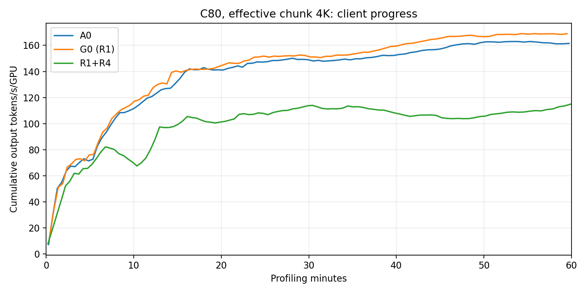

# R1+R4 C80 / 4K 完整实验结果

本轮已完成完整3600秒发送窗口并通过验收。**当前R1+R4不建议启用：相对历史G0（R1-only），输出吞吐下降31.32%，平均TTFT增加255.32%。建议本case继续保留R1，R4维持实验状态，先修正成本模型。**

| 指标 | A0原策略 | G0：R1-only | R1+R4 |
|---|---:|---:|---:|
| 成功请求 | 9,727 | 10,033 | 7,167 |
| 输出 tokens/s/GPU（16卡） | 161.66 | 168.70 | 115.87 |
| 平均 TTFT | 9.86秒 | 7.58秒 | 26.93秒 |
| TTFT p95 | 33.00秒 | 23.83秒 | 86.86秒 |
| 平均 ITL | 14.14ms | 13.48ms | 12.44ms |
| 请求级未命中比例 | 4.99% | 4.55% | 10.92% |
| P 平均排队 | 4.86秒 | 2.68秒 | 19.10秒 |
| P forward envelope均值 | 3.04秒 | 2.88秒 | 5.96秒 |
| 结束边界取消 | 13 | 16 | 49 |

相对A0，输出吞吐也下降28.32%。本轮发出7,216条正式请求，7,167条完成，正式导出错误0；窗口结束后按相同收尾规则取消49条。884条预热已结束，另有1条空内容解析错误，未删除或改记为成功。发送窗口22:38:20.124–23:38:20.124 UTC，随后完成请求收尾与指标导出。

曲线来自客户端日志的累计均值，表格来自最终汇总；图不把结束后的drain统计当作额外发送窗口。差距持续存在，并非单个采样点波动。

**为什么变慢：更多未命中带来额外P工作，同时队列整体变长。**

G0平均每个请求需要新计算约5,557 tokens，R1+R4约12,248；本轮虽然成功请求更少，新计算token总量仍从55.75M增加到87.78M。独立引擎采样的有效新输入处理速率也从约15.63K升到24.36K tokens/s。这不能解释为GPU更快，而是表明系统在为更少的用户请求做更多未命中计算。

与G0匹配到6,744对相同来源、输入差≤8 tokens且≤0.1%、实际输出长度相同的请求：平均miss为5,775→12,392 tokens，平均TTFT为7.58→26.97秒。问题并非本轮只是遇到了更长的输入或输出。

其中388对（5.8%）额外miss超过32K tokens，占全部新增miss的77.7%；少数大段缓存未命中贡献了大部分额外工作。另取device/host命中量都基本相同的4,400对，P排队仍从2.73秒升到19.68秒，说明等待恶化也影响了大量自身缓存没有变差的请求。这些是关联证据，不是逐次调度的反事实证明。

D平均正在生成的请求数从36.62降到23.61，等待KV的请求数从17.46升到50.70。因此ITL略好不能当作整体收益：D负载更轻，却有更多请求在等P。D等待KV包含P排队、计算和传输，不能全部算成纯网络耗时，也不能与P阶段重复相加。

**代码与方案判断。** R1的P完成释放实际生效，完成日志8,101/8,101为separated=true，正式7,167条请求全部P/D配对。R4也已在独立smoke中验证选中最小评分并实际改变选择，未发现“开关没开”或“代码未执行”的问题。

当前R4使用“在途有效输入tokens + 本次有效输入tokens”评分。它不再在主路径直接使用原策略的P overlap weight=20，而只通过减去命中前缀计算本次工作量；这改变了缓存与负载之间的权衡。工作量预约还一直保留到P响应体结束，不随chunk完成递减，也没有完整建模长上下文attention、请求固定开销和host读取成本。本轮结果与这种简化导致缓存利用变差的解释一致，但不能单凭本轮区分各项模型误差的贡献。

下一步应先保留R1的缓存亲和性，用现有数据校准P实际服务成本，再考虑把有效工作量作为受控修正项；不建议继续原样重跑当前R4，也没有追加新的A0/G0基线。

**验证范围与限制。**

- 镜像、模型、4K有效chunk、TP8/DP8、mem fraction0.85、P HiCache1.5、MTP与种子均按既定配置核验；R1=completion，R4=on，R2/R3=off，候选日志关闭。
- 当前节点P=n05-21、D=n05-29；历史A0/G0节点不同，且G0复用了A0引擎进程，本轮为新启动。单轮历史对照不能严格隔离全部因果，但现有数据不支持当前R4收益。
- 与A0共同出现的11个P、6个D MoE kernel配置没有发现选择差异；该检查不覆盖所有算子。当前GPU功耗上限1400W、性能模式auto，不能据此证明所有硬件条件完全相同。
- 最终scheduler PID与启动信息一致，验收检查全部通过。AIPerf聚合缓存统计有counter-reset提示，未作为缓存收益依据；上表采用请求级缓存记录。
- 匹配分析是已完成请求的交集，不是独立重复实验；相同长度也不证明字节完全相同。forward envelope包含调度间隙，不是独占GPU计算时间。

**空内容错误排查。** 已在相同镜像/模型实机强制单个`<think>`，得到HTTP200、completion_tokens=1/reasoning_tokens=1，但正文为空；同版本AIPerf把它解析为None，产生同类InvalidInferenceResultError。32条自然探针、24条AIPerf小请求及80条C80功能请求通过。历史3条没有保存输出token，不能逐条断言它们都是`<think>`；本轮预热1条同类错误的P/D同room且均完成1 token。没有修改正式warmup或隐藏错误统计。

完整smoke约10分35秒，276项离线测试通过。前3次正式尝试因batch抢占止于warmup，另2次未启动模型就主动重排；第四次取得本报告的完整结果。具体时间线见[执行历史](../HISTORY.zh-CN.md)。

模型服务已于23:44:50开始按P优先顺序停止，23:45:29停止调用全部返回成功。2026-09-25 00:04:40 UTC已确认16张GPU均约0.096%占用，随后确认两端无KFD进程；完整实测见[资源状态](resource-release.json)。之后释放本次自行申请的31719。

复现与证据：[配置核验](config-verification.json)、[验收](case-audit.json)、[对A0](vs-a0/COMPARISON.zh-CN.md)、[对G0](vs-g0/COMPARISON.zh-CN.md)、[匹配请求](matched-g0/MATCHED-REQUESTS.zh-CN.md)、[缓存长尾](matched-g0/cache-loss-tails.json)。原始目录：`/perf_apps/liyingli/bench_agentx/r1r4-4k-20260924/runs/r1r4-31719-performance-attempt4`。分析脚本在`../analysis/`，没有重跑基线或改动测量数据。
