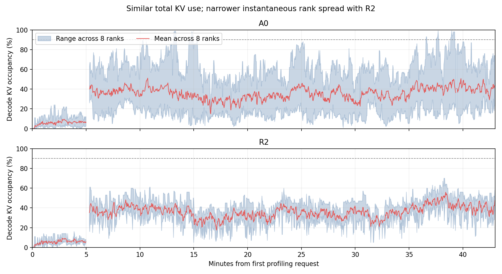

# R2 对照已有 A0 数据：缓解 Decode KV 热点，但未改善主要吞吐瓶颈

## 结论

R2不是没有作用。现有数据支持它改善了Decode瞬时KV负载分布，并减少分配长尾；但当前C80/4K的主要等待仍在Prefill相关路径，因此没有转化为明确的吞吐提升。暂不值得仅为补足60分钟而原样重跑R2。保留R2为可选策略，优先继续分析/验证P侧有依据的优化；若将来测试更高D压力的配置，可再验证R2的长尾收益，不能把本轮结果外推为已证明。

## 历史分析与口径

找到的历史结论：

- [A0-FINDINGS](../../../p8d8-adaptive-31625-20260923/analysis/A0-FINDINGS.zh-CN.md)：完整A0有32条直接KV分配阻塞，D allocation mean 25.89ms，不支持优先投入D扩容。
- [RECOVERY-AND-FINDINGS](../../../p8d8-c80-c112-tracing-aus-20260922/analysis/RECOVERY-AND-FINDINGS.zh-CN.md) §5.1：更早C80也出现局部D KV热点，但不是全局容量耗尽；P排队和长miss处理是更主要解释。该报告的9651条C80样本不是本轮直接A0，不能混用数字。

本次重新计算两轮各自首个profiling请求之后2580秒，即前43分钟。请求统计只包括在该窗口内开始且完成的请求；两轮全部选中请求都有P/D阶段记录。资源采样按同样墙钟窗口筛选，缺失样本不补零，不包含R2抢占后的错误和停机采样。

A0：6960条；R2：6987条；这两个正式窗口都没有客户端错误/取消。D有效scrape为1272/1275次（约2秒一次），查询错误12/9次；P为1275/1274次，错误9/10次。短于采样间隔的热点可能漏采。

P节点均为n10-29，但属于不同时间的运行；D从A0的n02-21换成R2的n01-21。因此属于历史对照，不能排除节点和时间差异。

## 1. R2改善的是瞬时KV占用，而非平均分配请求数

| 同窗口指标 | A0 | R2 |
|---|---:|---:|
| D八rank平均KV占用 | 32.26% | 32.50% |
| 每次采样最忙rank占用的均值 | 56.86% | 41.14% |
| 采样中最高单rank占用 | 99% | 70% |
| 同时刻八rank KV used tokens的变异系数均值 | 0.444 | 0.184 |
| 同时刻最高与最低占用之差的均值 | 43.17个百分点 | 16.91个百分点 |
| 某rank>90%、另有rank<50%的采样 | 38/1272（2.99%） | 0/1275 |
| 每rank平均正在生成请求数 | 4.35 | 4.39 |
| 正在生成请求数的瞬时变异系数均值 | 0.386 | 0.413 |

变异系数=8个rank的标准差/均值；越小越均匀。KV used tokens的瞬时偏斜下降约58.6%，且总KV用量基本相同；这是比累计请求数更直接的机制证据。token_usage gauge本身有舍入，因此另用原始kv_used_tokens计算CV，两者结论一致。

A0每个D rank累计完成867–872条，几乎完全平均；R2为783–953条。累计平均并不能避免瞬间把几个长输入集中到同一rank。R2允许请求数量不平均，按在途输入token需求分配，更接近KV负载目标。它并未让正在生成的请求数更平均；当前实现没有完整建模未来输出长度、剩余生成时间或D计算成本，不能据KV变均匀就认为所有D负载都变均匀。

蓝色带是每个时刻8个rank的最小到最大占用，红线是平均占用；两轮平均值相近，R2带宽明显收窄。超过5秒的采样间隔不连线。

## 2. 分配长尾减少，但原本影响的请求很少

| D分配指标 | A0 | R2 |
|---|---:|---:|
| 直接记录kv_budget阻塞的请求 | 12/6960 | 0/6987 |
| allocation等待>1秒的请求 | 21/6960 | 0/6987 |
| allocation平均等待 | 15.256ms | 0.769ms |
| allocation p95 | 1.003ms | 1.007ms |
| allocation p99 | 1.366ms | 1.367ms |
| allocation最大等待 | 11.004秒 | 60.956ms |
| 每rank平均prealloc排队请求数 | 0.0053 | 0 |

直接kv_budget事件与等待>1秒不是同一指标，因此12和21不矛盾。R2改善主要发生在极少数长尾，p95/p99基本不变。A0前43分钟的分配均值15.26ms，与完整一小时25.89ms不同，说明必须统一窗口。

按各自固定已完成请求集合，平均allocation时间只少约14.5ms；A0平均TTFT约9.215秒，allocation均值只占约0.17%。这个比例不是吞吐收益上界，但说明不能仅凭消除这些直接等待期待显著吞吐提升。

## 3. 主要等待仍在Prefill相关路径

| 阶段均值 | A0 | R2 |
|---|---:|---:|
| P排队 | 4.417秒 | 4.241秒 |
| P forward envelope | 2.975秒 | 2.926秒 |
| P算完至KV transfer完成的尾部 | 0.889秒 | 0.878秒 |
| D等待KV到达 | 8.064秒 | 7.872秒 |
| D生成阶段 | 12.690秒 | 12.805秒 |
| 每rank P平均排队请求数 | 1.535 | 1.471 |
| 每rank D平均transfer等待请求数 | 2.763 | 2.723 |

D等待KV到达包含等P排队、计算及传输；不能把7.9秒称作纯网络传输耗时，也不能将这些相互重叠的阶段相加作为TTFT。P forward envelope包含调度间隙，不是独占GPU计算时间。

P排队>1秒的请求仍有A0 2609/6960（37.5%）、R2 2532/6987（36.2%）。请求级device命中率均约94.38%；host命中率0.456%→0.378%，miss率5.165%→5.234%。P侧的缓存/排队情况没有随D分配优化发生根本改变。

两端GPU use指标都接近99%，但该粗粒度利用率不足以证明计算/显存带宽饱和，也不能据此排除等待或通信。本结论主要来自请求阶段和队列，而非单个GPU use指标。

## 4. 相同请求的交叉检查

按source_trace、conversation、turn、outer/inner索引取唯一交集，要求P/D记录齐全、实际输出token数完全相同、输入差≤8且≤0.1%，得到1644对请求。

| 匹配请求阶段均值 | A0 | R2 |
|---|---:|---:|
| D allocation | 15.249ms | 0.778ms |
| P排队 | 4.609秒 | 3.899秒 |
| P forward envelope | 3.163秒 | 3.084秒 |
| D等待KV | 8.461秒 | 7.684秒 |
| D生成 | 14.102秒 | 14.343秒 |

匹配集合也支持D分配长尾减少；P等待有所降低，但集合受完成时间、命中历史和输出匹配选择影响，且D节点不同，不能归因为R2直接加速P，也不能用子集推出整体吞吐增益。

## 5. 性能判断和下一步

前43分钟同口径输出吞吐156.37→154.79 tokens/s/GPU（约-1.01%）；平均TTFT 9.215→9.054秒，平均ITL 14.034→14.288ms。R2有KV负载均衡效果，但没有已证明的吞吐收益。

不为补齐时长立即重跑同一配置。优先看P排队、有效工作量与guard持有时间相关优化；R2保留为可选项。如果未来更高并发/长输入使D KV分配长尾变成显著问题，再做针对性验证。不能因本轮D热点消失就直接把R2设为默认最优策略。

## 记录更正：预热并非客户端零错误

原实时进度报告warmup errors=0，但profile_export原始记录中有3条InvalidInferenceResultError（没有实际内容），A0无此错误。R2的884条预热实际为881条客户端成功、3条解析错误。三条均有P/D同room的引擎完成记录，D输出均为1 token；仅凭这些证据无法确认是否特殊token/渲染行为，不能宣称已完全排除正确性问题。8条独立smoke通过，正式前43分钟6987条均无错误的结论不变。本轮可记为正式负载跑通，但预热存在这项待解释异常。

## 复现与文件

- `python3 compare.py`：读取两轮原始请求、诊断与采样，生成comparison.json，保留各rank、长尾、匹配请求和缺失统计。
- `PYTHONPATH=/usr/lib/python3/dist-packages python3 -S plot_occupancy.py`：生成decode-occupancy.csv和图，使用系统matplotlib环境。
- 原始路径写在脚本中；本分析不启动服务，也不修改实验参数。
