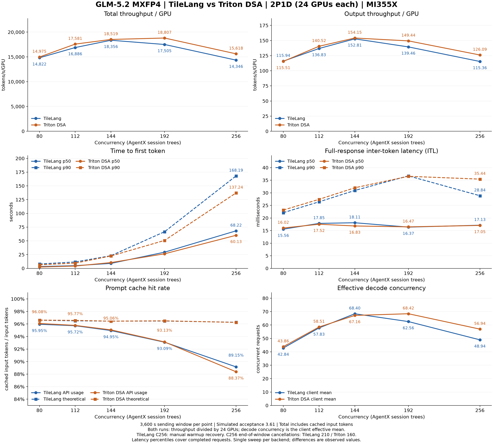

# TileLang 与 Triton DSA：2P1D 性能对比

蓝色为 TileLang 基线，橙色为 Triton DSA；两组均为 2P1D、24 张 MI355X。



[PNG](sweep_compare.png) · [SVG](sweep_compare.svg) · [作图数据 CSV](sweep_compare.csv) · [逐档差异 CSV](sweep_compare_delta.csv)

## 主要结果

- C192：总吞吐 +7.44%，输出吞吐 +7.16%，TTFT p90 -23.78%。
- C256：总吞吐 +8.86%，输出吞吐 +9.29%，TTFT p90 -18.40%；有效 Decode 并发 48.94 → 56.94（+16.35%）。
- 改善并不覆盖所有指标：C144 的 TTFT p50 +16.76%；C256 的 ITL p90 为 28.84 → 35.44 ms（+22.88%），API 缓存命中率为 89.15% → 88.37%，下降 0.78 个百分点。
- 各自峰值总吞吐：TileLang C144 为 18,356.23 tok/s/GPU；Triton C192 为 18,806.71 tok/s/GPU（峰值间变化 +2.45%）。
- 各自峰值输出吞吐：TileLang C144 为 152.81 tok/s/GPU；Triton C144 为 154.15 tok/s/GPU（峰值间变化 +0.87%）。

## 吞吐绝对值

每格按 **TileLang → Triton** 排列，单位均为 tok/s/GPU。

| 并发 | 总吞吐 / GPU | 输出吞吐 / GPU |
|---:|---:|---:|
| 80 | 14,821.96 → 14,975.27 | 115.94 → 115.51 |
| 112 | 16,886.23 → 17,581.16 | 136.83 → 140.52 |
| 144 | 18,356.23 → 18,519.35 | 152.81 → 154.15 |
| 192 | 17,504.51 → 18,806.71 | 139.46 → 149.44 |
| 256 | 14,346.41 → 15,618.00 | 115.36 → 126.09 |

## 逐档变化

变化率 = `(Triton / TileLang - 1) × 100%`。吞吐越高越好，TTFT/ITL 越低越好；Decode 并发反映活跃请求数，应结合吞吐和延迟解读。缓存列使用百分点差值。

| 并发 | 总吞吐 | 输出吞吐 | TTFT p50 | TTFT p90 | ITL p50 | ITL p90 | API 缓存命中率（百分点） | 有效 Decode 并发 |
|---:|---:|---:|---:|---:|---:|---:|---:|---:|
| 80 | +1.03% | -0.37% | -24.98% | -19.68% | +2.96% | +4.70% | +0.13 | +2.38% |
| 112 | +4.12% | +2.69% | -14.12% | -17.71% | -1.85% | +3.71% | +0.05 | +1.18% |
| 144 | +0.89% | +0.87% | +16.76% | -2.25% | -7.07% | +3.46% | +0.11 | -1.81% |
| 192 | +7.44% | +7.16% | -10.03% | -23.78% | +0.61% | -0.46% | +0.04 | +9.37% |
| 256 | +8.86% | +9.29% | -11.86% | -18.40% | -0.47% | +22.88% | -0.78 | +16.35% |

## 数据来源与口径

- TileLang：[`../../2p1d-sweep/results/`](../../2p1d-sweep/results/README.md)，运行 `2p1d-20260921T151735Z`。冻结配置中的 Prefill / Decode DSA backend 均为 `tilelang`。
- Triton：本目录，运行 `2p1d-triton-dsa-20260922T124849Z`；两个 DSA backend 均为 `triton`，见 [`experiment.json`](experiment.json)。
- 两组均完成 C80、C112、C144、C192、C256；GPU 拓扑、镜像 ID、每档 3600 秒发送窗口、10 requests/lane 压力预热和模拟接受长度 3.61 一致。
- 总吞吐、输出吞吐、TTFT p50/p90、full-response ITL p50/p90 读取各档 `agentx_conc*.json`，与示例图一致。总吞吐包括输入与输出，输入包含缓存命中的 token；每卡吞吐均除以全部 24 张 GPU。聚合吞吐沿用 JSON 的实际统计时长，不重新除以 3600 秒。
- API 缓存命中率来自 `profile_export_aiperf.csv` 的 `Overall Usage Prompt Cache Read % (%)`，并用 cached prompt tokens / prompt tokens 校验；理论命中率来自 JSON 的 `theoretical_cache_hit_rate`。缓存图实线为 API 实测、虚线为理论值。
- 两组 Decode 面板都采用 AIPerf `Effective Decode Concurrency` 的客户端均值。延迟图实线为 p50、虚线为 p90；ITL 采用 full-response 指标。
- TileLang C256 曾进行人工预热恢复，详见[基线测量说明](../../2p1d-sweep/results/measurement_notes.md)。C256 正式窗口结束后，TileLang / Triton 分别取消 210 / 160 个请求；延迟分位数仅覆盖完成请求，存在尾部截断。Triton 取消数来自[该档 benchmark.log](../.tmp/results/2p1d-triton-dsa-20260922T124849Z/c256/benchmark.log)的 profiling 完成记录。
- 每个后端只有一次 sweep；图中为本次观测差异，未估计重复实验的波动或置信区间。模拟接受长度设置用于性能比较。

## 重绘

在本套件根目录运行以下命令即可从两组已归档的 JSON 和 AIPerf CSV 重绘 PNG、SVG 与两份 CSV：

```bash
python3 scripts/plot_sweep_compare.py
```
