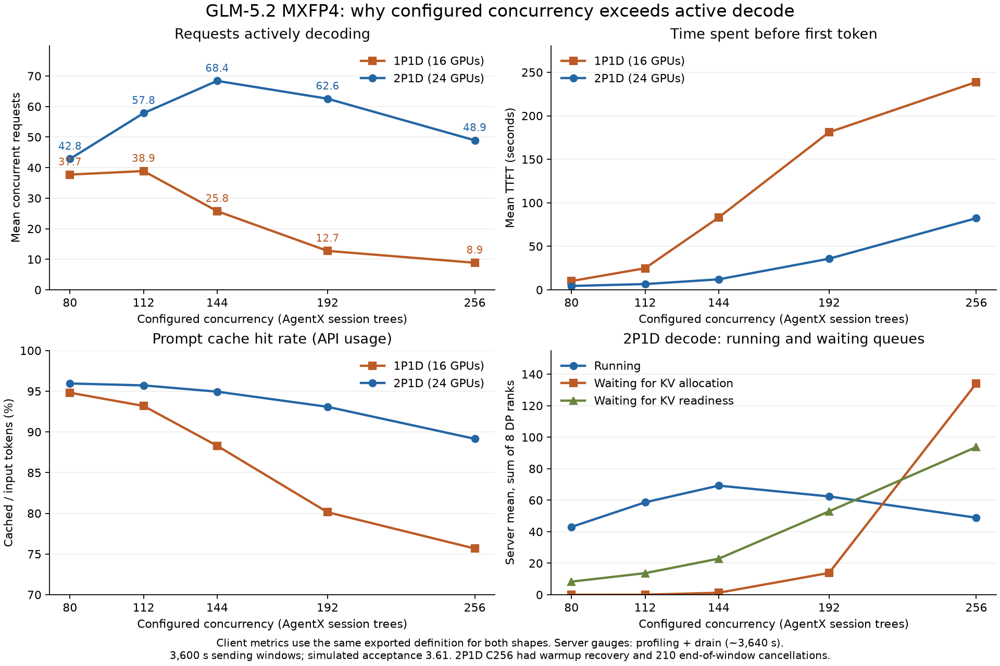

**GLM-5.2 MXFP4：配置 concurrency 与 decode running concurrency 的差距分析**

分析日期：2026-09-22。2P1D 运行：`2p1d-20260921T151735Z`；参考：
[`glm52.p8d8.agentx-sweep.packup_20260920`](../../../yihou/glm52.p8d8.agentx-sweep.packup_20260920/README.md) 的最终 Run 2。

**结论：差距同时来自会话回放口径、首 token 前的等待，以及高并发下的缓存和 KV 预分配压力。**
图中的 decode running 已经对 8 个 DP rank 求和，且与客户端独立计算的有效 decode 并发吻合。
增加一个 Prefill 后，decode 得到了更充分的供给：C144 的有效 decode 并发从 25.75 提高到 68.40。
但到 2P1D C256，Decode 的 KV token pool 已经频繁接近满载，大量请求停在预分配或等待 KV 就绪阶段，
使 active decode 反而下降。不能仅凭 running 小就认定 Decode 有充足 KV 空间，也不能把原因全部归为 Prefill 算力。



**1. 对齐部署和统计口径**

用户所指的参考目录实际是 **1P1D、两台机器、16 张 MI355X**：P 在 137，D 在 136，每实例 TP8/DP8。
本轮是 **2P1D、三台机器、24 张 MI355X**：新增 138 上的 Prefill，Decode 仍在 136。
两套配置使用同一镜像、相同 TP8/DP8、MTP 模拟 acceptance 3.61、IndexShare off、Prefill HiCache on、Decode HiCache off，
每档正式发送 3600 秒，warmup 10 requests/lane。两份配置均固定 InferenceX commit `918524ff94045b3f091115f1051c22a8588edf2b`。
这些是跨运行的部署比较；新增 Prefill 同时增加了算力和缓存容量，无法单独隔离两者贡献。

这里有三个不同的“并发”：

| 指标 | 计数对象 | 包含什么 |
|---|---|---|
| `CONC` / `--concurrency` | 活跃 AgentX 会话树 | 根会话及其子 agent；等待工具、等待下一轮时，会话树仍占一个 lane |
| AIPerf `Effective Concurrency` | HTTP 请求的时间加权在途数 | 从请求开始到响应结束；一个会话树可能没有在途请求，也可能有多个子请求 |
| `num_running_reqs` / Effective Decode Concurrency | 服务端 running 请求 / 客户端首 token 后的在途请求 | 已进入生成阶段，不包含此前的排队、KV 分配、Prefill 和等待 KV 就绪 |

AgentX 的实际运行日志确认 `timing_mode=agentic_replay`，保留 trace 的 end-to-start delay，
并使用 300 秒的 per-trajectory idle cap；不是持续维持 CONC 个 HTTP 请求的普通闭环压测。
因此，HTTP 在途数既可能低于 CONC，也可能因子 agent 并行而高于 CONC。
不能直接把 `CONC - decode_running` 解释为 Prefill 队列长度或闲置会话数。

口径来源：
[`agentx-mvp.md`](../.tmp/cache/InferenceX/utils/aiperf/docs/tutorials/agentx-mvp.md) 的 `--concurrency` 说明；
[`agentic_replay.py`](../.tmp/cache/InferenceX/utils/aiperf/src/aiperf/timing/strategies/agentic_replay.py) 的回放时序；
[`issuer.py`](../.tmp/cache/InferenceX/utils/aiperf/src/aiperf/credit/issuer.py) 的 `acquire_lane_credit`；
[`sweepline.py`](../.tmp/cache/InferenceX/utils/aiperf/src/aiperf/analysis/sweepline.py) 的请求区间积分。

**2. 图中的 running 数字经过客户端交叉验证**

| CONC | 2P1D 服务端 running，8 rank 合计 | 2P1D 客户端有效 decode | 客户端首 token 前在途数 | 客户端全部在途数 |
|---:|---:|---:|---:|---:|
| 80 | 43.05 | 42.84 | 12.78 | 55.62 |
| 112 | 58.63 | 57.83 | 22.07 | 79.90 |
| 144 | 69.25 | 68.40 | 44.11 | 112.51 |
| 192 | 62.39 | 62.56 | 121.66 | 184.22 |
| 256 | 48.87 | 48.94 | 237.63 | 286.57 |

服务端列来自 profiling + drain 约 3640 秒窗口的 gauge 均值求和，客户端列来自请求时间戳。
两者每档相差不足 1 个请求，所以图的主要现象不是 DP 求和错误或采样稀释造成的。
约 40 秒 drain 即使全空闲，对一小时均值的影响也仅约 1.1%，无法解释数倍差距。

用 Little's law/区间面积核算 C144：

```text
正式完成请求数 = 13,337；统计窗口约 3,640 秒
平均首 token 前时间 = 12.03910 秒
平均首 token 到响应结束时间 = 18.66779 秒

平均首 token 前在途请求 ≈ (13,337 / 3,640) × 12.03910 = 44.11
平均 decode 在途请求   ≈ (13,337 / 3,640) × 18.66779 = 68.40
平均全部在途请求       ≈ 44.11 + 68.40 = 112.51
```

这些是均值，不能用 TTFT p50 和 ITL p50 替代。`Effective Prefill Concurrency` 是客户端“首 token 前”区间，
包括服务端多种等待，不能当作 Prefill GPU 上正在执行的 batch size。
到 C256，同样的客户端分解变为 237.63 个请求等待首 token、48.94 个请求在 decode。

**3. 1P1D 的相同现象更严重，新增 Prefill 把下降区间推后**

下表的 decode 两列均使用两份原始 `profile_export_aiperf.csv` 的 **Effective Decode Concurrency**，
避免把 1P1D 客户端值冒充成服务端 gauge。参考包没有归档可供逐档复算的完整 server gauge CSV。

| CONC | 1P1D decode 均值 | 2P1D decode 均值 | 1P1D TTFT 均值，秒 | 2P1D TTFT 均值，秒 | 1P1D API cache hit | 2P1D API cache hit |
|---:|---:|---:|---:|---:|---:|---:|
| 80 | 37.72 | 42.84 | 10.08 | 4.41 | 94.81% | 95.95% |
| 112 | 38.88 | 57.83 | 24.79 | 6.60 | 93.19% | 95.72% |
| 144 | 25.75 | 68.40 | 83.16 | 12.04 | 88.30% | 94.95% |
| 192 | 12.74 | 62.56 | 181.10 | 35.75 | 80.13% | 93.09% |
| 256 | 8.86 | 48.94 | 238.83 | 82.28 | 75.67% | 89.15% |

1P1D 在 C112→C144 开始明显下滑：TTFT 均值增加到 83 秒，进入 decode 的请求显著减少。
2P1D 的 decode 并发继续增长到 C144，而 C192/C256 再进入下降区间。
相同 C144 下，增加一个 P 后，decode 并发达到原来的 **2.66 倍**，总吞吐达到 **2.19 倍**。
这支持 Prefill/缓存/KV 就绪供给不足是重要限制，而不是 Decode kernel 已经把 144 个请求满批运行。

吞吐要区分整套部署和每 GPU：已测档位的最高总吞吐由 1P1D C80 的 312,212 提高到 2P1D C144 的 440,549 token/s，
增加 **41.1%**；GPU 数增加 50%，所以各自已测最高点的每卡总吞吐反而从 19,513 降到 18,356，约 **-5.9%**。
这两个吞吐都包含缓存命中的输入 token。1P1D 的真实最优点是否低于 C80，现有 sweep 无法确定。

**4. 缓存未命中增加，使更高 CONC 带来更多 Prefill 工作**

两轮都是长上下文、相对短输出：2P1D 的平均输入约 118k–122k token，平均输出约 956–998 token。
在 C144，输入 p95 约 375k，最大约 951k。提高 CONC 扩大会话工作集，缓存命中率降低会放大需要处理的输入量。

| CONC | 1P1D API 未命中输入，token/s | 2P1D API 未命中输入，token/s |
|---:|---:|---:|
| 80 | 16,059 | 14,297 |
| 112 | 20,538 | 17,223 |
| 144 | 23,300 | 22,083 |
| 192 | 23,326 | 28,818 |
| 256 | 20,526 | 37,052 |

计算式为 `(Total Usage Prompt Tokens - Total Usage Prompt Cache Read Tokens) / duration_seconds`。
这是 API token accounting 下的未命中输入速率，不是 FLOPS，也不能完整覆盖内部重算、搬运成本。

1P1D 从 C112 起未命中处理速率接近平台，同时命中率持续降低、完成请求数下降；
2P1D 从 C144 到 C256，虽然完成请求减少约 21%，API 未命中输入速率却增加约 **68%**。
本轮理论 prefix hit 只从 C144 的 96.45% 变到 C256 的 96.27%，实际 hit 却从 94.95% 降到 89.15%，
不能只用数据集天然前缀复用程度变化解释。
服务端 gauge 还显示，2P1D Prefill host KV 池在 C112 起各档平均约 99.96% 占用；
参考包的环境记录显示 1P1D C80 的 CPU KV 池已满。

这些观测与缓存容量/驱逐/路由局部性导致的命中损失一致，但未做单变量实验，不能仅凭这组 sweep
断言具体是哪一种驱逐策略、HiCache 搬运或路由行为占主导。新增 P 同时增加缓存容量，不能把收益全归给算力。

**5. C256 还有明确的 Decode KV 容量与预分配压力**

以下队列均从 2P1D server gauge CSV 提取；请求数求和，token 使用率对 8 个 Decode rank 求平均。

| CONC | D running | D 等待预分配 | D 等待 KV 就绪 | D KV token 使用率均值 | P 普通等待队列 |
|---:|---:|---:|---:|---:|---:|
| 80 | 43.05 | 0.00 | 8.30 | 32.47% | 1.95 |
| 112 | 58.63 | 0.02 | 13.68 | 44.84% | 4.93 |
| 144 | 69.25 | 1.24 | 22.88 | 57.54% | 10.98 |
| 192 | 62.39 | 13.84 | 52.91 | 72.76% | 36.53 |
| 256 | 48.87 | 134.14 | 93.74 | 87.95% | 73.54 |

对应指标为 `num_running_reqs`、`num_decode_prealloc_queue_reqs`、`num_decode_transfer_queue_reqs`、
`token_usage`、`num_queue_reqs`。C256 Prefill bootstrap 队列也达到平均 124.23；
Decode 已就绪后的普通队列 `num_queue_reqs` 各档几乎为零。
P/D 两端可能同时表示同一个请求的等待状态，**不能把各端所有队列相加当作独立请求总数**。
transfer queue 表示尚未达到可 decode 状态，可能在等 Prefill，不能直接解释成 RDMA 在传这么多请求。

C256 的各 Decode rank KV 使用率中位数为 **94%–97%**，p90 均为 99%，都曾达到 100%。
平均 87.95% 包含了正式阶段初始低负载和结束 drain；该指标是 KV token pool 使用率，不是整卡 HBM 使用率。
原始正式窗口日志给出更直接的例子：

```text
[2026-09-21 23:47:42 DP0 TP0] Decode batch,
#running-req: 3, #token: 2908864, token usage: 0.97,
pre-allocated usage: 0.73, #prealloc-req: 21, #transfer-req: 12,
#retracted-req: 0, cuda graph: True, ... #queue-req: 0
```

来源：[`decode-0.log`](../.tmp/validation/c256-formal-transport/decode-0.log)，第 33775 行。
这时只有 3 个 running 请求，却已占用 97% KV pool，其中 pre-allocated usage 为 73%。
这说明大量 token 空间被尚未完成 KV 就绪流程的请求预占；长上下文使请求数与 token 容量并不成固定比例。

证据支持如下相互强化的过程：缓存命中降低/首 token 前处理变慢 → 已预分配的 KV 空间驻留更久 →
后续请求等待 KV 分配、P 端等待 bootstrap → 真正就绪的 decode batch 小，吞吐下降、等待继续增加。
各环节的精确因果贡献还需按请求关联时间线或单变量实验；目前不能确定环路最先由哪个环节触发。
“Decode 计算 batch 没喂满”和“Decode KV 接近满载”在这里可以同时成立。

`max_running_requests=256`，快照确认每 DP rank 的有效上限是 32；图中 running 每 rank 仅约 5–9。
这不能支持“把 max-running 调大就解决问题”。已有 KV 预分配压力，放大接纳规模还可能加重占用。
同样，单靠延长 KV 超时不会提高就绪请求供给。

**6. 证据边界与下一步**

- 1P1D 的高并发正式窗口缺少完整服务端 gauge 归档，所以可以确认其低 decode 并发、高 TTFT、低 cache hit，
  不能声称已经复算出与 2P1D 相同的 KV 预分配队列。参考报告有 KV 超时/慢预热描述，但不能把预热错误数直接当正式窗口错误率。
- 2P1D C256 有两次人工 warmup 恢复；正式发送窗口无人工干预，结束时自动取消 210 个请求。
  正式阶段采集日志里 Prefill POST 失败和 KV 超时为零，但有 44 次 Decode open retry。
  这些事实不能证明所有传输路径都无问题，也不支持将正式窗口主要吞吐下降归因于预热的 1800 秒 timeout。
- server counter/histogram export 存在已记录的 counter-reset 聚合警告，部分 count 也混入窗口边界前的历史。
  本分析的主结论使用客户端请求统计、server gauge 和带时间戳日志；未将 histogram 导出的阶段均值当作精确 TTFT 分解。
- 两轮均强制 acceptance 3.61，以上结论针对该性能配置。running 数不是 GPU 计算利用率；当前数据不能独立判定 Decode 算力的极限。

如果目标是提高有效 decode batch，优先围绕 C112–C192 测试：按 token 预算控制 D 端 KV 预分配窗口，
让预分配更接近 P 端实际可交付时机，同时观察 cache 命中和 P 排队。
应同步记录每 rank 的 running、prealloc/transfer、KV used/preallocated、P bootstrap/queue，
并关联同一请求的 P 排队、P 完成、KV 传输完成和 D admission 时间。
分开验证增大 P 缓存、改善 prefix 路由局部性、改善 D KV 容量/调度的效果；现有结果不足以直接决定应加第三个 P 还是第二个 D。

可复现脚本：[`compare_decode_concurrency.py`](compare_decode_concurrency.py)。
产物：[`对比 CSV`](decode_concurrency_comparison.csv)、[`2P1D 队列 CSV`](2p1d_queue_metrics.csv)、
[`PNG`](decode_concurrency_comparison.png)、[`SVG`](decode_concurrency_comparison.svg)。
运行 `python3 analysis/compare_decode_concurrency.py` 可从已有文件重新生成；不启动模型服务、不修改原始 sweep 结果。
