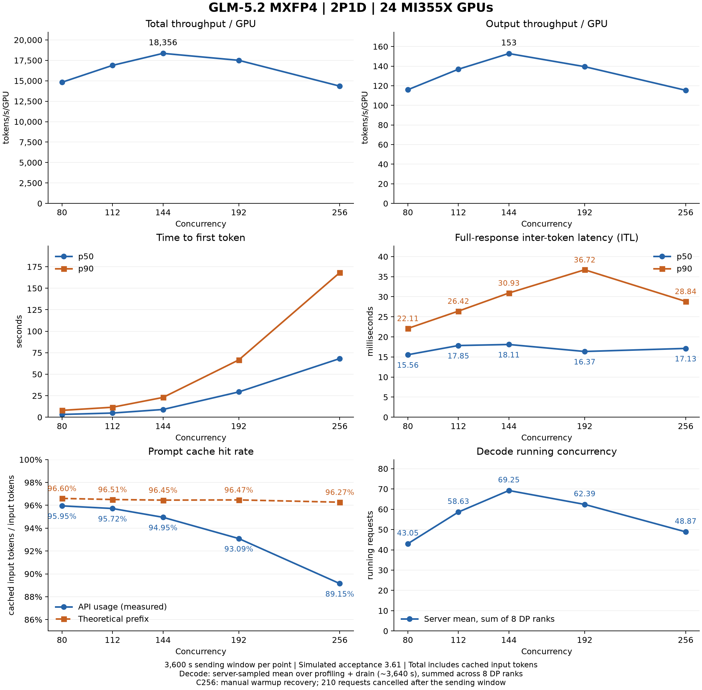

# 2P1D concurrency sweep 实测结果

运行 `2p1d-20260921T151735Z`，2026-09-21 至 2026-09-22。
Prefill：crsuse2-m2m-137 / 138；Decode：crsuse2-m2m-136。
每个 worker TP8/DP8，共 24 张 MI355X，GLM-5.2 MXFP4。
五档 C80/C112/C144/C192/C256 均完成 3600 秒正式发送窗口，使用同一组服务容器。

本轮扫描到的峰值为 **C144：18,356.23 总 token/s/GPU**，仅输出吞吐为
**152.81 token/s/GPU**，TTFT p50 为 **8.98 秒**。C256 总吞吐为 **14,346.41**，
比峰值低 **21.84%**，TTFT p50 为 **68.22 秒**；更高并发没有带来更高吞吐。
C112 的总吞吐为 16,886.23，TTFT p50 为 4.84 秒，可用于对照吞吐与首 token 延迟的取舍。
这些结论对应本次单轮测量和指定档位。

ITL 图使用 CSV 中的 `ITL_p50_ms` / `ITL_p90_ms`，对应原始聚合的
`full_response_itl`，单位为毫秒；五档的 p50/p90 数值均标在曲线上。

Cache hit rate 的实测曲线来自 AIPerf `Overall Usage Prompt Cache Read %`，
即 API 返回的缓存读取 token 总数 / prompt token 总数，按 token 数加权；
另画 `TheoreticalCacheHit` 理论前缀命中率作对照。

Decode 实际并发来自服务端 `sglang:num_running_reqs`：只选 Decode endpoint，
将 8 个 DP rank 的采样均值求和，表示整个 Decode 实例平均同时运行的请求数。
统计窗口是原始 server metrics 的 `profiling` 阶段（约 3640 秒，包含发送结束后的排空，
不含预热）。这是运行并发，等待队列和 KV 等待未计入。
各 rank 的 p50/p90 不能直接相加，图中只展示可加总的均值。
补充 CSV 同时保留客户端 `Effective Decode Concurrency` 的均值和分位数，供对照；
它按客户端请求的 Decode 时间区间估计，与服务端采样均值的口径不同。

| conc | Cache hit：API usage | 理论前缀命中率 | Decode 运行并发均值（8 DP 合计） | 每 DP 平均 |
|---|---:|---:|---:|---:|
| 80 | 95.95% | 96.60% | 43.05 | 5.38 |
| 112 | 95.72% | 96.51% | 58.63 | 7.33 |
| 144 | 94.95% | 96.45% | 69.25 | 8.66 |
| 192 | 93.09% | 96.47% | 62.39 | 7.80 |
| 256 | 89.15% | 96.27% | 48.87 | 6.11 |

- [完整指标表](sweep_results.md) / [CSV](results.csv)
- [Cache 与 Decode 并发补充 CSV](cache_decode_metrics.csv) / [各 DP rank 运行并发均值](decode_running_by_rank.csv)
- [可缩放曲线 SVG](sweep.svg)
- [2P1D 与 1P1D 六面板对比图](sweep_compare.png) / [SVG](sweep_compare.svg) / [作图数据 CSV](sweep_compare.csv)
- [运行拓扑、镜像及人工恢复事件](run.json)
- [测量口径、逐阶段错误与取消计数](measurement_notes.md)
- `c080/` 至 `c256/`：每档聚合 JSON、原始 AIPerf CSV 和 rail/GPU 错误审计摘要

`sweep_compare.png` 对比本轮 **2P1D / 24 卡** 与参考最终 Run 2 的 **1P1D / 16 卡**，
保留总吞吐、输出吞吐、TTFT、ITL、缓存命中率、Decode 并发六个面板。
蓝色为 2P1D，橙色为 1P1D；延迟图实线为 p50、虚线为 p90，缓存图实线为 API 实测、虚线为理论值。
每卡吞吐分别除以各自部署的总 GPU 数。参考包未保留完整服务端 running gauge，
因此对比图的 Decode 面板两组均使用客户端 `Effective Decode Concurrency` 均值，
与上方原图的服务端 running 均值分开标注。
通过 `python3 scripts/plot_sweep_compare.py`（在套件根目录运行）可从已归档结果重绘，无需 `.tmp/raw`。

本轮 2P1D 总吞吐包含输入和输出，输入包含缓存命中的 token；本轮每卡数据均除以 24。
使用参考设置的模拟 acceptance 3.61，结果用于性能比较，不表示生成正确性。
C256 经过两次人工预热恢复后完成全部 2845 个预热请求；正式一小时内没有人工干预。
正式窗口结束后按原配置取消了 210 个未完成请求，因此已完成请求的延迟分位数存在尾部截断。
各档 JSONL 的 error 都属于预热阶段，正式测量记录未发现 error；详细证据及限制见测量说明。
