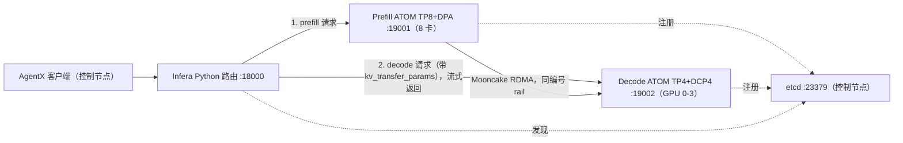

# GLM-5.2 8P4D（原生 ATOM + Infera）阶段报告

更新时间：2026-09-24 05:05 UTC（文中时间均为 UTC）。
详细时间线见 [progress.md](progress.md)，各问题的日志与分析见 [issues.md](issues.md)，计划见 [../plan/plan.md](../plan/plan.md)。

## 1. 概要

- 端到端流程已在原节点（prefill n02-33，decode n10-29）上验证可用：镜像构建、8P4D 部署、经 Infera Python 路由的 PD 请求、AgentX 测试、结果汇总。精度检查通过：GSM8K 200 题 0.965-0.99，6 万 token 大海捞针 3/3。
- 修复了 3 处代码问题（2 个 ATOM patch，1 个 Infera patch）和 4 处部署配置问题。
- prefill 加入了 LMCache CPU 卸载，默认开启，每个 DP rank 160 GiB，对应 2p1d prefill 的 HiCache，为此增加了第 2 个 Infera patch。在 n04-21 上以 128 GiB 验证了启动和 PD 链路（smoke 通过）；精度、CPU 命中和 160 GiB 下的启动尚未验证。
- amdgpu 6.19.x 的节点（n04-21、n04-29）上，RDMA 注册后固定的 KV 显存会被重复计入，需要降低显存比例才能启动。按用户决定，这类节点只用于功能验证，后续作业排除 n04-29。
- C16、600 秒的 AgentX 验证中，会话亲和生效后 total 为 4889 tok/s/GPU，TTFT p50 为 1.50 s；修复前分别为 2732 tok/s/GPU 和 14.46 s。
- C80 正式测试完成（作业 31690，prefill n10-29，decode n04-21，LMCache 开启）：total 17941 tok/s/GPU，output 161 tok/s/GPU，TTFT p50 20.0 s / p90 41.2 s，ITL p50 16.2 ms，12 卡。2p1d 参考（24 卡）为 14975、116、2.4 s / 6.4 s、16.0 ms。瓶颈是 decode 的 KV 容量：decode 所在的新驱动节点只能用 0.74 的显存比例，KV 已满，请求排队。详见 [../results/README.md](../results/README.md)。
- C112-C256 没有测。decode 扩展到 TP8 + DCP8 的测试见 [`../../8p8d-atom-infera`](../../8p8d-atom-infera/README.md)。

| 任务 | 状态 | 产物 |
|---|---|---|
| 1. 基于 ATOM nightly 构建 Infera 镜像 | 完成 | `docker/Dockerfile`、`scripts/build_image.sh`、`patch/` |
| 2. GLM-5.2 8P4D 部署 | 完成，在原节点验证 | `config.sh`、`scripts/{common,up,down,smoke}.sh` |
| 3. AgentX 脚本与性能测试 | 脚本完成，C16 验证完成，C80 完成（decode KV 容量受限），C112-C256 未测 | `scripts/{agentx,sweep}.sh`、`scripts/summarize.py`、`results/` |

## 2. 环境

- 登录：`ssh cyao1002@dccs-1334-slurm.prov.aus.ccs.cpe.ice.amd.com`，计算节点经 `ssh -J` 访问。
- 作业 31626 的提交命令：`sbatch --partition=Compute-DCPT --qos=batch --nodes=2 --ntasks-per-node=1 --cpus-per-task=256 --gres=gpu:mi355x:8 --mem=0 --exclusive --time=24:00:00 --job-name=cyao1002-2n --wrap="sleep infinity"`。
- 模型：`/apps/data/models/GLM-5.2-MXFP4`（实际路径 `/perf_apps/data/models/GLM-5.2-MXFP4`，408 GB，78 层加 1 层 MTP）。
- 基础镜像：`rocm/atom-dev:nightly_202609221542`（repo digest `sha256:8d7ebab3069a…`），其中 ATOM 为 `d9f0720e2f99`，Mooncake 为 v0.3.14-rc1。
- 网络：前端网卡 fenic 用于 HTTP、etcd、ZMQ；8 张 ionic（RoCE v2，GID index 1）用于 KV 的 RDMA 传输。两节点之间只有同编号 rail 互通。

作业使用过的节点：

| 时间段 | Prefill 节点 | Decode 与控制节点 | 说明 |
|---|---|---|---|
| 09:28-14:55 | n02-33（10.235.192.133） | n10-29（10.235.192.140） | 所有验证在这两台节点完成，14:55 被抢占 |
| 14:57-15:33 | n04-25（10.235.192.131） | n04-29（10.235.192.57） | n04-29 上 decode 显存不足，15:28 被抢占 |
| 15:33-15:52 | 排队 | 排队 | 作业 31626 在排队中被取消 |
| 9 月 24 日 01:01-02:13 | n04-21（10.235.192.135，amdgpu 6.19.14） | n04-29（10.235.192.57，amdgpu 6.19.16） | 作业 31684，两台都是新驱动，只做功能验证；02:13 取消 |
| 9 月 24 日 02:13 起 | 排队 | 排队 | 作业 31690，提交命令增加 `--exclude=smci355-ccs-aus-n04-29` |

镜像 `infera-atom:nightly_202609221542` 的 image ID：原节点为 `sha256:b7807ac42574…`，n04 节点为 `sha256:4aa7d9b22846…`。两者的 Dockerfile 与 patch 相同，ID 不同是因为在不同节点重新构建。

## 3. 部署配置



- 两侧共同参数：`python3 -m infera.engine.atom`（Infera 包装 ATOM 的 `openai_server`）、`--kv_cache_dtype fp8 --block-size 16 --enable_prefix_caching`、在线 PTPC FP8 量化（层 0-77 的专家保持 MXFP4，MTP 层 78 保持 BF16）、`--method mtp`、`--max-num-batched-tokens 16384`、`--gpu-memory-utilization 0.85`。
- Prefill：`-tp 8 --enable-dp-attention --enforce-eager --max-num-seqs 512`，kv_producer。ATOM 的 DPA 按 8 个 DP rank 运行 attention，每个 rank 有独立的 KV 池、prefix cache 和握手端口（21301-21308）。环境变量 `ATOM_MOONCAKE_MATCHED_RAILS=auto`、`ATOM_DP_SESSION_AFFINITY=1`。LMCache CPU 卸载开启时（默认 `PREFILL_OFFLOAD_GB=160`），kv-transfer-config 为 `multi`，包含 mooncake kv_producer 与 `lmcache_offload`，并设置 `LMCACHE_LOCAL_CPU=True LMCACHE_MAX_LOCAL_CPU_SIZE=160 LMCACHE_CHUNK_SIZE=256 OFFLOAD_MIN_LOAD_TOKENS=8192`。
- Decode：`-tp 4 --decode-context-parallel-size 4`，EP1，DPA 关闭，kv_consumer，握手端口 21311。`--max-num-seqs` 为 `2*CONC`，cudagraph 尺寸为 `[1,2,4,8,12,...,2*CONC]`，步长 4。这两条规则与 MTP 深度一样，来自 InferenceX 的 `glm5.2_fp4_mi355x_atom_mtp.sh`。
- MTP：CONC < 48 时 K4、forced acceptance 3.33；CONC ≥ 48 时 K3、2.99。设置 `MTP_AL=`（空值）可以关闭 forced acceptance，用于精度检查。
- 路由：`python3 -m infera.server --router-backend python --discovery-backend etcd --request-transport http --kv-event-transport zmq --router-policy round-robin`。ATOM 的 PD 使用 `atom-mooncake` 协议，prefill 完成后由路由把 `kv_transfer_params` 发给 decode。
- 端口：etcd 23379/23380、路由 18000、prefill 19001、decode 19002、握手 21301-21308 与 21311。这些端口都在临时端口范围（32768-60999）和 Mooncake 随机 RPC 端口（15000-17000）之外。

## 4. 完成的工作

### 4.1 镜像（任务 1）

`docker/Dockerfile` 以 `deploy/docker/Dockerfile.atom` 为参考，构建步骤如下：

1. 基于 ATOM nightly，保留镜像自带的 Mooncake v0.3.14-rc1（多协议版本），不重新编译旧版本。
2. 把 `patch/atom-*.diff` 应用到 `/app/ATOM`（`git -C /app/ATOM apply`）。
3. 复制 Infera 源码，把 `patch/infera-*.diff` 应用到 `/opt/infera`，然后执行 `pip install ".[atom]" "protobuf<7"`。
4. 安装 KV-event 的 `.pth` hook 和入口脚本。入口脚本在容器启动时把宿主的 libionic 换入容器。

ATOM 的 PD 只由 Python 路由支持，所以镜像不包含 Rust 路由。`scripts/build_image.sh` 在控制节点上构建镜像，通过 `docker save | ssh <prefill 节点> docker load` 同步到 prefill 节点，并输出两台节点的 image ID 供比对。

### 4.2 部署（任务 2）

- `config.sh`：节点、IP、镜像、模型、端口、引擎参数与 AgentX 参数。所有脚本都支持用 `KEY=VALUE` 覆盖默认值。
- `scripts/up.sh`：启动 etcd、prefill、decode，两者就绪后启动路由，并写出 `workers.json`。运行目录为 `.tmp/runs/<RUN_ID>/`。
- `scripts/down.sh`：把各容器的日志和 `docker inspect` 保存到当前运行目录，然后删除容器。
- `scripts/smoke.sh`：经路由发送一个 completions 请求和一个流式 chat 请求，并打印两侧的 Mooncake RDMA 初始化日志。

### 4.3 AgentX（任务 3）

- `scripts/agentx.sh`：在控制节点上启动客户端容器，使用与 2p1d 参考相同的 InferenceX commit（`918524ff`，aiperf `754356e9`，场景 `inferencex-agentx-mvp`）。脚本生成 `runtime.env`，内容包括拓扑（PREFILL TP8 DPA、DECODE TP4 DCP4）、`SIMULATE_ACC_LEN`、指标地址和缓存目录，然后调用 `benchmark_lib.sh` 的 `run_agentic_replay_and_write_outputs`，回放命令追加 `--apply-chat-template`。聚合结果写入 `<运行目录>/agentx/agentx_conc<N>.json`。
- `scripts/sweep.sh`：对 `POINTS` 中的每个并发档位依次执行 `down.sh`、冷启动 `up.sh` 和 `agentx.sh`，全部完成后调用 `summarize.py`。某一档失败时记录日志，并继续测试后面的档位。
- `scripts/summarize.py`：按 JSON 中记录的 GPU 数（8 + 4 = 12）换算每 GPU 指标，写出 `results/summary.{md,csv}`，并把各档 JSON 复制到 `results/c<NNN>/`。

## 5. 解决的问题

### 5.1 DPA prefill 在 eager 模式下 MoE 断言失败（issues.md 第 5 条）

- 现象：GSM8K 开始约 1 秒后，prefill 的一个 ModelRunner 因 `AssertionError: MoE was handed 35 rows on a decode step expecting 40` 退出，其余 rank 随后退出。
- 原因：producer 的 `kv_transfer_params` 需要返回 `draft_token_ids`，所以 prefill 每个请求都执行一次 MTP 的 decode 形态前向。connector 要求两侧在投机解码设置上一致，因此 prefill 不能关闭 MTP。该步骤的 batch 按 cudagraph 梯度填充计为 40 行，而 eager 模式下实际只有 35 行，DP MoE all-gather（`pad_for_all_gather`）要求两者相等。
- 处理：`patch/atom-moe-eager-decode-pad.diff`。在 decode 步行数等于 `scheduled_tokens`（即 eager 下未填充）时，按 prefill 的方式填充到 `running_tokens`，填充行清零，并返回真实行数供 reduce-scatter 截回。cudagraph 路径和 prefill 步不受影响；decode 节点 dp_size=1，不经过这段代码。
- 效果：prefill 可以正常服务，GSM8K 200 题 0.98。

### 5.2 prefill 的 cudagraph 模式（issues.md 第 5 条，未采用）

- FULL 与 PIECEWISE 两种模式在捕获完成后都出现 8 卡 `Memory access fault`。`PYTHONFAULTHANDLER` 显示故障发生在 drafter 用合成数据预热（`warmup_draft_graphs`）时。
- `.tmp/patchwork/atom-dp-eager-draft-skip-warmup.diff` 跳过该预热后 graph 模式可以启动，但每请求约 220 ms 的固定开销与 eager 相同，首次出现的形状还需要在线 JIT。因此默认保留 eager，这个 patch 没有加入镜像。

### 5.3 后端网络按 rail 隔离（issues.md 第 2 条）

- 现象：长上下文的 KV 传输平均 36.4 s/次，prefill 的 `ionic_1`、`ionic_5` 出现 `req_tx_retry_excd_err`。
- 原因：decode 在 8 张 HCA 上注册（alternate HCA）时，通告的目标网卡不唯一，部分 RDMA WRITE 发往不可达的 rail。
- 处理：decode 每个 rank 只注册本卡的 `ionic_<gpu>`；prefill 设置 `ATOM_MOONCAKE_MATCHED_RAILS=auto`，每条 rail 一个单网卡引擎，按 decode rank 的 rail 写入。
- 效果：重传超限消失。传输慢的主要原因见 5.4。

### 5.4 DCP consumer 的 KV 按 token 写入（issues.md 第 6 条）

- 现象：空闲时 10 万 token 提示的 KV 传输需要 4.93-5.56 s，网卡速率只有 0.01-0.02 GB/s。
- 原因：GLM-5.2 的 DSA 索引缓存加 MTP 要求 DCP `interleave_size=1`，每个 decode rank 拥有每隔 4 个的 token。producer 对 MLA KV 按 token 生成 RDMA 描述符（每层每 token 一条），10 万 token 约 790 万条。把每批条目数从 4096 加大到 262144 后传输变为 10.65-11.44 s，说明瓶颈也不在批次往返次数。
- 处理：`patch/atom-dcp-kv-staging.diff`（修改 `mooncake_connector.py` 和 `aiter_mla.py`）。
  - producer 为 MLA KV 建立 token 视图，按 8192 token 分块、每 8 层一组，在 GPU 上用 `index_select` 把目标 rank 的 token 收集到已注册的 staging 缓冲区。
  - staging 缓冲区有 16 个槽，与默认的 16 个发送线程一致，每个槽使用独立的 stream。
  - 连续的目的地址合并后按整页 RDMA 写出。
  - DSA 索引的 staging 分块由 256 页改为 2048 页。
- 效果：空闲时 10 万 token 的传输为 1.57-2.87 s，端到端 9.1-9.8 s（原为 12.4-15 s）。逐字节等价测试、大海捞针和 GSM8K 都通过（见第 6 节）。

### 5.5 prefill 各 DP rank 的 prefix cache 命中率低（issues.md 第 8 条）

- 现象：C16 AgentX 中，prefill 8 个 DP rank 的命中率为 21%-42%，decode 为 78.4%，数据集的理论命中率为 95%；TTFT p50 为 14.46 s。
- 原因：ATOM 的 DPA 引擎按负载为每个请求选择 DP rank，同一会话的多轮请求分布到不同 rank，后续轮次需要重新计算前文。ATOM 的 `ATOM_DP_SESSION_AFFINITY` 可以按 `x-correlation-id` 等请求头固定会话所在的 rank（新会话放在负载最低的 rank），但 Infera PD 路由没有把客户端的会话头转发给引擎。
- 处理：
  - `patch/infera-forward-session-headers.diff`：`infera/server/app.py` 把 `x-correlation-id`、`x-dynamo-session-id`、`x-dynamo-parent-session-id` 存入私有字段；`infera/router/disagg.py` 把它们加到 prefill 与 decode 两条请求的请求头；`infera/router/mixed.py` 在转发前删除该字段。
  - prefill 设置 `ATOM_DP_SESSION_AFFINITY=1`。decode 只有一个 DP rank，不需要设置。
- 效果：测试期间 prefill 的 `atom:dp_route_load_balanced_total` 为 0，全部请求按会话路由。prefill 各 rank 的命中率升到 49%-92%，decode 升到 85.0%，TTFT p50 降到 1.50 s。

### 5.6 prefill 没有 KV 卸载（issues.md 第 11 条，已实现，待验证）

- 问题：prefill 每个 DP rank 的显存 KV 约 289 万 token，C192、C256 时每个 rank 的会话量超过这个容量。2p1d 参考的 prefill 开启了 HiCache，本套件没有任何 KV 卸载。
- ATOM 的支持：`multi` connector 可以组合 mooncake producer 与 `lmcache_offload`。卸载格式包含 GLM-5.2 的 DSA 索引缓存和 MTP draft 层，DPA 下每个 DP rank 有独立的 CPU 池。
- 障碍：Infera 的 ATOM 包装层只读取 kv-transfer-config 顶层的 `kv_role`，`multi` 配置会让 prefill 注册为 MIXED。
- 处理：
  - `patch/infera-atom-multi-connector.diff`：配置为 `multi` 时，改从带 PD 角色的子 connector 读取角色、协议和握手端口。
  - `config.sh` 新增 `PREFILL_OFFLOAD_GB`（默认 160，设为 0 时关闭）。开启时 `up.sh` 生成 `multi` 配置，并设置 LMCache 环境变量；`agentx.sh` 把元数据记为 `KV_OFFLOADING=dram`、`KV_OFFLOAD_BACKEND=lmcache`。
  - 默认每个 rank 160 GiB，可容纳约 353 万 token，约为 0.85 下显存 KV 的 1.2 倍。8 个 rank 的总量受 GPU 的 GTT 上限（1511 GiB，主机内存的一半）约束：每 rank 256 GiB 时部分 rank 的 pinned 内存分配超过 10 分钟，NCCL barrier 超时导致启动失败；每 rank 128 GiB 时 13 s 完成。
- 状态：本地单元测试与离线检查通过。n04-21 上以每 rank 128 GiB 启动成功，smoke 通过，路由把 `multi` 配置的 prefill 识别为 PD prefill；其余验证项见 8.1。

### 5.7 部署层面的其他问题

| 问题 | 处理 | issues.md |
|---|---|---|
| n10-29 的 GPU 被他人容器占满（显存 85-86%） | 经用户授权 `docker stop`（未删除）他人容器 | 第 1 条 |
| `pip install ".[atom]"` 把 protobuf 升到 7，与 `opentelemetry-proto` 冲突 | 安装时加 `"protobuf<7"`，`pip check` 与基础镜像一致 | 第 3 条 |
| 前台经 SSH 运行的 `up.sh` 随会话退出 | 长时间任务用 `nohup setsid ... < /dev/null &` 启动 | 第 4 条 |
| prefill 端口 39001 被出站 socket 占用 | 所有监听端口移到临时端口和 Mooncake 随机端口范围之外 | 第 7 条 |

## 6. 测试与验证结果

### 6.1 精度

| 镜像内容 | 检查 | 结果 |
|---|---|---|
| patch 5.1 | GSM8K 5-shot 200 题 | 0.98 ± 0.0099（ATOM PD recipe 为 0.961） |
| patch 5.1 + staging 第一版 | GSM8K 200 题 | 0.99 |
| patch 5.1 + staging 最终版（当前 ATOM patch） | GSM8K 200 题 | 0.965 ± 0.013 |
| staging 三个版本 | 6 万 token 大海捞针 | 均为 3/3 |
| staging 最终版 | `test_kv_staging_mapping.py`（CPU） | staging 写出的字节与逐 token 路径一致，每块描述符由 1024 条降到约 60 条 |

精度检查都在关闭 forced acceptance（`MTP_AL=`）的配置下完成。GSM8K 期间 decode 的实际 MTP acceptance rate 约为 72%（K4，平均 3.9 token/前向）。Infera patch 只修改请求头，之后没有重新测 GSM8K。

### 6.2 KV 传输（空闲，10 万 token 提示，`.tmp/kv_transfer_probe.sh`）

| 版本 | decode 侧 KV 传输时间 |
|---|---|
| 原始（逐 token 描述符） | 4.93-5.56 s |
| 每批 262144 条 | 10.65-11.44 s |
| staging 第一版（4 槽，逐层写） | 2.57-3.98 s |
| 每 8 层合并，索引分块 2048 页 | 1.86-2.10 s |
| 最终版（16 槽） | 1.57-2.87 s |

### 6.3 AgentX 验证（C16，测量 600 秒，每 lane 预热 1 个请求，12 GPU，MTP K4，forced acceptance 3.33）

| 验证 | 相对上一次的改动 | total tok/s/GPU | output tok/s/GPU | TTFT p50 / p90 (s) | ITL p50 (ms) | 完成请求 | 错误 |
|---|---|---|---|---|---|---|---|
| check1 | 基线（alternate HCA） | 2827.39 | 21.77 | 13.09 / 34.28 | 6.83 | 155 | 0 |
| check2 | matched rails | 2861.15 | 21.21 | 13.07 / 34.01 | 6.96 | 156 | 0 |
| check3 | KV staging patch | 2732.42 | 20.65 | 14.46 / 37.04 | 6.73 | 148 | 0 |
| check4 | 会话亲和 | 4888.70 | 31.24 | 1.50 / 9.24 | 8.36 | 252 | 0 |

- check1-3 的 TTFT 主要花在 prefill 重新计算前文上，所以传输加速后 TTFT 没有下降。check3 比 check2 低 4.5%，这是单次 600 秒运行的差异，是否显著尚未确认。
- check4 的 TTFT p50 降到 check3 的约十分之一，total 提高 79%。ITL 从 6.7 ms 升到 8.4 ms，原因是 decode 同时处理的请求增多（C16 时 decode 最多同时运行 8 个请求）。
- 数据集特征（check1）：ISL p50 约 10.7 万 token，理论 prefix cache 命中率 95.1%，客户端有效并发均值 6.47。
- 汇总表位于 `.tmp/results-check{,2,3,4}/summary.md`，原始数据位于 `.tmp/runs/check*-c16/agentx/`。

### 6.4 C80 正式测试

作业 31690，prefill n10-29（0.85，LMCache 每 rank 160 GiB），decode n04-21（TP4 + DCP4，0.74），测量 3600 s，每 lane 预热 10，MTP K3、forced acceptance 2.99。

| 部署 | GPU | total tok/s/GPU | output tok/s/GPU | TTFT p50 / p90 (s) | ITL p50 (ms) | intvty p50 | 完成请求 |
|---|---|---|---|---|---|---|---|
| 8P4D ATOM + Infera | 12 | 17941.47 | 161.25 | 20.01 / 41.23 | 16.19 | 61.77 | 7137 |
| 2P1D SGLang（参考） | 24 | 14975.27 | 115.51 | 2.42 / 6.38 | 16.02 | 62.43 | 10641 |

decode 的 KV 占用在测量中期达到 96.7%-100%，同时有 15-25 个请求等待，TTFT p50 从测量开始时的 3.2 s 升到 20 s；prefill 负载很轻。完整说明见 [../results/README.md](../results/README.md)。

### 6.5 与 2p1d 参考的差异

参考结果（`../2p1d-sweep-triton-dsa-20260922/results/sweep_results.md`）：

| conc | total tok/s/GPU | output tok/s/GPU | TTFT p50 / p90 (s) | ITL p50 (ms) |
|---|---|---|---|---|
| 80 | 14975.27 | 115.51 | 2.415 / 6.377 | 16.02 |
| 112 | 17581.16 | 140.52 | 4.155 / 9.529 | 17.52 |
| 144 | 18519.35 | 154.15 | 10.481 / 22.480 | 16.83 |
| 192 | 18806.71 | 149.44 | 26.458 / 50.777 | 16.47 |
| 256 | 15618.00 | 126.09 | 60.131 / 137.236 | 17.05 |

两组结果目前还不可比：

| 项目 | 2p1d 参考 | 本套件 |
|---|---|---|
| 引擎 | SGLang | 原生 ATOM + Infera |
| GPU 数 | 24（2 个 prefill 节点加 1 个 decode 节点，均为 TP8/DP8 DPA） | 12（prefill 8 卡 TP8 DPA，decode 4 卡 TP4 DCP4） |
| prefill 二级缓存 | HiCache（ratio 1.5） | check1-4 没有；已加入 LMCache CPU 卸载（默认每个 DP rank 160 GiB，约为显存 KV 的 1.2 倍），尚未用于 AgentX 测试 |
| MTP | 5 步、6 个 draft token，模拟 acceptance length 3.61 | C ≥ 48 时 K3，模拟 acceptance length 2.99 |
| 已有数据 | C80-C256，每档 3600 s，每 lane 预热 10 | 只有 C16，600 s，每 lane 预热 1 |
| 每 GPU 并发 | 3.3-10.7 | C16 为 1.3；C80-C256 为 6.7-21.3 |

## 7. 脚本运行方法

### 7.1 约定

- 所有脚本在控制节点（decode 节点）的套件目录下执行：

  ```bash
  ssh -J cyao1002@dccs-1334-slurm.prov.aus.ccs.cpe.ice.amd.com smci355-ccs-aus-n04-29
  cd /apps/tas/yaoc/research/topic/glm-5.2-pd-opt/Infera-glm-5.2-2p1d/yaocheng/8p4d-atom-infera
  ```

- 参数用 `KEY=VALUE` 传入，例如 `bash scripts/up.sh CONC=80 MTP_AL=`，也可以修改 `config.sh` 中的默认值。
- 耗时超过几分钟的任务（`up.sh`、`agentx.sh`、`sweep.sh`、`gsm8k.sh`）用 `nohup setsid` 启动，通过日志查看运行状态：

  ```bash
  nohup setsid bash scripts/up.sh CONC=80 > .tmp/logs/up.log 2>&1 < /dev/null &
  tail -f .tmp/logs/up.log
  ```

- 执行过程中如果 SSH 被 `pam_slurm_adopt` 拒绝，说明作业已被抢占，用 `squeue -j 31626` 查看作业状态。

### 7.2 套件脚本

| 命令 | 作用 | 耗时 |
|---|---|---|
| `bash scripts/build_image.sh` | 在控制节点构建镜像，同步到 prefill 节点，输出两台节点的 image ID | 基础镜像已拉取时约 3-4 分钟 |
| `bash scripts/up.sh CONC=<N> [MTP_AL=] [RUN_ID=<名称>]` | 启动 etcd、prefill、decode 和路由，末行输出 `up: CONC=... run=...` | 新节点首次约 8 分钟，编译缓存命中后 2-3 分钟 |
| `bash scripts/smoke.sh` | `/v1/workers`、一个 completions 请求、一个流式 chat 请求（17×23，期望 391），以及两侧的 RDMA 初始化日志 | 数秒 |
| `bash scripts/agentx.sh CONC=<N> [DURATION=600] [WARMUP_PER_LANE=1]` | 对正在运行的服务测试一档 AgentX（DURATION 短于 900 秒时 InferenceX 会加 `--unsafe-override`） | 数据集配置约 3 分钟，加上预热和 DURATION |
| `bash scripts/down.sh` | 保存日志和 `docker inspect` 到当前运行目录，删除容器 | 约 20 秒 |
| `bash scripts/sweep.sh [POINTS="..."] [SWEEP_ID=<名称>] [RESULTS_DIR=<目录>]` | 每档冷启动并测试，结束后写 `results/` | 默认 5 档约 8 小时 |
| `python3 scripts/summarize.py .tmp/runs/<运行目录> ...` | 由已有运行目录重新生成汇总表 | 数秒 |

常用组合：

```bash
# 正式测试（默认 C80 C112 C144 C192 C256，每档 3600 s，每 lane 预热 10）
nohup setsid bash scripts/sweep.sh > .tmp/logs/sweep.log 2>&1 < /dev/null &
grep -E "^up:|AgentX C|failed" .tmp/logs/sweep.log      # 各档状态
grep NOTICE .tmp/logs/sweep.log | tail -3                # AgentX 当前阶段

# 短验证，与 check1-4 的条件相同
bash scripts/sweep.sh POINTS=16 DURATION=600 WARMUP_PER_LANE=1 \
    SWEEP_ID=check5 RESULTS_DIR="$PWD/.tmp/results-check5"

# 中止 sweep：结束其 process group，EXIT trap 会执行 down.sh；AgentX 客户端容器需要手动删除
ps -eo pid,pgid,args | awk '$3=="bash" && $4=="scripts/sweep.sh"'
kill -TERM -- -<PGID>
docker rm -f glm52-8p4d-atom-agentx
```

### 7.3 常用参数（`config.sh`）

| 参数 | 默认值 | 说明 |
|---|---|---|
| `PREFILL_NODE` / `PREFILL_IP` | n04-25 / 10.235.192.131 | prefill 节点及其 fenic IP |
| `DECODE_NODE` / `DECODE_IP` | n04-29 / 10.235.192.57 | decode 节点，同时是控制节点 |
| `CONC` | 16 | 并发，决定 MTP 深度、decode 的 `--max-num-seqs` 与 cudagraph 尺寸 |
| `MTP_K` / `MTP_AL` | 由 CONC 决定 | K4/3.33（CONC < 48），K3/2.99（CONC ≥ 48）；`MTP_AL=` 关闭 forced acceptance |
| `GPU_MEM_UTIL` | 0.85 | 显存比例 |
| `PREFILL_MEM_UTIL` / `DECODE_MEM_UTIL` | 取 `GPU_MEM_UTIL` | 分角色的显存比例；amdgpu 6.19.x 节点上约 0.70 / 0.74 才能启动 |
| `PREFILL_GRAPH_ARGS` | `--enforce-eager` | prefill 的 graph 模式参数 |
| `PREFILL_OFFLOAD_GB` | 160 | 每个 prefill DP rank 的 LMCache CPU 缓存（GiB），0 关闭；8 个 rank 的总量需小于 GTT 上限 1511 GiB |
| `PREFILL_EXTRA_ENV` / `DECODE_EXTRA_ENV` | 空 | 追加的环境变量，空格分隔的 `KEY=VALUE` |
| `PREFILL_EXTRA_ARGS` / `DECODE_EXTRA_ARGS` | 空 | 追加的引擎参数 |
| `DURATION` / `WARMUP_PER_LANE` | 3600 / 10 | AgentX 测量时长和每 lane 预热请求数 |
| `POINTS` | `80 112 144 192 256` | sweep 的并发档位 |
| `RUN_ID` / `SWEEP_ID` | UTC 时间戳 | 运行目录名 |
| `RESULTS_DIR` | `results/` | summarize 的输出目录 |

### 7.4 验证脚本（`.tmp/`）

除 `rdma_rate.sh` 和 `vram_sample.sh` 在所测节点上本地执行外，下列脚本都在控制节点执行，并且要求服务已由 `up.sh` 启动。精度类检查需要以 `MTP_AL=` 启动服务。

| 命令 | 作用 |
|---|---|
| `bash .tmp/gsm8k.sh [LIMIT=200]` | 经路由执行 GSM8K 5-shot（`lm_eval local-chat-completions`，并发 64），结果写入 `<运行目录>/gsm8k/` |
| `bash .tmp/needle_probe.sh [N=3] [TOKENS=60000]` | 在长提示开头放一个随机编号，要求模型复述，每条输出 `ok` 或 `WRONG` |
| `bash .tmp/kv_transfer_probe.sh [N=3] [TOKENS=100000]` | 逐个发送不重复的长提示，输出每个请求的总时间与 decode 侧 KV 传输时间（`atom:pd_kv_transfer_seconds_sum` 的增量） |
| `bash .tmp/eager_step_probe.sh` | 同一 1500 token 提示串行发送 16 次，输出 prefill 从调度到输出的时间（每请求固定开销） |
| `bash .tmp/rdma_rate.sh [秒数]` | 各 ionic 在该时段的 RDMA 收发速率与 `req_tx_retry_excd_err` 计数 |
| `bash .tmp/vram_sample.sh > .tmp/logs/vram.log` | 每 2 秒记录 8 张 GPU 的显存用量（MiB） |
| `CONC=80 bash .tmp/decode_probe.sh <容器名> <GPU 列表> <HTTP 端口> <握手端口> <dist 端口> [KEY=VALUE ...]` | 只启动一个 decode 实例（参数与 `up.sh` 相同），用于启动与显存测试；两个实例并行时，端口和 dist 端口需要不同 |
| `bash .tmp/offload_probe.sh [FILL=32] [TOKENS=100000]` | 在同一会话 ID 下依次发送：提示 A；重复的 A（显存命中）；FILL 条其他长提示（把 A 挤出该 rank 的显存）；第三次的 A。输出每个请求的耗时。第三次发送 A 的耗时与显存命中相当，说明从 CPU 加载成功。以 `PREFILL_EXTRA_ENV=OFFLOAD_PROFILE=1` 启动服务时，末尾会打印 `[OFFLOAD-LOAD-PROF]` 日志 |

patch 相关的工具位于 `.tmp/patchwork/`：

```bash
cd .tmp/patchwork
# a/ 为镜像中原始的 ATOM 文件，脚本生成修改后的 b/，diff 结果即为 patch/atom-dcp-kv-staging.diff
python3 make_staging_patch.py
# Infera patch：参数为仓库根目录，生成 infera-a/ 与 infera-b/
python3 make_infera_patch.py /apps/tas/yaoc/research/topic/glm-5.2-pd-opt/Infera-glm-5.2-2p1d
# multi connector 的 Infera patch：生成 infera-multi-a/ 与 infera-multi-b/
python3 make_infera_multi_patch.py /apps/tas/yaoc/research/topic/glm-5.2-pd-opt/Infera-glm-5.2-2p1d
# staging 的 CPU 等价测试，在镜像内执行，期望输出 "staged gather matches token_runs on all ranks"
docker run --rm -v "$PWD:/w" --entrypoint python3 infera-atom:nightly_202609221542 /w/test_kv_staging_mapping.py
```

运行期间可以查看的指标：

- prefill 的 `/metrics`：`atom:dp_affinity_new_total`、`atom:dp_affinity_owner_hit_total`、`atom:dp_route_load_balanced_total`，后者为 0 表示全部请求按会话路由。
- decode 的 `/metrics`：`atom:pd_kv_transfer_seconds_sum` 与 `_count`。
- 两侧日志中每个 Engine 的 `Prefix cache hit rate`、`GPU KV cache usage`、`Running`/`Waiting`。

### 7.5 结果与日志位置

| 路径 | 内容 |
|---|---|
| `.tmp/runs/<RUN_ID>/` | `workers.json`；`logs/` 下各容器日志与 `docker inspect`；`agentx/` 下 `runtime.env`、`runner.log`、`agentx_conc<N>.json`、aiperf 原始数据；`gsm8k/` |
| `.tmp/results-check{,2,3,4}/` | C16 验证的汇总表 |
| `.tmp/logs/` | 各脚本的输出日志（`sweep.log`、`up-*.log`、`build_image*.log`、`vram-*.log` 等） |
| `.tmp/cache/` | InferenceX 仓库、ATOM 源码（`d9f0720e2f99`）、aiperf venv、数据集与 HuggingFace 缓存（位于共享存储，更换节点后可继续使用） |
| `results/` | 正式测试的 `summary.md`、`summary.csv` 与 `c<NNN>/`，目前还没有内容 |

### 7.6 更换节点时的步骤

作业被抢占后重新运行时，节点可能不同，需要按以下步骤重新部署：

1. 提交作业时排除问题节点（`--exclude=smci355-ccs-aus-n04-29`），在登录节点上用 `squeue -j <作业号> -h -o %N` 查看节点列表。
2. 在每台节点上检查：
   - 驱动版本：`cat /sys/module/amdgpu/version`，`up.sh` 启动时也会打印。6.19.x（n04-21 为 6.19.14，n04-29 为 6.19.16）需要降低显存比例，按用户要求只做功能验证。
   - GPU 显存与他人容器：`amd-smi metric --mem-usage`、`docker ps`。
   - fenic IP：`ip -4 -o addr show fenic`。
   - ionic 网卡与 GID：`ls /sys/class/infiniband`、`cat /sys/class/infiniband/ionic_0/ports/1/gids/1`。
   - 端口占用：`ss -ltn`。
3. 修改 `config.sh` 的 `PREFILL_NODE`、`PREFILL_IP`、`DECODE_NODE`、`DECODE_IP`。prefill 需要 8 张空闲 GPU。
4. 在新的控制节点上执行 `docker pull rocm/atom-dev:nightly_202609221542`（约 1-2 分钟）和 `bash scripts/build_image.sh`。
5. 以 `nohup setsid bash scripts/up.sh CONC=80 MTP_AL= PREFILL_EXTRA_ENV=OFFLOAD_PROFILE=1 RUN_ID=bringup-<节点> ...` 冷启动，然后执行 `scripts/smoke.sh`、`.tmp/gsm8k.sh`、`.tmp/needle_probe.sh`、`.tmp/offload_probe.sh`。
6. 执行 `bash scripts/down.sh`，然后启动 `scripts/sweep.sh`。

## 8. 未完成的部分与风险

### 8.1 未完成

- C112-C256 的正式测试。C80 已完成，但 decode 在新驱动节点上 KV 容量受限；decode 扩展到 TP8 + DCP8 的测试见 `../../8p8d-atom-infera`。单档需要 75-90 分钟。
- decode 在旧驱动节点上（显存比例 0.85）的 C80 对照。
- n04-29 显存不足的原因只确定到驱动层面（显存用到约 84% 时分配失败），具体机制没有查明。
- prefill 的 cudagraph 模式没有修复（drafter 预热访存错误）。目前测量显示 graph 模式不带来收益，所以不影响当前结果。
- LMCache CPU 卸载的节点验证。n04-21 上以 128 GiB 验证了启动和 PD 链路；尚未完成的有：GSM8K 与大海捞针，`.tmp/offload_probe.sh`（显存逐出后从 CPU 加载），160 GiB 下的启动，以及短测下的 prefill 命中率与 TTFT。镜像需要在新节点上重新构建。

### 8.2 风险

1. **抢占**：作业的 QOS 为 `batch`。集群按 QOS 抢占（`PreemptMode=REQUEUE`），作业启动 30 分钟后即可被 `dcgpu-test`、`dcgpu-prod`、`dcgpu-fullpool`、`sponsor`、`perf`、`shared-medium`、`special-group` 等 QOS 的作业抢占，宽限期 5 分钟。两次抢占都来自 jabowden 的 `dcgpu-test` 作业（31639、31642）。账号 emad 下可用的 QOS 只有 `batch`、`debug`、`normal`、`shared-low`，全部可被抢占。
2. **新驱动节点**：n04-29（amdgpu 6.19.16，ionic 26.07.9）上 decode 在显存约 243 GB 时 OOM。peer-mem 与 dma-buf 两种注册方式结果相同。n04-25（amdgpu 6.14.14）与原节点没有这个问题。可行的处理有两种：把 decode 放在旧驱动节点上；或者降低 `GPU_MEM_UTIL`（0.80 时 KV 容量约减少 14%）。
3. **高并发下的容量**：
   - decode 的 KV 约 880 万 token，10.5 万 token 的请求最多同时 83 个，C192-C256 预计受 decode KV 容量限制，请求在 decode 排队。排队期间 prefill 持有这些请求的 KV。按代码阅读，connector 的超时（`PREFILL_LOOKUP_TIMEOUT=60`）只针对 prefill 尚未完成的情况，Infera 路由的 HTTP 请求没有读超时，所以预计排队只增加延迟，不会导致请求失败。这一点没有在高并发下实测。
   - prefill 每个 DP rank 的显存 KV 为 180751 个 block，约 289 万 token，10.5 万 token 的会话最多容纳 27 个。C192 时每个 rank 约 24 个会话，C256 时约 32 个，超过显存容量。默认开启的 LMCache CPU 卸载每个 rank 160 GiB，可缓存约 353 万 token。由于写透，CPU 中的内容大部分与显存重复，有效容量约为显存的 1.2 倍；C256 时每个 rank 约 32 个会话（约 336 万 token），处于上限附近。风险包括：8 个 rank 的 pinned 内存总量受 GTT 上限（1511 GiB）约束，每 rank 256 GiB 时前 5 个 rank（共 1280 GiB）很快完成，其余 rank 使总量超过上限后分配明显变慢；按此计算，每 rank 最多约 188 GiB，还需要留出余量；CPU 加载的带宽；镜像中 LMCache 0.5.5rc3 与 InferenceX 标注的 0.4.5 版本不同。
4. **prefill 的固定开销**：eager 模式下每请求约 220 ms，高并发时会计入 TTFT。
5. **forced acceptance**：性能测试使用模拟的 acceptance length（K3 为 2.99，K4 为 3.33），结果只用于性能比较，不代表生成质量。实际 acceptance rate 需要以 `MTP_AL=` 单独测量。
6. **验证条件较短**：check1-4 为 600 秒、每 lane 预热 1 个请求，正式条件为 3600 秒、每 lane 预热 10 个请求，C16 的数据只能作为初步参考。
7. **patch 的版本依赖**：ATOM patch 基于 `d9f0720e2f99`。更换基础镜像时如果 `git apply` 失败，镜像构建会中止，需要按新版本重新生成 patch。
8. **节点间 libionic 版本不一致**：n04-25 为 1.1.54，n04-29 为 1.1.39，入口脚本使用宿主版本。不同版本之间的 RDMA 互通没有经过验证。

### 8.3 需要节点所有者或管理员处理的状态

这些节点目前已无法访问：

- 此前按授权停止的他人容器仍处于停止状态：n10-29 的 `glm52-pd-yihou-sn-p4d4-n1029-{prefill-0,decode-0,etcd}`，n02-33 的 `sikl.jihhe` 与 `dev_primus_mxfp6_265`，n04-29 的 `sikl.jihhe`。恢复需要 `docker start <容器名>`。
- 本套件的容器可能仍在运行：n02-33 的 `glm52-8p4d-atom-prefill`，n10-29 的 `glm52-8p4d-atom-{etcd,decode,router,agentx}`，n04-25 的 `glm52-8p4d-atom-prefill`，n04-21 的 `glm52-8p4d-atom-prefill`（持有 1 TiB pinned 主机内存），n04-29 的 `glm52-8p4d-atom-{decode,etcd,router}`。后两台是作业 31684 被取消时仍在运行的服务。

### 8.4 后续的可选方案

- 如果能申请到不会被 `dcgpu-test` 抢占的 QOS（`dcgpu-test`、`dcgpu-prod`、`dcgpu-fullpool`、`sponsor`），或者节点预留，可以按 7.6 的步骤部署，然后执行 `scripts/sweep.sh`。
- 如果只能使用 `batch`，可以在每次作业启动后测试一档（`POINTS=<单个档位>`，不同档位使用不同的 `SWEEP_ID`），各档完成后用 `summarize.py` 合并多个运行目录。作业启动 30 分钟后仍有被抢占的可能。
- 如果需要减少单档耗时，可以设置 `DURATION=1200 WARMUP_PER_LANE=1`，但测量条件与参考不同，结果与参考不可比。
- 如果 LMCache 卸载在节点上验证失败，可以设置 `PREFILL_OFFLOAD_GB=0` 恢复为 check1-4 的配置。如果需要评估卸载的收益，可以在同一档位分别测试开启和关闭两组。
