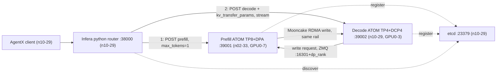

# GLM-5.2 8P4D（原生 ATOM + Infera）部署与 AgentX 性能测试计划

## 目标

- 基于 `rocm/atom-dev:nightly_202609221542`（与 `latest` 同一 digest `sha256:8d7ebab3069a`，2026-09-22 17:11 UTC 发布，截至 2026-09-23 09:40 UTC 为最新 nightly）构建 Infera ATOM 镜像，Dockerfile 放在 `yaocheng/8p4d-atom-infera/docker/`。
- 在作业 31626 的两台 MI355X 上部署 GLM-5.2-MXFP4 8P4D：1 个 Prefill（TP8 + DPA，8 卡），1 个 Decode（TP4 + DCP4，EP1，DPA 关闭，4 卡），共 12 卡。
- 参考 `yaocheng/2p1d-sweep-triton-dsa-20260922` 编写精简的 AgentX 脚本，完成性能测试并汇总结果。

## 调研结论（决定方案的事实）

- 引擎（已与用户确认）：原生 ATOM，由 `python -m infera.engine.atom` 启动。Infera 的 ATOM PD 协议 `atom-mooncake` 为 serial-pull，只有 Python 路由实现；Rust 路由遇到 ATOM worker 会报错（`rust/router/src/protocol.rs` 第 30-41 行）。
- 基础镜像自带 Mooncake `v0.3.14-rc1`（`ENABLE_MULTI_PROTOCOL=ON`、HIP dma-buf）和 Pensando ionic provider（ATOM `docker/atom_release.dockerfile` 第 467-570 行）。`deploy/docker/Dockerfile.atom` 中按固定旧 commit 重编 Mooncake 的步骤是为 ATOM 0.1.4 基础镜像准备的，在新镜像上执行会降低 Mooncake 版本。
- chat 路径：最新 ATOM 的 `ChatCompletionRequest` 带 `kv_transfer_params` 字段，非流式 chat 响应返回 `kv_transfer_params`。AgentX 使用 `/v1/chat/completions`，经 Infera 路由完成 PD 在代码层面可行；`infera/router/disagg_protocols/atom_mooncake.py` 第 28-30 行「仅 /v1/completions」的说明针对旧版 ATOM，需要实测确认。
- DPA：ATOM 在 `-tp 8 --enable-dp-attention` 下改为 DP8×TP1（`atom/model_engine/engine_core_mgr.py` 第 290-295 行）。prefill 响应带真实 `tp_size=1` 和 `dp_rank`，Infera `annotate_decode`（`atom_mooncake.py` 第 133-139 行）用 `setdefault` 保留该值，consumer 计算的握手端口为 `handshake_port + dp_rank`，与 8 个 EngineCore 的实际端口一致，路由代码不需要修改。
- DCP：consumer 在 write request 中携带自身 DCP 拓扑，producer 发送时按分片重排，支持「Prefill 无 DCP、Decode DCP4」的组合（`mooncake_connector.py` 第 577-581、1769-1790 行）。
- 网络：两台节点的后端网卡按 rail 物理隔离，实测同 rail ping 通、跨 rail 不通；`ionic_i` 与 rail 的对应关系在两台节点一致。Prefill 的 8 个 DP rank 向 Decode 的 4 个 TP rank 写 KV 时存在跨 rail 传输，按 ATOM `recipes/pd_disaggregation_guide.md` 的说明：decode 的 kv-transfer-config 增加 `"ib_enable_alternate_hca": true, "ib_hca_count": 8`，两侧设置 `MC_ENABLE_DEST_DEVICE_AFFINITY=1`。回退方案为 prefill 侧设置 `ATOM_MOONCAKE_MATCHED_RAILS=auto`。
- 参数来源：
  - InferenceX `configs/amd-master.yaml` 中 `glm5.2-fp4-mi355x-atom-agentic-mtp` 与 `benchmarks/single_node/agentic/glm5.2_fp4_mi355x_atom_mtp.sh`（MI355 ATOM 单机，TP4+DCP4+MTP）：C16-C40 用 MTP K4、acceptance 3.33，C48 用 K3、2.99；`--max-num-seqs 2*CONC`；cudagraph 尺寸 `[1,2,4,8,12..2*CONC 步长 4]`；回放命令追加 `--apply-chat-template`（只影响客户端 ISL 统计）。
  - ATOM `recipes/Agentic-GLM-5.2.md` 的 1P1D PD（Prefill TP1×PP4、Decode TP4×DCP4、MTP3）：block size 16、`ATOM_MLA_PAGE_SIZE=1` 等 PD 相关环境变量。
- AgentX：沿用 2p1d 目录固定的 InferenceX `918524ff`，其 aiperf 子模块 `754356e9` 与主干一致并支持 `--apply-chat-template`，结果可与 2p1d SGLang 数据对比。聚合脚本按 `PREFILL_*`/`DECODE_*` 变量计算 GPU 数，8P4D 为 12 卡（`utils/agentic/aggregation/process_agentic_result.py` 第 117-150 行）。

## 实验环境（作业 31626，运行至 2026-09-24 09:28 UTC）

- 登录：`ssh cyao1002@dccs-1334-slurm.prov.aus.ccs.cpe.ice.amd.com`；本机 `smc300x-ccs-aus-a16-19` 通过 `-J` 访问两台节点。套件脚本在控制节点 n10-29 上执行，经 SSH（`-o StrictHostKeyChecking=accept-new`）操作 n02-33。
- Prefill：`smci355-ccs-aus-n02-33`，fenic `10.235.192.133`，GPU 0-7。
- Decode 与控制服务（etcd、Infera 路由、AgentX 客户端、镜像构建）：`smci355-ccs-aus-n10-29`，fenic `10.235.192.140`，Decode 使用 GPU 0-3，其余 4 卡空闲。
- 模型（用户指定）：`/apps/data/models/GLM-5.2-MXFP4`，符号链接到 `/perf_apps/data/models/GLM-5.2-MXFP4`，两节点可读，282 个分片、408G，含 1 层 MTP。容器内使用同一路径只读挂载。
- 端口：n10-29 的 22379、29001 已被占用。本套件使用 etcd 23379/23380、路由 38000、prefill 39001、decode 39002、握手端口 16301（prefill 8 个 DP rank 占用 16301-16308）与 16311（decode）。
- 他人容器（用户已授权）：GPU 步骤开始时 `docker stop`（不删除）n10-29 的 `glm52-pd-yihou-sn-p4d4-n1029-{prefill-0,decode-0,etcd}`（占满 8 卡，显存 85-86%）与 n02-33 的 `sikl.jihhe`、`dev_primus_mxfp6_265`，并写入 `.record`。



## 交付物（`yaocheng/8p4d-atom-infera/`）

- `docker/Dockerfile`：Infera ATOM 镜像。
- `config.sh`：节点、IP、镜像、模型、端口、Prefill/Decode 参数、AgentX 参数，全部可用 `KEY=VALUE` 覆盖。
- `scripts/common.sh`：加载配置、`KEY=VALUE` 解析、`on <node> <cmd>`（SSH）、`wait_http`。
- `scripts/build_image.sh`：在 n10-29 构建镜像，`docker save | ssh n02-33 docker load`，比对两节点 image ID。
- `scripts/up.sh CONC=<N>`：启动 etcd、prefill、decode，就绪后启动路由；MTP 深度、acceptance、cudagraph 尺寸与 `--max-num-seqs` 由 CONC 计算。
- `scripts/down.sh`：删除本套件容器（名称前缀 `glm52-8p4d-atom`）。
- `scripts/smoke.sh`：经路由发送 completions 与流式 chat 请求，检查 `/v1/workers` 与日志中的 Mooncake RDMA 初始化信息。
- `scripts/agentx.sh CONC=<N> [DURATION=<s>]`：生成 `runtime.env`，在控制节点的客户端容器中调用 InferenceX `benchmark_lib.sh` 的 4 个函数。
- `scripts/sweep.sh`：对每个 CONC 依次执行 down、up、agentx、down。
- `scripts/summarize.py`：读取 `agentx_conc*.json`，输出 `results/summary.md` 与 `results/summary.csv`（列与 2p1d `sweep_results.md` 相同，GPU 数取 JSON 中 `num_prefill_gpu + num_decode_gpu`）。
- `README.md`（简短用法）、`.gitignore`（忽略 `/.tmp/`）、`results/`。
- `.record/progress.md`（按 UTC 时间记录操作、结果、产物路径）、`.record/issues.md`（每个问题记录现象、日志片段、原因、处理、状态）。
- `.tmp/`：日志、缓存（InferenceX checkout、aiperf venv、HF 数据集、ATOM 编译缓存）、原始 AgentX 数据、临时脚本（例如 GSM8K 校验）。

目标规模：scripts 与 config 合计约 350 行，只保留启动、等待、记录所需的检查，不复制 2p1d 中 `agentx_env.py`、`audit.py`、`verify_pd_fixes.py` 的校验逻辑。

## Dockerfile 设计

相对 `deploy/docker/Dockerfile.atom` 的改动：

- 保留：安装 infera `.[atom]`、KV-event `.pth` 钩子、ionic 注入 entrypoint。
- 去掉：Mooncake 重编（基础镜像已有更新的 multi-protocol 版本）；`deploy/docker/patches/atom/` 的 3 个 patch（分别针对 Qwen3.5 GDN、MiniMax-M2，以及上游已修复的 consumer slot 初始化，均与 GLM-5.2 无关）；Rust 路由（ATOM PD 只能用 Python 路由）；apt mirror（默认空操作）。

```dockerfile
ARG ATOM_BASE_IMAGE=rocm/atom-dev:nightly_202609221542
FROM ${ATOM_BASE_IMAGE}

WORKDIR /opt/infera
COPY pyproject.toml README.md ./
COPY infera ./infera
RUN pip install --no-cache-dir ".[atom]"

RUN SITE_PKGS=$(python3 -c "import site; print(site.getsitepackages()[0])") \
    && echo "import infera.engine.atom.hooks.kv_event_bootstrap" \
        > "${SITE_PKGS}/zzz_infera_atom_bootstrap.pth"

COPY deploy/docker/scripts/infera_inject_host_ionic.sh /usr/local/bin/infera-inject-host-ionic
ENTRYPOINT ["/usr/local/bin/infera-inject-host-ionic"]
CMD ["/bin/bash"]
```

镜像名 `infera-atom:nightly_202609221542`，构建上下文为仓库根目录（约 84 MB，`.dockerignore` 已排除大目录）。构建后的无 GPU 校验：`python3 -c "import atom, infera, mooncake.engine"`，记录 ATOM commit、Mooncake 版本、`pip check` 结果、`atomesh` 与 `lm_eval` 是否存在。

## 启动参数（`config.sh` 默认值）

两侧相同：

- 环境变量：`AITER_QUICK_REDUCE_QUANTIZATION=INT4 AITER_USE_FLYDSL_MOE_SORTING=1 AITER_LOG_LEVEL=WARNING PYTHONHASHSEED=0 ATOM_MLA_PAGE_SIZE=1 ATOM_ONLINE_QUANT_STREAMING=0 ATOM_SPARSE_INDEXER_LOGITS_BUDGET_MB=2047 ATOM_USE_TRITON_MLA=0 MC_ENABLE_DEST_DEVICE_AFFINITY=1 MC_GID_INDEX=1 ATOM_HOST_IP=<本节点 fenic IP> INFERA_ATOM_READY_TIMEOUT=3600`
- 参数：`--model /apps/data/models/GLM-5.2-MXFP4 --host 0.0.0.0 --trust-remote-code --kv_cache_dtype fp8 --block-size 16 --enable_prefix_caching --level 3 --method mtp --num-speculative-tokens $MTP_K`，`--online_quant_config` 采用 InferenceX 版本（专家层 0-77 与 MTP 层 78 保持原精度）。
- Infera 包装：`python3 -m infera.engine.atom --etcd-endpoint 10.235.192.140:23379 --advertise-host <本节点 fenic IP> <ATOM 参数>`，KV events 关闭。

Prefill（n02-33，`HIP_VISIBLE_DEVICES=0,1,2,3,4,5,6,7`）：

```bash
-tp 8 --enable-dp-attention --enforce-eager --max-num-seqs 512 \
--max-num-batched-tokens 16384 --gpu-memory-utilization 0.85 --server-port 39001 \
--kv-transfer-config '{"kv_role":"kv_producer","kv_connector":"mooncake","handshake_port":16301,"http_port":39001,"proxy_ip":"10.235.192.133","protocol":"rdma"}'
```

Decode（n10-29，`HIP_VISIBLE_DEVICES=0,1,2,3`）：

```bash
-tp 4 --decode-context-parallel-size 4 --cudagraph-mode FULL \
--cudagraph-capture-sizes "$CG_SIZES" --max-num-seqs $((2*CONC)) \
--max-num-batched-tokens 16384 --gpu-memory-utilization 0.85 --server-port 39002 \
--spec-decode-acceptance-length $MTP_AL \
--kv-transfer-config '{"kv_role":"kv_consumer","kv_connector":"mooncake","handshake_port":16311,"http_port":39002,"proxy_ip":"10.235.192.140","protocol":"rdma","ib_enable_alternate_hca":true,"ib_hca_count":8}'
```

- `MTP_K/MTP_AL`：CONC < 48 时为 4/3.33，CONC ≥ 48 时为 3/2.99；`MTP_AL` 为空时不传 `--spec-decode-acceptance-length`（正确性校验使用）。Prefill 使用相同的 `MTP_K`。
- 路由：`python3 -m infera.server --host 0.0.0.0 --port 38000 --router-backend python --discovery-backend etcd --etcd-endpoint 10.235.192.140:23379 --request-transport http --router-policy round-robin --router-tokenizer-path /apps/data/models/GLM-5.2-MXFP4`。
- 容器：每个服务一个 `docker run -d`（`--network host --ipc host`，挂载 `/dev/kfd /dev/dri /dev/infiniband`、模型只读目录、宿主 `libionic.so` 到 `/host-libionic/libionic.so`），`.tmp/cache/<host>/<image-id>` 挂载为 `/root/.cache`，保留 ATOM、Triton、inductor 编译缓存，缩短每档重启时间；日志用 `docker logs -f` 写入 `.tmp/runs/<RUN_ID>/logs/`。

## 执行步骤

阶段 1：准备与镜像（不使用 GPU）

1. 建立 `.record/progress.md`、`.record/issues.md`，记录作业、节点、IP、rail 测试、他人容器与授权、镜像 digest。
2. 编写 `docker/Dockerfile`、`config.sh`、`scripts/`（AgentX 相关脚本在阶段 3 编写）。
3. 在 n10-29 执行 `scripts/build_image.sh`，确认两节点 image ID 一致，完成无 GPU 校验。

阶段 2：部署与正确性（使用 GPU）

4. `docker stop` 两节点上的他人容器；检查所用 GPU 显存低于 2%、端口空闲。
5. `scripts/up.sh CONC=16 MTP_AL=`（MTP 开启、forced acceptance 关闭），等待两个 worker 注册到路由。
6. `scripts/smoke.sh`：completions 与流式 chat 返回正确文本；prefill、decode 日志出现 Mooncake `protocol=rdma` 初始化，没有 transfer 失败或 TCP 回退。
7. GSM8K 5-shot、200 题，经路由用 `lm_eval local-chat-completions` 测试（脚本放在 `.tmp/`，`lm_eval` 不在镜像中时安装到 `.tmp/` 下的 venv）；准确率与 ATOM PD recipe 的 0.961 相差不超过 3 个百分点视为通过。
8. 出现问题时按以下次序排查，并写入 `issues.md`：
   - chat 路径 PD 失败：用 ATOM 镜像自带的 atomesh 路由对照，区分 Infera 路由与 ATOM 引擎的问题；涉及代码修改的方案由用户审阅后执行。
   - 跨 rail 传输失败：prefill 侧增加 `ATOM_MOONCAKE_MATCHED_RAILS=auto`。
   - DPA + MTP 的 prefill 启动失败：保留日志，与用户确认后调整（例如 prefill 改用 ATOM recipe 中已验证的参数）。

阶段 3：AgentX 性能

9. 编写 `scripts/agentx.sh`、`scripts/sweep.sh`、`scripts/summarize.py`；InferenceX `918524ff` 克隆到 `.tmp/cache/InferenceX`（含子模块）。
10. `runtime.env` 主要取值：`FRAMEWORK=atom PRECISION=fp4 IS_MULTINODE=true DISAGG=true PREFILL_NUM_WORKERS=1 PREFILL_TP=8 PREFILL_DP_ATTN=true DECODE_NUM_WORKERS=1 DECODE_TP=4 DECODE_DCP_SIZE=4 DECODE_DP_ATTN=false SPEC_DECODING=mtp SIMULATE_ACC_LEN=$MTP_AL AIPERF_REQUIRED_SERVER_METRIC_PREFIX=atom: AIPERF_SERVER_METRICS_URLS=<router,prefill,decode>/metrics TMPDIR=/ax-tmp`，其余键与 2p1d 生成的 `runtime.env` 相同。
11. 链路验证：`sweep.sh POINTS=16 DURATION=600`（带 `--unsafe-override`，结果不发布），确认产出 `agentx_conc16.json`。
12. 完整测试：`POINTS="16 24 32 40 48"`，每档 3600 秒、每 lane 预热 10 个请求；每档约 1.5-2 小时，合计约 8-10 小时，在作业结束（2026-09-24 09:28 UTC）前完成。
13. `summarize.py` 生成 `results/summary.md`、`results/summary.csv`，通过的档位 JSON 复制到 `results/c<NNN>/`；数值与 2p1d SGLang 结果并列（注明 GPU 数与并发范围不同）。

## 验收标准

- 两节点 image ID 一致，`import atom, infera, mooncake.engine` 成功。
- 路由 `/v1/workers` 为 1 个 prefill 和 1 个 decode；completions 与流式 chat 经路由返回正确文本。
- GSM8K 200 题准确率达到上述阈值。
- 每个 CONC 产出 `agentx_conc<N>.json`，测量时长不少于 3528 秒（0.98 × 3600），失败请求比例低于 10%，`results/summary.md` 汇总完成。

## 主要风险

- ATOM chat 路径的 PD 尚未在 Infera 路由上验证。
- 「Prefill TP8 DPA + MTP」与「Decode TP4 DCP4」的组合没有官方验证记录（ATOM 1P1D recipe 的 prefill 为 TP1×PP4）。
- Python 路由在高并发流式请求下的开销；需要时在结果中注明。
- 完整测试约 8-10 小时，调试时间受作业剩余时间（约 23.5 小时）限制；时间不足时减少档位并记录。
